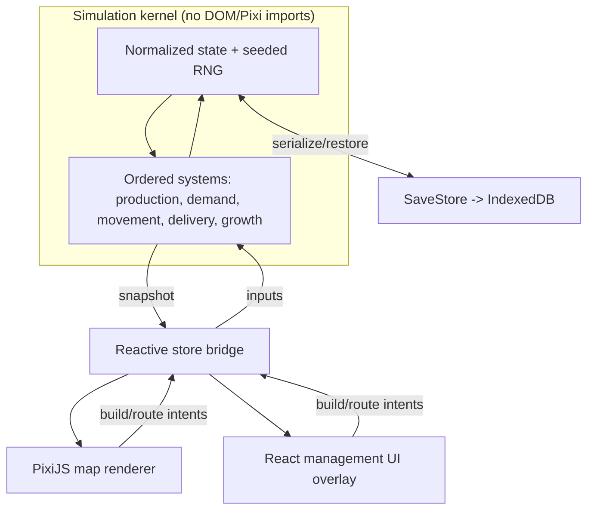
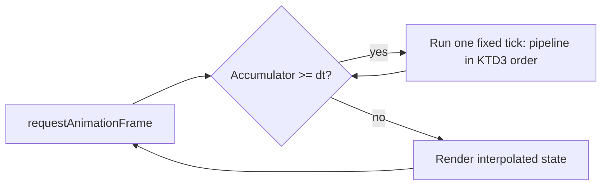

# Railroad Economy Sim - Plan

## Goal Capsule

- **Objective:** Build a single-player, browser-based railroad game where a haul-for-hire carrier grows real-world cities by delivering the goods they demand, on a living market that reacts to play — architected to keep absorbing new mechanics for years.
- **Product authority:** Solo creator / product owner (mikejestes@gmail.com).
- **Open blockers:** None. The demand-coupled fee model (R3–R5) is the load-bearing mechanic; by decision it is designed at planning time as a first-cut model to prototype and tune.

## Product Contract

### Summary

A deep economic railroad sim for the browser. The player is a carrier paid on delivery (as in the 1990 *Railroad Tycoon*), but delivery fees are driven by a living supply-and-demand market. The spine is city growth: deliver the goods a city actually demands and it grows, unlocking new demands and industries; neglect it and it stalls. Geography is real and recognizable; the economy is seeded and different every run.

### Problem Frame

The original DOS *Railroad Tycoon* had a beloved core — learning a real map, working up the engine progression, connecting cities — but two weaknesses. First, the advanced controls (numpad track laying, consist swapping, routing rules) were opaque, so most of the depth stayed hidden. Second, and more damaging, the resource economy was ignorable: the revenue formula weighted distance and speed so heavily that running passengers and mail between distant cities was mathematically optimal, and the whole raw→processed→goods supply chain went unused. The player's stated frustration — never learning to use the less common resources or match passenger demand — is that flaw felt from the inside.

Modern transport games solved it by making city growth depend on delivering matched demand (you cannot grow a city on passengers alone), surfacing each city's demand explicitly, and letting prices/payouts move with real scarcity and transit time. The opportunity is to keep RRT's recognizable haul-for-hire loop while making the market alive enough that reading demand and using every resource type becomes the actual game.

### Key Decisions

- **Deep economic simulation is the product; railroads are the vehicle.** Investment goes into the market model and its legibility, not into rail-network micro-optimization or a finance metagame.
- **Haul-for-hire, not trading.** The player is paid a delivery fee and never owns or speculates on goods — this keeps RRT's recognizable money-making act. Chosen over transport-arbitrage and speculation models.
- **City growth is the v1 spine.** Of the four market forces the player wants (city growth, saturation, supply shocks, AI competitors), city-growth-driven demand is what the first playable version proves, because it is the force that makes every resource type matter. The other three layer on top of it.
- **Demand-coupled fees are mandatory, not optional tuning.** Because the game is both haul-for-hire and city-growth-driven, fees must scale with real demand and fulfillment rather than RRT's near-pure distance×speed. Without this, premium passenger/mail routes dominate again and freight stays ignorable — reintroducing the exact flaw this product exists to fix.
- **Real geography, procedural economy.** Recognizable regions for nostalgia and readability; seeded resource placement and market conditions so no two runs are alike and the game stays replayable and experiment-friendly.
- **Simulation is a decoupled, deterministic, testable layer.** Foundational technical framing that serves the "iterate on mechanics for years" goal: the economic rules live in their own module the render/UI layers only read from, so mechanics can be added, tuned, and regression-tested without rewrites. Detailed stack selection is deferred to planning (see Sources / Research).
- **First playable region is Europe, started early.** The v1 slice uses European geography — the map the player already knows — but begins early enough (not the original's ~1900 Europe start) to preserve the early-steam engine progression. Chosen over a US early-steam map and over an abstract test map, accepting that we decouple from the original's historical dates to get both the familiar map and the progression.
- **Fee model is designed at planning time.** The demand-coupled fee model is load-bearing but is deliberately left to the planner to propose as a first-cut model to prototype and tune, rather than fixed here.

### Requirements

**Market & demand model**

- R1. Each city expresses explicit, visible demand for specific goods — the player can see what a city wants and how much.
- R2. Passengers and mail are one demand type among many, not a dominant carve-out; they do not bypass the demand model that governs freight.
- R3. Delivery fees are coupled to demand and fulfillment: higher for goods a city currently wants, lower as that want is satisfied, such that no single cargo class trivially dominates regardless of what is demanded.
- R4. Over-supplying a good to a city depresses its fee (saturation / diminishing returns), and the market recovers as the city consumes — rewarding spreading deliveries and hunting fresh demand over one golden route.
- R5. Timely, direct delivery is rewarded over slow delivery (a transit-time factor in payout), so route quality matters.

**City growth & evolution (the spine)**

- R6. Sustained delivery of demanded goods grows a city; growth unlocks new demands and new industries. Neglected cities stagnate.
- R7. A city cannot be grown on passengers and mail alone — freight fulfillment is required for growth.
- R8. Play reshapes the economic map: the network the player builds changes what goods are demanded and produced and where, rather than leaving a static world.
- R9. Raw materials convert to intermediate and finished goods through industries the player feeds and connects (e.g. a resource → a processor → a city demand), so supply chains are the substance of "using every resource type."

**World & session**

- R10. The world uses real, recognizable geography (regions such as Europe and the US); resource placement and market conditions are seeded and vary per run.
- R11. Locomotives and technology progress over eras, with meaningful speed-versus-pulling-power tradeoffs, so the engine progression the player loved is preserved.
- R12. The simulation runs in real time with pause, single-player, in a desktop browser.

**Legibility & controls (fixing the original's opacity)**

- R13. The economy is legible on the map: the player can see why a route pays what it pays — demand, saturation, distance, timeliness — without diving through report menus.
- R14. Core controls (track laying, routing, consist and scheduling) are mouse-driven and discoverable; the advanced controls that stumped players in the original are surfaced rather than hidden.

**Extensibility**

- R15. New mechanics can be added, reworked, and tuned over time without rewrites, and the economic rules are independently testable.

### Key Flows

- F1. Connect a city and grow it (the core loop)
  - **Trigger:** The player surveys the map and picks a city with unmet demand near a usable resource or a second city.
  - **Steps:** Lay track and place stations so the resource and the city fall in catchment → run a train carrying the demanded good → the city is paid-into and its demand is partially fulfilled → sustained fulfillment grows the city → growth raises and diversifies demand, and may unlock a new industry → the player extends the network to serve the new demand.
  - **Outcome:** A widening loop where each fulfilled demand creates the next opportunity, and the map the player builds becomes the economy.
  - **Covered by:** R1, R3, R6, R8, R9, R13.

### Acceptance Examples

- AE1. Demand-coupled fee. **Covers R3, R4.** **Given** a city demanding steel and lightly served with textiles, **when** the player delivers steel versus textiles over the same distance, **then** the steel delivery pays materially more, and **when** the player keeps delivering steel past the city's current demand, **then** each further steel delivery pays less until demand recovers.
- AE2. Growth requires freight. **Covers R7.** **Given** two connected cities exchanging only passengers and mail, **when** time passes with no freight demand fulfilled, **then** neither city grows; growth resumes only once demanded goods are delivered.
- AE3. No premium-cargo dominance. **Covers R2, R3.** **Given** a long-distance passenger route and a well-matched freight route, **when** both are optimized, **then** neither strictly dominates the other on payout purely by cargo class — the outcome turns on demand and fulfillment, not on the class weighting.

### Success Criteria

- Every resource type has runs in which hauling it is the right move — no cargo is a permanent trap or a permanent king (the concrete "freight matters" bar).
- A new player can read, on the map, why one route pays more than another without opening a manual or a report screen.
- Adding or retuning a market mechanic (a new good, a new demand rule, a saturation curve change) is a bounded, test-covered change — not a rewrite.
- The economic model is unit-testable in isolation: feed a seed and fixed inputs, run ticks, assert exact outcomes.

### Scope Boundaries

**Deferred for later** (wanted, layered on after the v1 demand→growth loop works)

- AI competitors contesting demand and routes.
- Supply shocks and events (harvests, discoveries, recessions, seasons).
- A finance / stock / robber-baron layer — a plausible later *mode*, not part of the core.
- Mobile / touch support and multiplayer, accounts, cloud saves.

**Outside this product's identity**

- Transport-arbitrage or commodities-trading gameplay where the player owns and speculates on goods — the player is a carrier, decided in Key Decisions.
- Rail-network throughput optimization as the primary challenge (the OpenTTD lane) — logistics is a means here, not the point.
- 3D / isometric-3D presentation as a goal in itself.

### Dependencies / Assumptions

- Assumes solo-developer, single-player, desktop-browser scope for v1; nothing external is required to start.
- Assumes real-time-with-pause and era-based engine progression as settled defaults (confirmed in dialogue).
- Assumes the recommended architecture keeps the simulation runnable headless (no render/UI coupling), which preserves the option of a server-authoritative or multiplayer future without building it now.

### Outstanding Questions

**Deferred to planning**

- The demand-coupled fee model (R3–R5): what determines a fee, and how demand, fulfillment, saturation, distance, and transit time combine. Load-bearing, but by decision the planner proposes a concrete first-cut model to prototype and tune.
- The starting cargo/industry set and the depth of supply chains in v1 (single-hop raw→city versus multi-stage chains).
- The Europe start year and engine roster — early enough to give the early-steam progression, with the exact timeline set in planning.
- Save/persistence model and autosave behavior.
- The specific rendering/UI/simulation stack (see Sources / Research for the researched recommendation to weigh).

### Sources / Research

Two research passes were run during this brainstorm and should orient the planner.

- **Original RRT mechanics.** The 1990 game paid on delivery via a distance-and-speed-weighted formula (`REVENUE` scaling with distance, mph, tonnage, cargo class 0–4) that made class-0 mail and class-1 passengers between distant cities the dominant strategy, leaving the raw→processed→goods supply chain under-incentivized. Stations catch supply/demand from tiles in a radius (Depot/Station/Terminal = larger radius); conversion happens when a raw good reaches a station whose catchment holds the right processor. Known pain points: numpad-only track laying, menu-dived economic info, and one cargo class dominating. Successor fixes to borrow: RT3's living local price model, Railway Empire's explicit per-city demand lists with fulfillment-gated growth (≈60% demand for normal growth) and "can't grow on passengers alone," OpenTTD's transit-time payment decay, Transport Fever 2's throughput-driven industry growth. (Sources: Wikipedia "Railroad Tycoon (video game)"; FreeRails RT1 specification; the community revenue-formula FAQ on comp.sys.ibm.pc.games.strategic; The Digital Antiquarian; Railway Empire and OpenTTD wikis.)
- **Web game architecture (recommended stack to weigh, not yet decided).** For a solo dev optimizing iteration speed: TypeScript + Vite + Vitest; a WebGL 2D renderer (PixiJS) for the map; a reactive DOM framework (React/Preact/Svelte) as a separate overlay for the management UI, bridged through a small store; a plain, normalized, fixed-timestep, seeded-deterministic simulation in its own module with no render imports; IndexedDB for versioned save snapshots; no backend for v1. Use integer/fixed-point math for money in case lockstep multiplayer is ever added. The deterministic, decoupled sim is what makes the economic model unit-testable and the "iterate for years" goal cheap — this is the through-line to R15. (Sources: js-game-rendering-benchmark; PixiJS vs Phaser comparisons; Vitest docs; ECS/determinism references; IndexedDB save-pattern write-ups.)

---

## Planning Contract

**Product Contract preservation:** Product Contract unchanged. The two items the brainstorm deferred to planning (the demand-coupled fee model and the Europe start year) are resolved here as Key Technical Decisions, not as product-scope changes. This plan scopes a **playable v1 vertical slice** of the Product Contract — the full deliver→demand→grow loop on one region — deferring the AI-competitor, supply-shock, and finance layers already marked out of v1 scope.

### Key Technical Decisions

- KTD1. **Stack: TypeScript + Vite + Vitest, PixiJS map, React DOM overlay, IndexedDB saves.** A WebGL renderer (PixiJS) draws the map; a reactive DOM framework (React, or Preact) owns the heavy management UI as a sibling layer, bridged through a small store; the simulation imports neither. Rendering is the easy part of this genre, so the stack optimizes for iteration speed on sim rules and UI. (session-settled: user-approved — chosen over Phaser / plain-canvas and over in-engine UI: fastest iteration for a solo dev; instantiates the Product Contract "decoupled, deterministic, testable simulation" decision.) See Sources / Research.
- KTD2. **Simulation kernel: plain normalized data model, fixed timestep, seeded RNG, ordered systems, integer money.** State is typed maps of entities (cities, industries, track, trains, markets); `tick(state, dt)` is pure and imports no render/DOM code; a seeded PRNG with a serializable counter drives all randomness; money is integer (cents), never float. No ECS to start — migrate hot systems later only if entity counts demand it. This is what makes saves, replays, headless runs, and R15's fearless iteration possible. Serialize state through a canonical scheme (stable key order, arrays rather than raw `Map` iteration order) so snapshots are byte-identical. Keep the store bridge snapshot/message-shaped so the kernel can later move to a Web Worker as a bridge swap, not a rewrite.
- KTD2a. **Determinism is scoped to same-engine single-player replay.** IEEE-754 float math is deterministic within one JS engine, so float train positions and timers are fine for v1's replay and save/load gates. Cross-engine determinism — needed only if lockstep multiplayer is ever pursued — would additionally require fixed-point positions and timers; that is out of v1 scope, and the integer-money choice only pre-pays part of it.
- KTD3. **Fixed tick pipeline order:** production → demand update → train movement & arrivals → delivery & fee settlement → city growth/evolution → bookkeeping. A single fixed order each tick is required for determinism. (Directional; exact sub-steps settle in implementation.)
- KTD4. **First-cut demand-coupled fee formula (tunable).** `fee = base_rate(good) × demand_pressure × timeliness × distance_factor − saturation_penalty`, where `demand_pressure` rises with a city's unmet demand for the good and falls toward zero as it is fulfilled; `timeliness` decays with transit time since the cargo loaded; `distance_factor` rewards longer hauls with diminishing returns; `saturation_penalty` accumulates from recent deliveries of that good to that city and decays as the city consumes. Passengers and mail are goods with their own population-driven demand curves — never exempt from this model (R2). Clamp the fee at a non-negative floor so a fully-satisfied city never produces a pay-to-deliver result, and treat falling `demand_pressure` and rising `saturation_penalty` as one saturation effect expressed once, not two that double-count oversupply. Directional starting model to tune in play, not a fixed spec. (session-settled: user-approved — chosen over leaving the model for the implementer to invent: the brainstorm's "fee model designed at planning time" decision, cashed out as a committed first cut.)
- KTD5. **City growth: fulfillment-threshold model, freight-gated.** Each city tracks a fulfillment ratio across its demanded goods; sustained fulfillment above a growth threshold advances the city a size tier, which raises existing demand quantities and adds a new demanded good or spawns an industry. Passenger/mail fulfillment alone cannot cross the threshold — freight is required (R7). Thresholds are directional and tuned in play. Instantiates R6, R7, R8.
- KTD6. **World: tile grid over real European geography, seeded economy, early start.** Cities sit at real locations from a static geography layer; the grid carries terrain/coastline; resource and industry sites are placed by seeded generation per run (R10). The clock starts early enough (~1830s) to include the early-steam engine progression, decoupling from the original's ~1900 Europe start (R11). Pin an approximate tile scale (km per tile) and grid dimensions early in U3, sanity-checked against catchment radius (KTD7) and render/serialization budgets — resolution trades map recognizability against continent-scale tile count.
- KTD7. **Track / station / catchment model.** Mouse-driven track laying on the grid; stations carry a catchment radius; industries and city tiles within a station's radius supply and demand through it. Mirrors the original's proven catchment economics with modern on-map controls (R14).
- KTD8. **Persistence: versioned IndexedDB snapshots behind a `SaveStore` interface.** A save serializes the plain sim state plus the RNG seed/counter plus a schema version; a `SaveStore` interface hides IndexedDB so a cloud backend is a one-file swap later; manual export/import to a file backs saves up. The store publishes throttled/delta snapshots rather than a full clone every tick, and autosave serializes on an interval — so snapshot cost stays off the hot path; the vertical slice validates this against a target entity-count budget.
- KTD9. **v1 region and mode boundary:** one region (Europe), single-player, real-time-with-pause. No AI competitors, supply shocks, or finance layer in v1 — carried from the Product Contract's Scope Boundaries.

### High-Level Technical Design

Three layers with a one-way data contract: the simulation kernel owns all state and never imports render or DOM code; the renderer and UI only read state (through a store) and send player intents back as inputs.



The clock drives the kernel on a fixed timestep decoupled from the render loop:



### Assumptions

- Modern desktop browser with WebGL2; no backend and no accounts in v1.
- European geography (city coordinates, coastline/terrain) comes from an open dataset (e.g., Natural Earth); exact source and license confirmed during U3.
- Tick granularity (sim time per fixed step) is chosen in U2 and tuned; it does not affect determinism.

### Sequencing

Five phases, dependency-ordered: **Foundation** (U1–U2) → **World & economy** (U3–U4) → **Building & movement** (U5–U6) → **The core loop** (U7–U8) → **Legibility & session** (U9–U12). The loop is not playable until U8; every unit before it is a prerequisite, so keep the vertical slice thin and resist widening any unit beyond what the loop needs.

---

## Output Structure

```text
src/
  sim/                  # deterministic kernel — imports no DOM/Pixi
    state.ts
    rng.ts
    tick.ts
    clock.ts
    model/              # goods, cities, industries, trains, track
    systems/            # production, demand, movement, delivery, growth
    index.ts
  world/
    geography.ts        # real Europe data -> grid
    generate.ts         # seeded resource/industry placement
  render/               # PixiJS map + overlays
  ui/                   # React overlay: App + panels
  store/                # reactive bridge between sim and view
  persistence/          # SaveStore interface + IndexedDB impl
  main.ts
tests/
  sim/  world/  persistence/  store/  ui/
```

The tree is a scope declaration, not a constraint — the per-unit `Files` lists are authoritative, and the implementer may adjust layout if a better shape emerges.

---

## Implementation Units

### U1. Project scaffold and toolchain

- **Goal:** A running TypeScript + Vite project with Vitest, PixiJS, and React wired: a mounted map canvas with a React overlay sibling and the directory skeleton from Output Structure.
- **Requirements:** R15.
- **Dependencies:** none.
- **Files:** `package.json`, `vite.config.ts`, `tsconfig.json`, `index.html`, `src/main.ts`, `src/ui/App.tsx`, `src/render/mapRenderer.ts` (stub), `tests/example.test.ts`.
- **Approach:** Pin current stable PixiJS, React, Vite, Vitest. Mount a PixiJS canvas and a React DOM overlay as siblings over it (two trees, one store later). Establish the `src/sim` boundary as import-clean from the start.
- **Patterns to follow:** standard Vite + TS + Vitest layout.
- **Test scenarios:** `Test expectation: none — scaffolding/config with no behavior; a trivial example test proves Vitest runs.`
- **Verification:** `npm run dev` serves a page showing the canvas with a React overlay on top; `npx vitest` runs green; `npx tsc --noEmit` is clean.

### U2. Simulation kernel

- **Goal:** A deterministic fixed-timestep kernel: seeded RNG, normalized state, integer money, and an ordered-but-empty system pipeline.
- **Requirements:** R12, R15.
- **Dependencies:** U1.
- **Files:** `src/sim/state.ts`, `src/sim/rng.ts`, `src/sim/tick.ts`, `src/sim/systems/index.ts`, `tests/sim/rng.test.ts`, `tests/sim/tick.test.ts`.
- **Approach:** `tick(state, dt)` pure and render-free; seeded PRNG (e.g. mulberry32) with a serializable counter; money as integer cents; systems run in the KTD3 order via a fixed registry.
- **Execution note:** Build the kernel test-first — determinism is the core guarantee everything else leans on.
- **Test scenarios:** same seed reproduces the identical RNG sequence, and a serialized counter restores mid-stream; same seed + same inputs + N ticks produces an identical serialized state; money accumulators stay integer with no float drift.
- **Verification:** two runs from one seed yield byte-identical serialized state after N ticks.

### U3. World geography and seeded generation

- **Goal:** Real European geography loaded onto the tile grid, with seeded, reproducible placement of resource and industry sites.
- **Requirements:** R10.
- **Dependencies:** U2.
- **Files:** `src/world/geography.ts`, `src/world/generate.ts`, `src/sim/model/cities.ts`, `src/sim/model/industries.ts`, `tests/world/generate.test.ts`.
- **Approach:** static geo data → grid tiles (land/sea/terrain); each tile carries a terrain movement-cost weight consumed by U6 routing; cities at real coordinates; `generate.ts` places resources/industries deterministically from the run seed, respecting terrain. Pin the tile scale (km per tile) and grid dimensions here per KTD6.
- **Test scenarios:** the same seed yields the identical resource/industry layout; a different seed differs; cities land at their expected real locations; no resource is placed on sea/invalid terrain.
- **Verification:** the rendered map reads as recognizable Europe; re-running a seed reproduces the layout.

### U4. Goods, industries, supply chains, and city demand

- **Goal:** The goods catalog, industries with raw→intermediate→finished conversions including at least one multi-stage chain, and explicit per-city demand.
- **Requirements:** R1, R2, R9.
- **Dependencies:** U3.
- **Files:** `src/sim/model/goods.ts`, `src/sim/model/industries.ts`, `src/sim/systems/production.ts`, `src/sim/systems/demand.ts`, `tests/sim/economy.test.ts`.
- **Approach:** goods catalog; an industry consumes a set of goods and produces one; at least one two-stage chain (e.g. iron + coal → steel → city, or grain → food → city); the production system advances stockpiles each tick; the demand system maintains each city's unmet-demand levels, scaling with city size. Passengers and mail are goods with population-driven demand (R2).
- **Test scenarios:** production converts inputs to outputs at the expected rate; a multi-stage chain yields its finished good only when the intermediate is present; city demand scales with size; passenger/mail demand is generated by population, not industry.
- **Verification:** with no trains running, stockpiles and demand still evolve sensibly over ticks.

### U5. Track and station building with catchment

- **Goal:** Mouse-driven track laying and station placement on the grid, with catchment tying nearby industries and city tiles to a station.
- **Requirements:** R14; supports R1, R13.
- **Dependencies:** U2, U3, U1.
- **Files:** `src/sim/model/track.ts`, `src/render/mapRenderer.ts`, `src/ui/panels/BuildPanel.tsx`, `src/store/gameStore.ts`, `tests/sim/track.test.ts`.
- **Approach:** grid-based track segments laid by mouse drag (never numpad); stations with a catchment radius; catchment computed from tiles within radius; building deducts integer cost. Track segments form a connected graph (tile adjacency) that train routing pathfinds over in U6. Player intents flow view → store → sim.
- **Test scenarios:** track connects adjacent tiles and rejects invalid segments; a station's catchment includes tiles within radius and excludes those beyond; building deducts the expected integer cost.
- **Verification:** the player can lay a line and place two stations entirely by mouse.

### U6. Trains, engines, eras, and movement

- **Goal:** Buyable engines with speed/power tradeoffs unlocking by era, and trains that carry consists along track between stations, advanced by a movement system.
- **Requirements:** R11, R12.
- **Dependencies:** U2, U5.
- **Files:** `src/sim/model/trains.ts`, `src/sim/systems/movement.ts`, `src/ui/panels/TrainPanel.tsx`, `tests/sim/movement.test.ts`.
- **Approach:** engine roster carrying (speed, power, era-year, cost); a train is an engine + cars + an ordered route of stops with load/unload actions. The track network is a graph (tile adjacency from U5); movement resolves the path between consecutive stops by shortest weighted path (e.g. A*/Dijkstra over per-tile terrain movement cost) and advances the train along it, respecting speed and consist weight; engines unlock as the sim year reaches their era.
- **Test scenarios:** a train advances along its resolved path at its speed; when two routes connect the same two stops, movement takes the shorter weighted one; a heavier consist or higher terrain cost slows it; an engine becomes available only at/after its era year; a route loops through its ordered stops.
- **Verification:** a placed train runs its route and stops at each station.

### U7. Delivery and the demand-coupled fee model

- **Goal:** On arrival, unload demanded goods, fulfill city demand, and pay the KTD4 demand-coupled fee.
- **Requirements:** R2, R3, R4, R5.
- **Dependencies:** U4, U6.
- **Files:** `src/sim/systems/delivery.ts`, `tests/sim/fees.test.ts`.
- **Approach:** implement the KTD4 formula; track per-cargo load time for the timeliness term; maintain a per-(city, good) saturation accumulator that grows with recent deliveries and decays as the city consumes.
- **Execution note:** implement the fee formula test-first with table-driven scenarios so later tuning is safe.
- **Test scenarios:** `Covers AE1.` delivering a demanded good pays materially more than an undemanded one over the same distance, and repeated over-supply drops each successive fee until demand recovers. `Covers AE3.` a matched freight route and a long passenger route — neither strictly dominates on payout by cargo class alone. Timeliness: a slower delivery of the same load pays less than a fast one.
- **Verification:** the table-driven fee tests pass; completing a delivery in play credits money.

### U8. City growth and evolution

- **Goal:** Sustained fulfillment grows cities — raising and diversifying demand and unlocking industries — with freight required for growth.
- **Requirements:** R6, R7, R8.
- **Dependencies:** U7.
- **Files:** `src/sim/systems/growth.ts`, `tests/sim/growth.test.ts`.
- **Approach:** implement the KTD5 fulfillment-threshold model; crossing the threshold advances a size tier that raises demand quantities and adds a new demanded good or spawns an industry; passenger/mail fulfillment alone cannot cross the threshold.
- **Test scenarios:** `Covers AE2.` a city exchanging only passengers/mail does not grow. Sustained freight fulfillment advances the growth tier; growth adds new demand or an industry; a neglected city stagnates.
- **Verification:** a well-served city visibly grows over sim time and opens new demand, closing the deliver→grow loop.

### U9. Map legibility overlays

- **Goal:** Surface each city's demand, current fees, saturation, and route economics on the map rather than in report menus.
- **Requirements:** R13.
- **Dependencies:** U4, U7.
- **Files:** `src/render/overlays.ts`, `src/store/selectors.ts`, `tests/store/selectors.test.ts`.
- **Approach:** on-map badges for city demand and a fee heat cue; a route/hover preview that shows why a route pays what it pays (demand, distance, timeliness, saturation). The demand/fee data comes from store selectors (`src/store/selectors.ts`) shared with U10. Unit-test the selectors, not the pixels.
- **Test scenarios:** the demand selector returns a city's live unmet demand; the fee-preview selector returns a value consistent with the U7 formula for a given route; saturation is reflected after repeated deliveries.
- **Verification:** the player can read a city's demand and a route's expected fee from the map without opening a menu.

### U10. Management UI overlay

- **Goal:** The heavy management surface as DOM — city demand panels, train/route management, and a financial readout.
- **Requirements:** R13; supports R14.
- **Dependencies:** U5, U6, U8.
- **Files:** `src/ui/App.tsx`, `src/ui/panels/CityPanel.tsx`, `src/ui/panels/TrainPanel.tsx`, `src/ui/panels/FinancePanel.tsx`, `src/store/gameStore.ts`, `tests/ui/panels.test.ts`.
- **Approach:** React overlay reads from the store; the store publishes throttled/delta snapshots on tick, never per render frame; route edits flow back as intents. Keep React out of the per-frame path. `FinancePanel` shows player cash/cashflow only — not the deferred stock/robber-baron layer.
- **Test scenarios:** store selectors return correct demand/finance/train values from a known state; editing a route in the panel updates the train's route in sim state.
- **Verification:** panels reflect live sim state and a route edit takes effect on the next tick.

### U11. Save and load persistence

- **Goal:** Versioned snapshot save/load to IndexedDB with export/import and an autosave interval.
- **Requirements:** R12, R15.
- **Dependencies:** U2.
- **Files:** `src/persistence/saveStore.ts`, `src/persistence/indexedDb.ts`, `tests/persistence/roundtrip.test.ts`.
- **Approach:** serialize plain state + RNG seed/counter + schema version; hide IndexedDB behind a `SaveStore` interface with a migration hook; write autosave snapshots off the render path; support manual file export/import.
- **Test scenarios:** a save→load round-trip restores identical state; a run resumed from a snapshot ticks identically to an uninterrupted run from the same seed; the schema version is present; export→import round-trips a save file.
- **Verification:** reloading restores an in-progress game exactly, including subsequent determinism.

### U12. Game clock and real-time-with-pause controls

- **Goal:** A real-time clock that drives the kernel's fixed timestep from wall-clock, with pause and speed controls.
- **Requirements:** R12.
- **Dependencies:** U2, U10.
- **Files:** `src/sim/clock.ts`, `src/ui/panels/ClockControls.tsx`.
- **Approach:** accumulate real time and run whole fixed ticks (KTD3 order), interpolating the render between ticks; pause and speed multipliers change how many ticks run per second, never the per-tick result. Cap catch-up at a maximum number of ticks per frame (clamp accumulated time) so a large real-time gap never runs an unbounded burst in one frame. Sim time does not advance while the tab is hidden — the game effectively pauses on blur, so refocus resumes rather than replaying the elapsed gap.
- **Test scenarios:** pause halts ticks; a speed multiplier changes tick cadence but a fixed number of ticks still produces identical state; a large real-time gap catches up in fixed steps without a variable-dt jump; a very large accumulated gap runs at most the per-frame tick cap, never an unbounded burst in one frame.
- **Verification:** the player can pause and change speed, and determinism holds regardless of speed.

---

## Verification Contract

- **Type check:** `npx tsc --noEmit` is clean.
- **Unit tests:** `npx vitest run` passes. The load-bearing gate is the simulation-kernel suite (`tests/sim/**`): determinism (U2), economy and multi-stage chains (U4), the fee model (U7), and city growth (U8) must all be green — these prove the plan's core claims.
- **Determinism gate:** the same seed and inputs produce byte-identical serialized state across runs (U2) and across a save/load boundary (U11). Treat a determinism-test failure as a release blocker, not a flake.
- **Build:** `npx vite build` succeeds.
- **Manual smoke (the vertical slice):** on Europe, lay a line, run a train carrying a demanded good, watch the fee reflect demand and saturation, and watch a well-served city grow and open new demand.

## Definition of Done

**Global**

- The deliver→demand→grow loop is playable end-to-end on Europe: build track, run a train, earn a demand-coupled fee, and grow a city into new demand (R1–R14).
- The simulation kernel imports no render/DOM code and is deterministic under test (R15).
- Every Acceptance Example (AE1–AE3) has a passing test.
- The Verification Contract passes: type check, unit tests (kernel suite green), determinism gate, build.
- Abandoned-attempt and dead-end code from exploration is removed — no commented-out systems or unused experimental modules left in the diff.

**Per unit**

- Each unit meets its Verification line and its test scenarios pass. Feature-bearing units (U2–U12) carry real tests — kernel/economy/fee/growth suites plus U9/U10 selector and panel tests; U1 is scaffolding only.

---

## Risks & Dependencies

- **Balance is empirical, not provable.** The fee model (KTD4) and growth thresholds (KTD5) are first cuts; whether they *feel* right is discovered by playing, not by tests. Mitigation: keep both table-driven and tunable, and treat the tests as guarding shape (demand rewarded, saturation bites, freight gates growth), not final numbers.
- **Geography data licensing.** The Europe dataset (U3) must be open-license for the intended distribution; confirm before committing a source.
- **Scope is large for a solo build.** Twelve units span a whole playable slice. Mitigation: the phase order front-loads the kernel and keeps every pre-U8 unit as thin as the loop requires; nothing beyond the vertical slice enters v1.
- **Library version churn.** PixiJS and React majors move; pin versions at U1 and verify the PixiJS major on npm before relying on v8-specific APIs.
