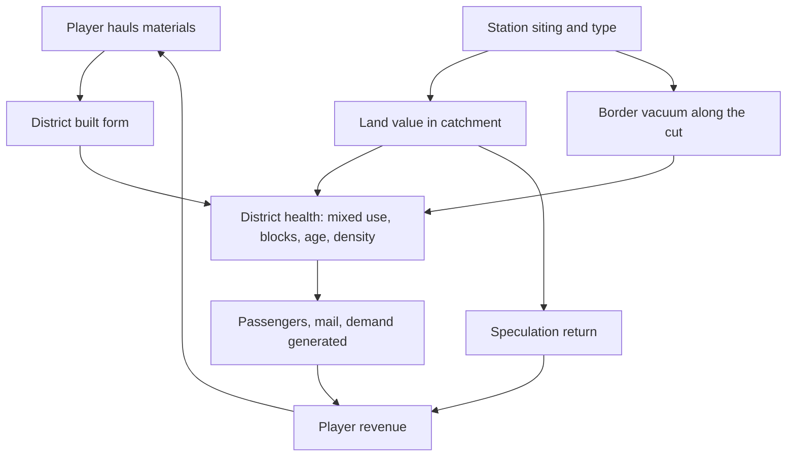
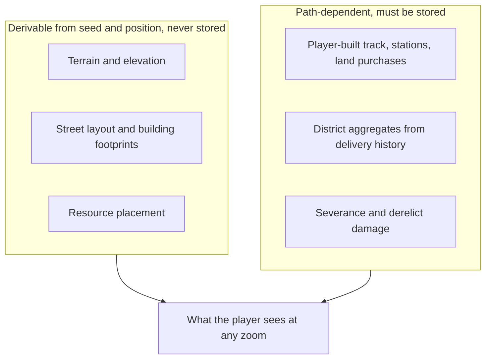

# Two-Scale World and City Districts - Plan

## Goal Capsule

- **Objective:** Give the world two scales joined by continuous zoom — the existing continental network on top, and a street-scale district around each station underneath — so that the supply chain the player hauls becomes visible as built form, and so that laying track and siting stations become decisions with terrain, cost, and consequence behind them.
- **Product authority:** Solo creator / product owner (mikejestes@gmail.com).
- **Open blockers:** None for milestones 1–5. Milestone 6 is blocked on the speculation exploit surface (see that plan's Outstanding Questions).

This document is the umbrella Product Contract. Implementation is split across six milestone plans listed below; this file holds the requirements they trace to and is not itself executable.

---

## Delivery Plan

Six milestones, dependency-ordered. Each carries its own Product Contract slice tracing to the requirements below.

| # | Plan | Covers | Depends on | Readiness |
|---|---|---|---|---|
| 1 | `docs/plans/2026-07-18-002-feat-camera-and-semantic-zoom-plan.md` | R1–R5 | — | implementation-ready |
| 2 | `docs/plans/2026-07-18-003-feat-procedural-terrain-substrate-plan.md` | R20, R21, R25–R28 | 1 | implementation-ready |
| 3 | `docs/plans/2026-07-18-004-feat-route-surveying-and-track-economics-plan.md` | R19, R21–R24 | 2 | requirements-only |
| 4 | `docs/plans/2026-07-18-005-feat-city-districts-and-organic-growth-plan.md` | R6–R9, R25–R26 | 1, 2 | requirements-only |
| 5 | `docs/plans/2026-07-18-006-feat-station-siting-type-and-severance-plan.md` | R10–R15 | 4 | requirements-only |
| 6 | `docs/plans/2026-07-18-007-feat-land-economics-and-speculation-plan.md` | R16–R18 | 3, 5 | requirements-only |

Milestones 3 and 4 are independent of each other and can proceed in either order once 2 lands. Milestones 3–6 stay requirements-only until their upstream dependency ships, because their technical decisions are stated in terms of APIs that do not exist yet.

**R1 is reworded in milestone 1.** The canvas already fills the window and resizes (`src/render/mapRenderer.ts:19`, `index.html:9-10`); the world does not, because it draws at a fixed 22px per tile. The gap is world scaling, not canvas resizing.

**R25 is amended in milestone 2.** Rivers require flow accumulation, which is inherently non-local and cannot be evaluated per coordinate. A coarse river graph is computed once and stored; all other terrain remains derivable.

---

## Product Contract

### Summary

Add a street-level city scale beneath the existing continental map, reached by continuous zoom rather than a separate screen. Districts around each station grow organically out of what the player's trains deliver; the player never zones, but sites and re-sites stations, chooses what kind of station to build, and trades land ahead of their own infrastructure. Track laying gains depth from elevation, a wider terrain palette, and land acquisition cost.

### Problem Frame

The current map is a 40x28 grid of flat rectangles in three colors (`src/world/geography.ts`, `src/render/worldRenderer.ts`). At `TILE_DEGREES = 0.9` a tile spans roughly 100 km, so a city and the farm feeding it are 100 km apart and a station's radius-2 catchment covers a 500 km square. There is no zoom, no pan, and no camera transform anywhere in the codebase; the world is drawn once at a hardcoded 22 px per tile into a fixed canvas.

Play surfaces two distinct failures. The map is monotonous to look at, and it is monotonous to build on. The second is the more damaging: every land tile is interchangeable, so routing from one city to another has no decisions in it. Track costs a flat $50 per segment with a $100 surcharge when either endpoint is mountain, and mountains exist in exactly two boxes (the Alps and the Pyrenees) on the whole continent. Nothing else on the map is worth routing around.

The map also hides the thing the product is about. Twenty-six industry sites are generated and simulated, and none of them are drawn — `src/render/worldRenderer.ts` has five layers and none reads `state.industries`. The raw-to-processed supply chain that the existing plan calls "the substance of using every resource type" (R9) is invisible on the surface the player spends all their time looking at, reachable only by opening a panel.

### Key Decisions

- **Two scales joined by continuous zoom, not a city screen.** (session-settled: user-directed — chosen over a hard scale switch and a drill-in inset panel: the appeal of station-created land value depends on seeing the line and the neighborhood in one picture, and a separate screen makes the two economies read as two games.) The map changes what it is a map *of* as the player zooms, in one coordinate space, with no modes.

- **The player is a carrier and a landowner, never a planner.** (session-settled: user-directed — chosen over free zoning and over pure observation: free zoning makes the player a city builder and contradicts the product's identity; pure observation leaves nothing to do at city scale.) The city zones itself. The player's leverage over a district is which station they put there, where they put it, and what they haul into it.

- **Railroad baron above, Jane Jacobs below.** (session-settled: user-directed.) The player acts as top-down infrastructure at continental scale and must live with bottom-up neighborhood response at street scale. Jacobs named rail lines as the classic *border vacuum* — hard infrastructure that creates a dead edge and hollows out the blocks beside it. Station siting therefore creates land value and severs the district in the same act, and the district's health feeds back into the demand and supply the player earns from. This is what makes the second scale a game rather than a decoration.

- **The district is watched, not operated.** (session-settled: user-directed — chosen over adding clearance and demolition rights: clearance would make the player a planner, which the identity decision rules out.) No verb reaches inside a district. Station type and land speculation both attach to decisions the player already makes elsewhere — at siting time and at routing time — so the district stays a consequence surface without being inert.

- **The district is a readout of delivery history.** Built form derives from what arrived: steel permits height and density, food thickens residential, manufactured goods produce commercial frontage. This is the cheapest available fix for the invisible-supply-chain problem — the street becomes the report screen.

- **Relocation leaves its own vacuum.** (session-settled: user-directed — chosen over slow district decay and over retaining sunk value: decay reads as punishment for a corrective move, and retained value drains the weight from siting, which is the tension the design rests on.) A district keeps what it became, but the abandoned station site becomes derelict land that depresses what is around it. Every act of infrastructure leaves a mark, including its removal.

- **Persist district aggregates; generate street detail.** (session-settled: user-approved — chosen over persisting individual buildings: a simulation holding a million building records is neither plainly serializable nor unit-testable in isolation, both of which are existing commitments.) Per-district state is a small record — population, use mix, density tier, age distribution, severance damage. The visible street scene is generated from position and seed, conditioned on that record. Resolution becomes free; storage does not grow with zoom depth.

- **Track depth is build-time, not recurring.** (session-settled: user-directed — land acquisition cost, elevation and grades with priced structures, and a wider terrain palette were selected together; ongoing maintenance was declined.) Land cost is the load-bearing one because it serves both scales: the same land-value field that drives district development also prices the route and makes speculation possible.

- **Track laying becomes route-based surveying.** Chaining individual adjacent tile clicks (`src/main.ts:62-76`) is unusable once a Paris-Lyon line is thousands of segments. Surveying is also where elevation and land cost become legible, since the survey is where they appear as a number the player reacts to.

### Requirements

**Viewport and scale**

- R1. The map fills the browser window and responds to window resize.
- R2. The player can pan the map by dragging.
- R3. The player can zoom continuously from the full continent to street level, in a single coordinate space, with no mode switch or separate screen.
- R4. Detail appropriate to the current zoom level appears and disappears as the player zooms, without the world changing identity — the same place stays the same place at every depth.
- R5. Industry sites are visible on the map, at the zoom levels where they are meaningful.

**City districts**

- R6. Each station has a district around it whose built form grows in response to the goods the player's trains deliver into that station.
- R7. Different delivered materials produce different built form, such that a player can look at a district and infer what has been shipped there and what has been neglected.
- R8. District health derives from the generators of urban diversity — mixed uses, block granularity, building age variety, and density — and feeds back into the passengers, mail, and demand the district generates.
- R9. The player never zones, designates land use, places buildings, or demolishes within a district.

**Station siting, type, and severance**

- R10. Siting a station creates land value in its district.
- R11. Station type — at minimum freight yard, passenger terminal, and mixed depot — shapes what kind of district grows around it, independently of the station's catchment size.
- R12. Stations, yards, and track sever the district they pass through, depressing the blocks along that edge — the same act that creates value also damages the neighborhood.
- R13. The player can move a station after siting it.
- R14. Severance persists after a station moves. The player can relocate infrastructure; they cannot undo the cut.
- R15. An abandoned station site becomes derelict land that depresses what surrounds it, so relocation leaves a second vacuum rather than a clean slate.

**Land economics**

- R16. The player can acquire and develop land within the catchment of their own stations — built or committed — and nowhere else.
- R17. Land acquired before the infrastructure that serves it appreciates when that infrastructure arrives, so buying ahead of a committed route is a viable play.
- R18. Land value is legible to the player before purchase, so speculation rests on judgment rather than on a hidden roll.

**Track laying and terrain**

- R19. Track is laid by surveying a route between two chosen points, not by chaining adjacent tile clicks. The player sees the proposed route, its cost, and its grade before committing, and can adjust it.
- R20. The terrain palette is wide enough that most of the map is worth routing around or through deliberately, rather than uniform and interchangeable.
- R21. Terrain carries elevation. Grade affects what trains can haul and how fast, so a cheap steep route and an expensive flat one are a real choice.
- R22. Engineering structures — at minimum bridges, tunnels, and cuttings — are priced choices the player makes when a route meets an obstacle.
- R23. Track cost includes the cost of the land it crosses, so routing through developed or valuable land is more expensive than routing through hinterland.
- R24. Track has no recurring maintenance cost. All track decisions are paid for at build time.

**World generation and persistence**

- R25. Terrain and street-level detail are generated deterministically from position and world seed, so the same seed produces the same world at every zoom level without storing it.
- R26. Only path-dependent state persists: what the player built, bought, or changed, and the district state that resulted from delivery history.
- R27. Resource placement has spatial logic — clustering, spacing, and plausible geology — rather than uniform random draws.
- R28. A save remains a canonical serialization of the simulation state, and the simulation remains unit-testable in isolation, at any world resolution.

### Key Flows

- F1. Zoom from network to district
  - **Trigger:** The player is looking at the continental network and wants to see what is happening at a city.
  - **Steps:** Zoom in on a city dot; the dot resolves into a settlement, then a street grid; the station and its catchment appear at true size; the line the player laid is still visible arriving into the district.
  - **Outcome:** The player reads the network and the neighborhood in one continuous picture, and never loses track context while looking at a district.
  - **Covered by:** R3, R4, R5.

- F2. Grow a district by hauling
  - **Trigger:** A district has a station and unmet demand.
  - **Steps:** The player routes freight into the station; delivered materials accumulate; the district's built form thickens and diversifies according to what arrived; district health rises; the district generates more passengers, mail, and demand, which the player earns from.
  - **Outcome:** A widening loop where the supply chain the player stitches together is legible as architecture, and good urbanism around the player's own stations pays them.
  - **Covered by:** R6, R7, R8.

- F3. Site a station and live with the cut
  - **Trigger:** The player is bringing a line into a city for the first time.
  - **Steps:** The player chooses where the station goes, what type it is, and how its approach enters the city; land value rises in the catchment; the blocks along the track edge are severed and decline; the player develops land inside the catchment; later, the player may move the station to a better site, leaving both the original cut and a derelict yard behind.
  - **Outcome:** Station siting is a lasting decision with an upside and a permanent cost, rather than a placement puzzle.
  - **Covered by:** R10, R11, R12, R13, R14, R15, R16.

- F4. Buy ahead of your own line
  - **Trigger:** The player is surveying a route toward a city they have not yet served.
  - **Steps:** The player reads land value along and around the candidate route; commits to the route; acquires land in the catchment of the station they intend to build; the line and station arrive; the land appreciates.
  - **Outcome:** Routing decisions carry a second layer of judgment — where value will be, not only what haulage will cost.
  - **Covered by:** R16, R17, R18, R19, R23.

The loop the player is paid by runs through district health, and station siting feeds that loop from both directions at once — value from the catchment, damage from the cut.

Everything reproducible from the seed stays out of the save. Only history goes in, which is what keeps storage flat as zoom depth grows.

### Acceptance Examples

- AE1. Continuous scale. **Covers R3, R4.** **Given** the player is viewing the full continent, **when** they zoom into a city without releasing, **then** the view resolves through region to street level with no screen transition or mode change, and the track they laid remains visible and correctly positioned at every depth.

- AE2. Built form reflects hauling. **Covers R6, R7.** **Given** two districts of equal size, one fed steel and manufactured goods and one fed only food, **when** the player zooms into each, **then** the two districts are visibly different in built form, and the difference corresponds to what was delivered.

- AE3. Station type shapes the district. **Covers R11.** **Given** two cities served identically in goods and volume, one through a freight yard and one through a passenger terminal, **when** both districts mature, **then** they differ in built form and in what they generate.

- AE4. Severance costs the player. **Covers R8, R12.** **Given** a district with a station, **when** the player routes track through the middle of it rather than around its edge, **then** the blocks along that edge decline and the district generates measurably less traffic than the same district served from its edge.

- AE5. Relocation does not heal, and leaves its own scar. **Covers R13, R14, R15.** **Given** a district cut by a badly sited station, **when** the player moves that station elsewhere in the city, **then** the original severance remains, the blocks it damaged do not recover, and the abandoned site depresses its own surroundings.

- AE6. Buying ahead pays. **Covers R16, R17, R18.** **Given** a city the player has committed a route to but not yet reached, **when** the player acquires land in the planned catchment before the line arrives and holds it until after, **then** that land is worth more than it cost, and the player could have read enough before buying to judge that.

- AE7. Routing is a real choice. **Covers R19, R21, R23.** **Given** two candidate routes between the same pair of cities, one short and steep across cheap land and one long and flat across developed land, **when** the player surveys both, **then** each shows a different cost and grade profile, and neither is strictly better than the other.

- AE8. Zoom depth is free. **Covers R25, R26, R28.** **Given** a save made while zoomed to the continent, **when** the player loads it and zooms to street level in a city they have never visited, **then** the district appears fully detailed, and the save file is no larger for having done so.

### Success Criteria

- Watching the map and laying track are both engaging on their own — the two halves of the original complaint.
- A player can identify what a district has been receiving by looking at it, without opening a panel.
- Choosing where to bring a line into a city is a decision players hesitate over.
- Storage and simulation cost do not grow with zoom depth or with how much of the world the player has visited.
- The simulation remains headless, deterministic, and unit-testable at any resolution, and adding a district mechanic stays a bounded, test-covered change.

### Scope Boundaries

**Deferred for later**

- Chunked on-demand persistence records. Held in reserve; unnecessary while district state stays small.
- The existing plan's deferrals are unchanged and remain downstream of this work: AI competitors, supply shocks and seasons, and the finance / robber-baron layer.

**Outside this product's identity**

- Zoning, land-use designation, and building placement by the player. The player is a carrier and a landowner, not a planner.
- Clearance and demolition rights inside a district, including within the player's own catchment.
- Individual buildings as durable, addressable objects. Buildings express district state; they are not entities the player owns or tracks.
- Recurring track maintenance and upkeep economics.
- 3D or isometric-3D presentation as a goal in itself.

### Dependencies / Assumptions

- Assumes the existing simulation and rendering boundary holds: the renderer reads state and never mutates it, and the simulation runs headless.
- Assumes money stays integer cents and the save stays a canonical serialization of simulation state.
- Assumes the existing continental economy — city demand, industry recipes, delivery fees, city growth — remains the trunk, and the district economy hangs off it rather than replacing it.
- Procedural terrain generation is new capability, not an extension of what exists. The world seed currently drives industry placement only; terrain and city positions are fixed authored data (`src/world/generate.ts`).
- Real European geography stays recognizable at continental zoom. How authored geography and generated detail meet is unresolved (see Outstanding Questions).
- Land speculation (R17) assumes route commitment is a distinct, visible act the player takes before building, since it is what grants acquisition rights ahead of the line.

### Outstanding Questions

**Deferred to planning**

- How authored geography and generated detail compose — whether real coastlines and city positions anchor a generated field, or generation is confined to detail below the authored layer.
- What district state consists of, and the mapping from delivered goods to built form.
- How station type expresses itself in district growth, and how it interacts with catchment size — whether type and tier are independent axes or a single combined choice.
- How land value is computed and how appreciation is timed, including what prevents speculation from becoming a risk-free money printer once the player controls both sides of the trade.
- How catchment is expressed once it can no longer be a tile count, and what Depot / Station / Terminal mean at street scale.
- Zoom-level thresholds, level-of-detail transitions, memory strategy for generated detail, and rendering approach at high tile counts.
- Route surveying: pathfinding across cost and elevation fields, how the player adjusts a proposed route, and how structures are chosen or priced.
- Staging. The recommended sequence is viewport and pan first, then route surveying with elevation and land cost on the existing grid, then the full vertical stack for a single city as a detail island, then generalization — front-loading the uncertainty about whether the district loop is fun.

### Sources / Research

- **Current state, verified.** The renderer has five layers and never draws industries (`src/render/worldRenderer.ts`); generation places 26 industry sites by uniform random draw with replacement (`src/world/generate.ts:62-85`); there is no zoom, pan, or camera transform anywhere in `src/`, and clicks convert to tiles by dividing by a hardcoded `TILE_PX` (`src/main.ts:22, 62-77`); track cost is two terms with no recurring cost (`src/sim/model/track.ts:31-62`); terrain has three types and two mountain boxes (`src/world/geography.ts:23, 58-61`); catchment is a Chebyshev radius in tile counts (`src/sim/model/track.ts:87-89`); the terrain array is serialized whole (`src/sim/state.ts:17-22, 100`); the RNG is seeded and serializable but drives industry placement only (`src/sim/rng.ts`, `src/world/generate.ts:15-19`).
- **Jane Jacobs, *The Death and Life of Great American Cities*.** The four generators of diversity (mixed primary uses, small blocks, aged building stock, sufficient density) supply the district health model in R8. The chapter on border vacuums names rail lines specifically as infrastructure that creates dead edges and hollows out adjacent blocks — the direct source for R12, R14, and R15.
- **Historical railroad land economics.** Nineteenth-century railroads earned heavily as land companies, not only as carriers — land grants, station-town development, and buying ahead of announced routes. This is what makes R16 and R17 consistent with the product's haul-for-hire identity rather than a departure from it.
- **Prior artifact.** `docs/plans/2026-07-15-001-feat-railroad-tycoon-econ-sim-plan.md` carries the trunk product contract this work extends, including the demand-coupled fee model, city growth as the spine, and the legibility and extensibility commitments (R13, R15 there).
