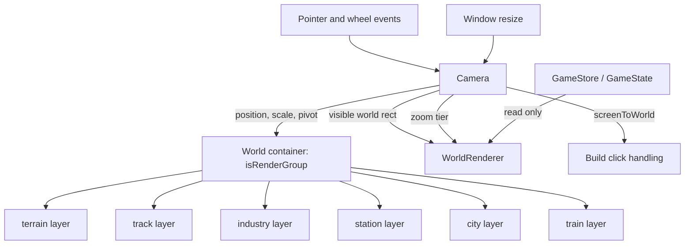
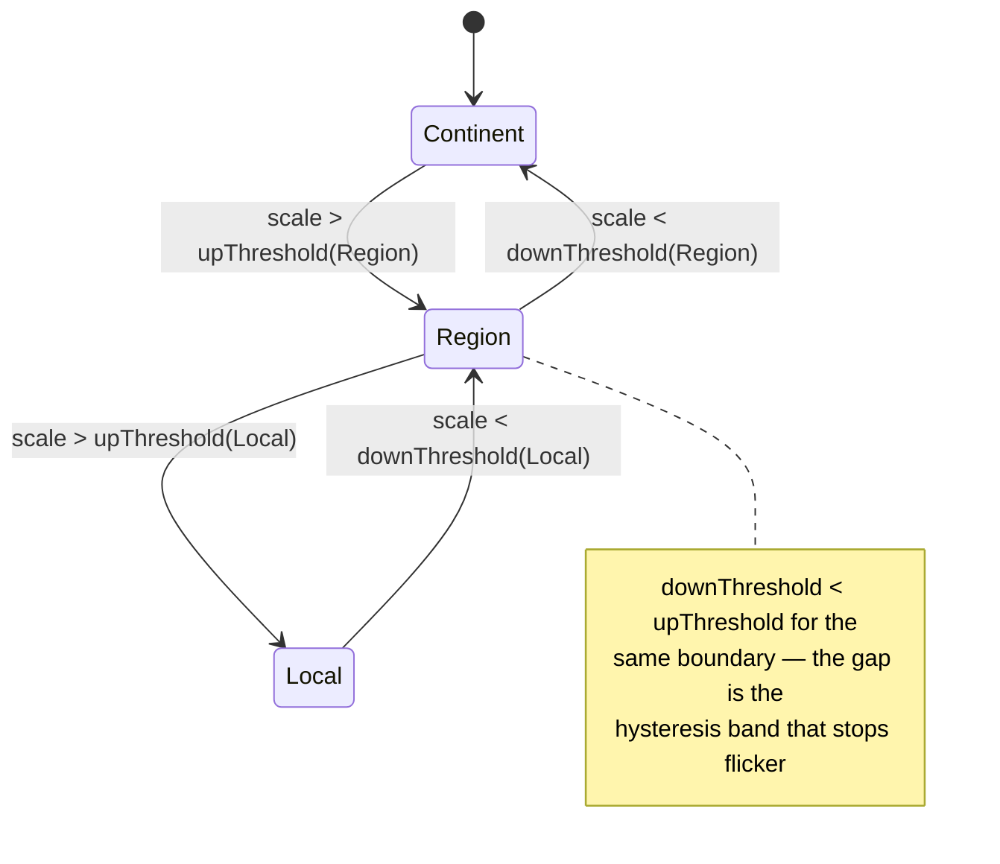

# Camera and Semantic Zoom - Plan

Milestone 1 of 6. See `docs/plans/2026-07-18-001-feat-two-scale-world-and-districts-plan.md` for the umbrella Product Contract and the full milestone sequence.

## Goal Capsule

- **Objective:** Put the world behind a pannable, zoomable camera and make zoom change what the map shows rather than only how big it is. Ship the interaction substrate every later milestone depends on.
- **Product authority:** Solo creator / product owner (mikejestes@gmail.com).
- **Open blockers:** None.
- **Execution profile:** Rendering and input work with no simulation changes. The sim kernel is not touched; `GameState` gains no fields.
- **Stop conditions:** Stop and surface if camera state appears to need a home inside `GameState` — that would change the serialization and determinism contract (origin plan KTD2) and is out of scope here.

---

## Product Contract

**Product Contract preservation:** changed — R1 reworded. The umbrella plan's R1 read "the map fills the browser window and responds to window resize," which is already true: `src/render/mapRenderer.ts:19` passes `resizeTo: container` and `index.html:9-10` places `#map-canvas` at `inset: 0` in a full-viewport root. The canvas already fills the window; the *world* does not, because it draws at a fixed 22px per tile. R1 now states the actual gap.

### Summary

Introduce a camera: a transformable world container with pan, cursor-anchored wheel zoom, and a discrete zoom-tier model that swaps what each entity draws as instead of scaling it. Render industries, which are simulated but currently invisible.

### Problem Frame

The world container is added straight to the stage and its transform is never touched (`src/main.ts:42-43`). Everything draws at a hardcoded `TILE_PX = 22` (`src/main.ts:22`), and the pointer handler recovers tile coordinates by dividing screen pixels by that constant (`src/main.ts:66-68`). There is no camera, no pan, no zoom, and no world-to-screen transform anywhere in `src/`.

The consequence is a 880×616 pixel map floating in a full-window canvas, with no way to look closer at anything. Every later milestone — terrain detail, districts, land value — assumes the player can get close enough to see it.

Twenty-six industry sites are generated and simulated (`src/world/generate.ts:62-85`) and none are drawn. `src/render/worldRenderer.ts` has five layers and none reads `state.industries`.

### Requirements

- R1. The rendered world scales to fill the available viewport rather than drawing at a fixed pixel-per-tile, and re-fits on window resize.
- R2. The player can pan the map by dragging.
- R3. The player can zoom continuously with the wheel, and the world point under the cursor stays under the cursor across the zoom.
- R4. Zoom is bounded — the player cannot zoom past a useful maximum or minimum, and cannot pan the world entirely off screen.
- R5. What an entity draws as changes with zoom tier, not just how large it is.
- R6. Zoom-tier transitions do not flicker when the camera rests near a tier boundary.
- R7. Industry sites are visible at the zoom tiers where they are meaningful.
- R8. Camera state is view state: it is never added to `GameState`, never serialized, and never affects simulation determinism.

### Acceptance Examples

- AE1. Cursor-anchored zoom. **Covers R3.** **Given** the cursor rests over a specific city, **when** the player zooms in and out repeatedly, **then** that city stays under the cursor throughout.
- AE2. Tier boundary is stable. **Covers R6.** **Given** the camera sits exactly at a tier-transition zoom level, **when** the zoom is nudged back and forth by a small amount, **then** the representation does not flicker between tiers.
- AE3. Determinism is untouched. **Covers R8.** **Given** two runs from the same seed, one with heavy camera movement and one with none, **when** both are serialized after the same number of ticks, **then** the output is byte-identical.

### Success Criteria

- The map is legible and navigable at every zoom level the camera allows.
- Panning a full world stays smooth on a mid-range laptop.
- The camera is usable by later milestones without modification — terrain chunking and district rendering consume its visible-region query rather than reimplementing it.

### Scope Boundaries

- No terrain changes. The 40×28 grid and its three terrain types are untouched; milestone 2 replaces them.
- No new simulation state, systems, or intents.
- No district or street-level content. Tier definitions anticipate it; nothing renders it yet.
- No touch, pinch, or mobile input — desktop mouse and trackpad only, per the origin product contract's desktop-browser scope.

---

## Planning Contract

### Key Technical Decisions

- KTD1. **Hand-roll the camera; do not adopt `pixi-viewport`.** The library is genuinely v8-compatible (v6.0.3, MIT, `pixi.js >=8` peer dep) but has had no code commits since 2024-11-27 — roughly 20 months — while PixiJS shipped 13 minor releases, and it carries 144 open issues. The camera here is a few hundred lines and has to drive zoom-tier dispatch, which the library does not model. Adopting a dormant dependency for code we would still have to extend is the worse trade.

- KTD2. **The world container is a render group.** `new Container({ isRenderGroup: true })` moves pan and zoom transforms to the GPU, so camera movement costs near-zero CPU regardless of child count. This is the v8 feature that makes a large world pannable, and it becomes load-bearing in milestone 2. Render groups do not batch with each other, so exactly one is used for the world — not one per layer.

- KTD3. **Camera state lives in the render layer, never in `GameState`.** `GameState` is serialized wholesale and byte-equality is the determinism oracle (`src/sim/state.ts:100-116`, origin plan KTD2). Putting a camera in it would make every pan a save-state change and break the determinism gate. The camera is a plain class owned by the boot sequence.

- KTD4. **Semantic zoom over magnification.** Zoom changes an entity's representation, not its size. This is the Pad++ semantic-zoom model that web maps standardized on: zooming out removes and merges rather than shrinking. It is also what makes the later district work legible — a district is a different representation of a city, not a bigger one.

- KTD5. **Discrete zoom tiers with hysteresis, not continuous LOD.** A fixed set of representations, selected by zoom with an asymmetric threshold: transition down at a lower zoom than the one you transition back up at. Continuous LOD suits terrain meshes, not 2D tile games, and a single threshold produces visible flicker when the camera rests on it.

- KTD6. **Stroke widths and marker radii divide by camera scale.** PixiJS does not compensate stroke width for a scaled parent, so a 3px track line becomes 30px at 10× zoom. Every stroke and marker size in `worldRenderer.ts` becomes a function of the current scale.

- KTD7. **Verify with coordinate math and state, not pixels.** The repo has no rendering tests by policy, and `docs/solutions/ui-bugs/react-frozen-ui-over-mutable-store-state.md` records that screenshots failed to catch a total UI freeze. Camera correctness is proven by unit-testing the transform functions directly and by asserting camera state through the debug hook.

### High-Level Technical Design

The camera owns the transform and answers two queries the renderer needs: the visible world rectangle and the current zoom tier. It never reads or writes simulation state. Build clicks invert the camera transform instead of dividing by a constant.

Tier selection with hysteresis, directional:

### Assumptions

- PixiJS resolves to 8.19.0 under the existing `^8.6.0` range, so render groups, the v8 culling API, and `ParticleContainer` are all available. Verify at implementation with `npm ls pixi.js`.
- `cullArea`'s coordinate space is documented inconsistently across sources (the API docs say local, at least one deep-dive says global). This plan does not depend on it — visible chunks are computed arithmetically — but if generic culling is used later, verify empirically first.
- Three zoom tiers are enough for this milestone. Milestone 4 likely adds a street tier; the tier list is data, so adding one is not a structural change.

### Sequencing

U1 → U2 → U3 must land in order; the transform must exist before zoom, and zoom before hit-testing can be inverted correctly. U4 and U5 depend on U2. U6 and U7 can land any time after U3.

---

## Implementation Units

### U1. World container transform and pan

- **Goal:** Introduce a `Camera` that owns the world container's transform, fits the world to the viewport, and supports drag-to-pan.
- **Requirements:** R1, R2, R8
- **Dependencies:** none
- **Files:**
  - `src/render/camera.ts` (create)
  - `src/render/mapRenderer.ts` (modify — expose `app.screen` / resize events to the camera)
  - `src/main.ts` (modify — construct the camera, wire pointer drag, drop the fixed `TILE_PX` render path)
  - `tests/render/camera.test.ts` (create)
- **Approach:** `Camera` holds a reference to the world `Container` and exposes `screenToWorld`, `worldToScreen`, `fitToViewport(worldWidth, worldHeight, screenRect)`, `panBy(dxScreen, dyScreen)`, and `visibleWorldRect()`. Construct the world container with `{ isRenderGroup: true }` per KTD2. `fitToViewport` replaces the fixed `TILE_PX` constant: the initial scale is whatever makes the world fill the shorter viewport axis. Pointer drag listens on the canvas element, consistent with the existing handler; a drag that moves beyond a small threshold suppresses the build click so panning does not lay track.
- **Patterns to follow:** File docblock stating why the design is what it is, citing KTD ids, per every file in `src/` (e.g. `src/sim/rng.ts:1-9`). Imports carry explicit `.ts` extensions. Tuning constants are `SCREAMING_SNAKE` exported from the module that owns them so tests import rather than duplicate them (`src/sim/systems/production.ts:14-15`).
- **Test scenarios:**
  - `screenToWorld` and `worldToScreen` round-trip to the original point within floating-point tolerance, at unit scale and at a non-unit scale.
  - `fitToViewport` on a wide viewport and a tall viewport both produce a scale where the whole world is visible and centered.
  - `panBy` moves the visible world rect by exactly the screen delta divided by scale.
  - `visibleWorldRect` on a viewport smaller than the world returns a sub-rect; on a viewport larger than the world it returns a rect containing the world.
  - A drag shorter than the click threshold is not treated as a pan.
- **Verification:** Dragging moves the map; the world fills the window at boot and re-fits on resize; `npm run typecheck` is clean.

### U2. Cursor-anchored wheel zoom

- **Goal:** Wheel zoom that keeps the world point under the cursor fixed, with bounded scale.
- **Requirements:** R3, R4
- **Dependencies:** U1
- **Files:**
  - `src/render/camera.ts` (modify)
  - `src/main.ts` (modify — wheel listener)
  - `tests/render/camera.test.ts` (modify)
- **Approach:** `zoomAt(screenPoint, factor)` reads the world point under the cursor, applies the new scale, then restores the world point to that screen position. Zoom steps are multiplicative (`scale *= factor`) so zooming feels linear in log space; additive steps feel wrong at the extremes. Normalize `WheelEvent.deltaMode` — trackpads report pixels, mice often report lines — before deriving the factor. Clamp scale to `MIN_SCALE`/`MAX_SCALE` and clamp the camera position so the world cannot be panned entirely out of view.
- **Test scenarios:**
  - Covers AE1. Zooming in at a screen point leaves `screenToWorld(point)` unchanged before and after.
  - The same holds zooming out, and after a sequence of alternating zoom in/out steps.
  - Zooming at the viewport corner, not just the center, preserves the anchor.
  - Scale clamps at `MIN_SCALE` and `MAX_SCALE` and does not overshoot on a large wheel delta.
  - A `deltaMode` of line units and of pixel units producing the same intended zoom yield the same resulting scale.
  - Position clamping keeps at least part of the world within the viewport after an extreme pan.
- **Verification:** Wheel zoom tracks the cursor; the map cannot be lost off screen or inverted.

### U3. Hit-testing through the camera transform

- **Goal:** Build clicks resolve to tile coordinates through the camera instead of dividing by a constant.
- **Requirements:** R2, R3
- **Dependencies:** U1, U2
- **Files:**
  - `src/main.ts` (modify — replace the `TILE_PX` division at `:66-68`)
  - `tests/render/camera.test.ts` (modify)
- **Approach:** The pointer handler converts client coordinates to world coordinates via the camera, then floors to tile coordinates. Keep the existing intent dispatch path unchanged — this unit changes only how `x, y` are derived. Note that `applyIntent`'s switch has no `default` and no exhaustiveness assert (`src/store/applyIntents.ts:36-46`), so add a `default` that throws on an unhandled kind; later milestones add several intents and a silent no-op is the failure mode to avoid.
- **Test scenarios:**
  - A click at a known screen position resolves to the expected tile at unit scale, and to a different expected tile after zooming and panning.
  - Clicks at tile boundaries floor consistently and never produce a tile outside world bounds.
  - `applyIntent` with an unrecognized `kind` throws rather than silently doing nothing.
- **Verification:** Station and track placement land where the player clicks at any zoom and pan.

### U4. Zoom tiers with hysteresis

- **Goal:** A tier model that maps camera scale to a named representation tier and does not flicker at boundaries.
- **Requirements:** R5, R6
- **Dependencies:** U2
- **Files:**
  - `src/render/zoomTiers.ts` (create)
  - `src/render/camera.ts` (modify — expose current tier)
  - `tests/render/zoomTiers.test.ts` (create)
- **Approach:** Tiers are a data array of `{ id, upThreshold, downThreshold }` where `downThreshold < upThreshold` for the same boundary. `tierFor(scale, currentTier)` is a pure function taking the current tier so the hysteresis band applies directionally — this is why it cannot be a plain scale lookup. Three tiers to start: `continent`, `region`, `local`.
- **Test scenarios:**
  - Covers AE2. Scale inside the hysteresis band returns the current tier regardless of which side it approached from.
  - Crossing `upThreshold` from below advances the tier; crossing `downThreshold` from above retreats it.
  - Oscillating scale within the band across many calls never changes tier.
  - Scale below the lowest and above the highest threshold clamps to the end tiers.
  - `tierFor` is pure — the same inputs always return the same tier.
- **Verification:** Slowly zooming through a boundary swaps representation once, with no visible flicker on a rested camera.

### U5. Semantic representations per tier

- **Goal:** Cities, stations, track, and trains draw differently per tier rather than scaling uniformly.
- **Requirements:** R5, R7
- **Dependencies:** U4
- **Files:**
  - `src/render/worldRenderer.ts` (modify — accept camera, branch on tier, compensate stroke widths)
  - `src/main.ts` (modify — pass camera to `render`)
- **Approach:** `render(state, camera)` reads the tier and the visible world rect. At `continent`, cities are demand-tinted dots and labels are suppressed below a population threshold to avoid clutter; at `region`, cities gain labels and stations gain visible catchment outlines; at `local`, stations and trains gain distinguishable shapes. All stroke widths and marker radii divide by `camera.scale` per KTD6. Skip drawing entities outside the visible world rect — for a small entity count this is a cheap bounds check, not generic culling. Follow the precedent from commit `70130e2`, where a separate `DemandOverlay` renderer was folded into `WorldRenderer` rather than accumulating parallel renderers.
- **Execution note:** The city-dot `Graphics` is currently reallocated per city per frame and the removed children are never destroyed (`src/render/worldRenderer.ts:75-87`). Cache and reuse per city the way `labelFor` already caches `Text` objects; leaving the reallocation in place will compound badly under the higher entity counts later milestones bring.
- **Test scenarios:** `Test expectation: none for the draw calls themselves` — the repo has no rendering tests by policy (`tests/ui/panels.test.ts:7-11`). The tier-selection and visibility-culling logic must be extracted as pure functions and covered:
  - A visible-bounds predicate includes entities inside the visible rect and excludes ones outside it, with a margin so entities do not pop at the edge.
  - Scale-compensated stroke width returns a constant apparent width across several scales.
  - The label-suppression predicate hides small-city labels at `continent` and shows them at `region`.
- **Verification:** Zooming from continent to local visibly changes what is drawn, not just its size; line weights stay visually constant across zoom.

### U6. Render industries

- **Goal:** Draw the 26 simulated industry sites, which are currently invisible.
- **Requirements:** R7
- **Dependencies:** U5
- **Files:**
  - `src/render/worldRenderer.ts` (modify — add an industry layer between track and stations)
  - `src/store/selectors.ts` (modify — add an industry read-model selector if the renderer needs derived state)
  - `tests/store/selectors.test.ts` (modify)
- **Approach:** Industries render as distinct marks per `IndustryType`, hidden at `continent` tier and shown from `region` inward. Raw extractors and processors read differently so the supply chain is visible at a glance. If the renderer needs anything beyond raw fields — output stock relative to cap, or whether a processor is starved of inputs — add it as a pure selector in `src/store/selectors.ts` following the existing pattern, rather than computing it inside the renderer.
- **Test scenarios:**
  - A starved-processor selector returns true when input stock is below the recipe requirement and false when it is sufficient.
  - An output-pressure selector returns a normalized value that reaches its maximum exactly at `OUTPUT_CAP`, importing the constant rather than duplicating it.
- **Verification:** Zooming to region tier shows mines, farms, and mills on the map, and a starved mill is visually distinguishable from a running one.

### U7. Camera affordances on the debug hook

- **Goal:** Make camera state assertable by a browser driver, consistent with the project's verify-on-state rule.
- **Requirements:** R8
- **Dependencies:** U3
- **Files:**
  - `src/dev/debugHook.ts` (modify — extend `DebugApi` and `summary()`)
  - `src/main.ts` (modify — pass the camera into `installDebugHook`)
- **Approach:** Expose `camera` with a getter for scale, tier, and visible world rect, plus `setCamera({ x, y, scale })` for driving deterministic checks. Extend `summary()` with `scale` and `tier`. Follow the `buyTrain` precedent from commit `abad898` — one validated code path rather than a second unvalidated entry point.
- **Test scenarios:** `Test expectation: none -- dev-only hook, guarded by import.meta.env.DEV and excluded from production builds.`
- **Verification:** `window.__game.summary()` reports scale and tier; `setCamera` moves the view and the reported visible rect matches.

---

## Verification Contract

| Gate | Command | Applies to | Signal |
|---|---|---|---|
| Type check | `npm run typecheck` | all units | clean |
| Unit tests | `npm test` | all units | 16+ files pass; new `tests/render/` suite green |
| Determinism | `npm test` (`tests/sim/tick.test.ts`, `tests/persistence/roundtrip.test.ts`) | U1, U7 | unchanged and green — camera work must not touch serialization |
| Build | `npm run build` | all units | succeeds (`tsc --noEmit && vite build`) |
| Manual smoke | `npm run dev` | U2, U5, U6 | drag pans; wheel zooms to cursor; representations change across tiers; industries visible |

The determinism gate is the load-bearing one for this milestone. Camera work has no legitimate reason to change serialized output; if the determinism tests move, something has leaked into `GameState`.

Follow the repo's test conventions: `describe` blocks name the behavior plus the decision id (`describe('camera transform (KTD3)', ...)`), `it` strings assert the product claim in prose and carry an `AE<N>:` prefix where they enforce an Acceptance Example, and local factory functions build fixtures with no shared setup or mocks.

## Definition of Done

**Global**

- The player can pan and zoom the map, and zoom changes what is drawn (R1–R7).
- Industry sites are visible (R7).
- `GameState` is unchanged; camera state is not serialized and the determinism gate is green (R8).
- Every Acceptance Example (AE1–AE3) has a passing test.
- The Verification Contract passes: type check, unit tests, determinism, build.
- Abandoned-attempt code from exploration is removed — no unused camera experiments or commented-out transform paths left in the diff.

**Per unit**

- Each unit meets its Verification line and its test scenarios pass. U1–U4 carry real coordinate-math tests; U5 and U6 carry tests for their extracted pure predicates and selectors; U7 is a dev-only hook with no test expectation.
- New files carry a header docblock stating the design rationale and citing the KTD ids they implement, matching the convention in every existing `src/` file.
