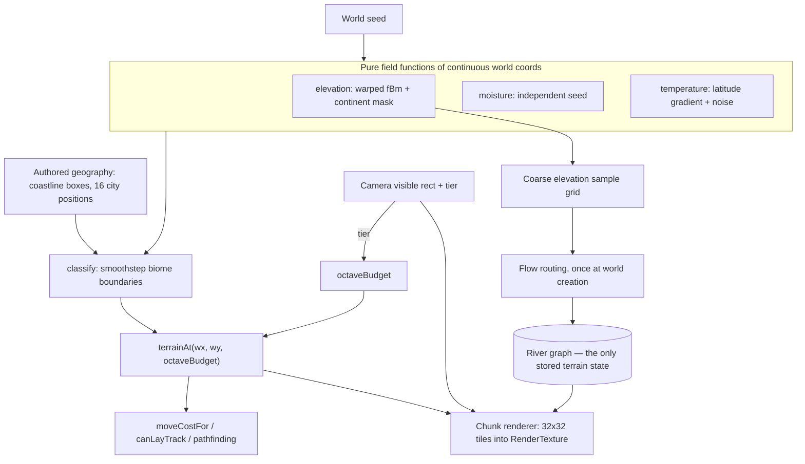
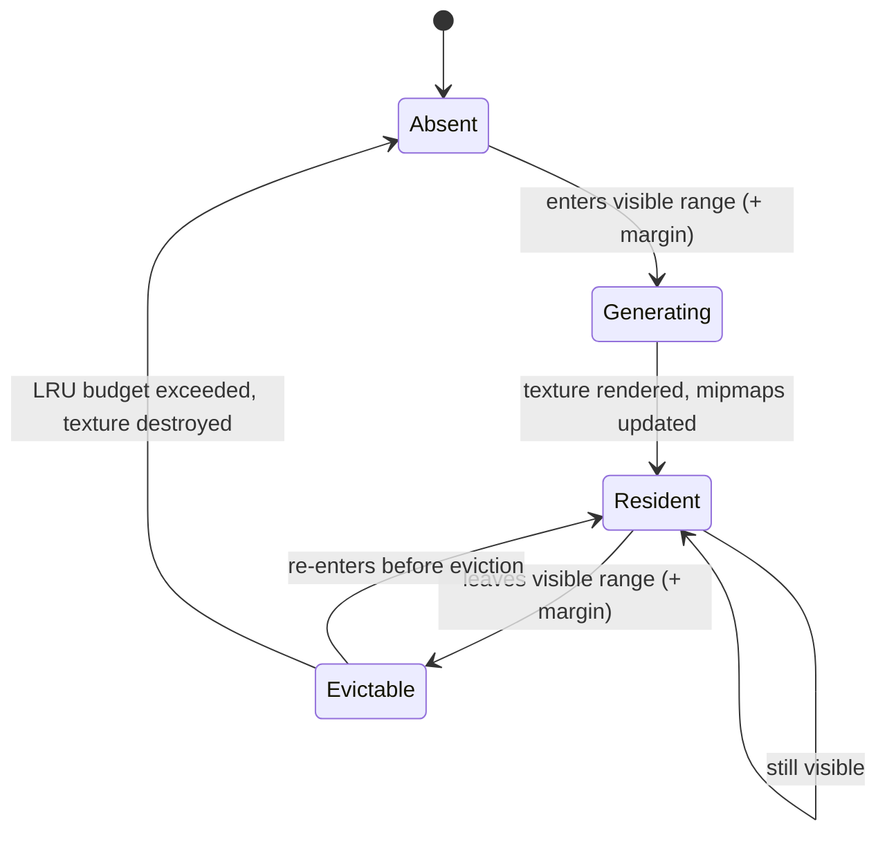

# Procedural Terrain Substrate - Plan

Milestone 2 of 6. Depends on milestone 1 (`docs/plans/2026-07-18-002-feat-camera-and-semantic-zoom-plan.md`). See `docs/plans/2026-07-18-001-feat-two-scale-world-and-districts-plan.md` for the umbrella Product Contract.

## Goal Capsule

- **Objective:** Replace the stored three-type terrain array with continuous terrain fields evaluated from world coordinates, so the map carries real variety at any resolution without growing the save.
- **Product authority:** Solo creator / product owner (mikejestes@gmail.com).
- **Open blockers:** None.
- **Execution profile:** Changes the world model and the serialization contract. The determinism gate is the primary risk surface throughout.
- **Stop conditions:** Stop and surface if terrain field evaluation cannot meet the per-chunk budget, or if recognizable European geography cannot be preserved under generation — both would reopen decisions the umbrella Product Contract treats as settled.

---

## Product Contract

**Product Contract preservation:** changed — R25 amended. The umbrella plan states all terrain is derivable from seed and position and never stored. Rivers are the exception: a river must flow monotonically downhill and accumulate upstream flow, both of which need neighbor knowledge and cannot be evaluated per coordinate. A coarse river graph is computed once at world creation and stored. Everything else remains derivable. The exception is bounded — kilobytes, not megabytes — and does not change the character of the decision.

### Summary

Define terrain as pure functions of continuous world coordinates — elevation, moisture, temperature — layered with fractal noise and domain warping, anchored beneath authored European geography. Render it as chunked render textures. Store nothing except a coarse river graph.

### Problem Frame

Terrain today is three types derived from seven hand-drawn lon/lat boxes (`src/world/geography.ts:47-74`), materialized into a flat array of 1,120 values (`src/world/generate.ts:26-31`) and serialized whole (`src/sim/state.ts:100`). Mountains exist in exactly two boxes on the continent. Every land tile is interchangeable, which is why routing has no decisions in it.

The stored-array approach cannot survive the zoom the previous milestone introduced: street-level detail across Europe is on the order of hundreds of millions of tiles. Storing that is impossible, and generating it into an array eagerly is equally impossible. Terrain has to become a function.

Resource placement compounds the problem — extractors are drawn uniformly at random from the land-tile list *with replacement* (`src/world/generate.ts:70`), so placement has no clustering, no spacing, and no geological logic, and two mines can occupy the same tile.

### Requirements

- R1. Terrain is a pure function of world seed and continuous world coordinates, evaluable at any point and any resolution without generating neighbors first.
- R2. Terrain sampled at a coarse resolution and at a fine resolution agrees — the same place is the same place at every zoom tier.
- R3. The terrain palette is wide enough that most of the map is worth routing around or through deliberately.
- R4. Terrain carries continuous elevation, not a discrete terrain-type label alone.
- R5. Mountain structure reads as plausible ranges with passes and valleys, not as isolated blobs.
- R6. Real European geography stays recognizable — coastlines and city positions remain authoritative over generated detail.
- R7. Rivers flow consistently downhill and reach the sea.
- R8. Resource placement has spatial logic — clustering, spacing, and plausible association with terrain.
- R9. The save does not grow with world resolution or with how much of the world the player has viewed.
- R10. The simulation remains deterministic: the same seed produces byte-identical serialized state.

### Acceptance Examples

- AE1. Multi-resolution coherence. **Covers R1, R2.** **Given** a world coordinate, **when** elevation is sampled directly and again as part of a coarse-grid evaluation and a fine-grid evaluation, **then** all three agree within the tolerance implied by octave truncation.
- AE2. Order independence. **Covers R1.** **Given** the same seed, **when** a set of coordinates is evaluated in one order and then in reverse, **then** every value is identical — no evaluation depends on prior calls.
- AE3. Geography survives generation. **Covers R6.** **Given** the generated world, **when** each of the 16 city positions is checked, **then** every city sits on land, and the coastline still reads as Europe at continent tier.
- AE4. Rivers reach the sea. **Covers R7.** **Given** the generated river graph, **when** each river is traced from source to mouth, **then** elevation is non-increasing along its length and it terminates at sea.
- AE5. Save stays flat. **Covers R9.** **Given** two saves from the same seed, one taken before any zooming and one after viewing several regions at the finest tier, **then** the two serialize to the same size.

### Success Criteria

- Laying a line across the continent involves visibly different terrain with different costs.
- Terrain generation meets a per-chunk budget that keeps panning smooth at every tier.
- The determinism gate stays green across the world-model change.

### Scope Boundaries

- No track-cost or surveying changes. Milestone 3 consumes elevation; this milestone only produces it.
- No street-level or district content. The fields support arbitrary resolution; nothing yet asks for it below the local tier.
- No erosion simulation, no tectonic modeling, no climate simulation. Domain-warped noise plus a coarse flow graph is the whole model.
- No GPU/shader terrain generation. CPU generation into chunk textures is sufficient at this scale and keeps the sim testable in Node.

---

## Planning Contract

### Key Technical Decisions

- KTD1. **Terrain is a function of continuous world coordinates, never of tile indices.** This single choice is what delivers multi-resolution coherence: sampling at any resolution is evaluating the same continuous field on a different grid, so tiers agree by construction with no stitching and no seams. Tile indices would bake a resolution into the definition and reintroduce the problem.

- KTD2. **Adopt `fastnoise-lite` (MIT) rather than hand-rolling noise.** It ships OpenSimplex2, fractal fBm/ridged modes, and domain warp in one MIT-licensed ESM package, and is ported from a single reference implementation to GLSL among others — so moving generation into a shader later produces identical output for the same seed. The alternative, `simplex-noise` v4 plus `alea`, is equally well maintained but requires hand-writing fBm and domain warp. Use separate instances for terrain and for warping: the library's docs warn that domain-warp settings also affect ordinary noise on the same instance.

- KTD3. **Domain-warp the elevation field.** `f(p + fbm(p))` rather than plain `fbm(p)`. Plain fractal noise produces undifferentiated blobby hills; domain warping produces the elongated, folded ridge structures that read as real mountain ranges — and those are exactly what create passes, valleys, and detours worth routing around. This is the highest visual and gameplay return per line of code in the milestone, at roughly 3× the noise evaluations, paid once per chunk.

- KTD4. **Truncate octaves by zoom tier.** At any tier, include only octaves whose wavelength exceeds a couple of screen pixels. Higher octaves contribute sub-pixel detail that cannot be seen and would only alias. Because fBm amplitudes decay geometrically, dropping high octaves shifts the value by a bounded, small amount — so tiers agree visually and the crossfade between them is seamless. This is a free LOD scheme and a large performance win when zoomed out.

- KTD5. **Authored geography is a mask over generated fields, not a competitor to them.** Real coastlines and the 16 real city positions stay authoritative; generation supplies elevation, moisture, and detail *beneath* that authority. The alternative — generating coastlines outright — would forfeit the recognizable-Europe requirement the origin product contract treats as identity. The existing `geography.ts` header already anticipates this: swapping in a real landmask is documented as a change to `terrainAt` alone.

- KTD6. **Rivers are a coarse precomputed graph, stored; everything else is derived.** Flow accumulation is inherently non-local and cannot be made per-coordinate stateless. Sampling elevation on a coarse grid, routing flow over that low-resolution field once at world creation, and storing the resulting polyline graph preserves statelessness for terrain while producing hydrologically correct rivers. The graph is kilobytes. Ridged-noise fake rivers were rejected: they neither connect to the sea nor flow downhill, which AE4 exists to prevent.

- KTD7. **Render terrain as chunked render textures, never as per-tile `Graphics`.** The current renderer emits one `.rect().fill()` per tile (`src/render/worldRenderer.ts:44-50`), which is a documented PixiJS performance cliff — cost scales with draw calls, and adding strokes to fills breaks batching entirely. Each chunk renders its tiles once into a `RenderTexture` and thereafter draws as a single sprite. Chunk size 32×32 tiles, following Factorio's long-proven choice. In PixiJS v8 mipmaps are no longer auto-generated on a schedule: call `source.updateMipmaps()` when chunk content is ready, or minified chunks will shimmer during pan.

- KTD8. **Compute visible chunks arithmetically; do not use the generic `Culler`.** For a regular grid the visible chunk range falls directly out of the camera's visible world rect. Generic culling exists for irregular scenes and would pay for bounds walks that arithmetic gives for free. This also sidesteps the documented ambiguity in `cullArea`'s coordinate space.

- KTD9. **Bump `SCHEMA_VERSION` to 2 and let old saves fail loudly.** `World.terrain` stops being a stored array, which is a breaking format change. `migrate()` already throws on version mismatch (`src/persistence/saveStore.ts:47-51`), and there is no save UI, no autosave, and no load path in the running app today — persistence is exercised only by tests. Writing a migration for saves that cannot exist would be speculative work.

### High-Level Technical Design

Terrain has two consumers with different needs. The renderer wants chunks at a tier-appropriate octave budget. The simulation wants exact values at specific tiles and must always use the full octave budget — a train's route cost cannot depend on where the camera is pointing.

Chunk lifecycle:

### Assumptions

- A 32×32-tile chunk at 32px per tile is a 1024×1024 RGBA texture, roughly 4MB of VRAM. The resident-chunk budget must be explicit and enforced by LRU eviction; assume a few dozen resident chunks, tuned against the visible range at the finest tier.
- Domain-warped fBm at ~10 octaves for a 1,024-tile chunk is affordable on the main thread. Factorio reports comparable generation at ~2.83ms per chunk. If measurement contradicts this, a Web Worker is the escape hatch and the origin plan's KTD2 already keeps the kernel worker-ready.
- Lacunarity of exactly 2.0 can produce axis-aligned artifacts; use 1.97 or 2.03.
- `fastnoise-lite` builds a seeded permutation table per instance at construction. It is pure after construction, which satisfies R1 — but it is not literally table-free, so a future GLSL port must use the matching FastNoiseLite GLSL implementation rather than assuming a hash-only formulation.

### Sequencing

U1 → U2 → U3 must land in order — fields, then classification, then the authored overlay. U4 depends on U3. U5 depends on U1 only, and can land in parallel with U2–U4. U6 depends on U2. U7 closes the milestone and depends on everything.

---

## Implementation Units

### U1. Terrain field functions

- **Goal:** Pure elevation, moisture, and temperature fields over continuous world coordinates, with a configurable octave budget.
- **Requirements:** R1, R2, R4, R5
- **Dependencies:** none
- **Files:**
  - `src/world/fields.ts` (create)
  - `package.json` (modify — add `fastnoise-lite`)
  - `tests/world/fields.test.ts` (create)
- **Approach:** Build noise instances once from the world seed and export `elevationAt(wx, wy, octaves)`, `moistureAt(wx, wy)`, `temperatureAt(wx, wy)`. Elevation composes a low-frequency continent mask with domain-warped fBm per KTD3, using separate seed offsets per octave so octaves do not correlate. Moisture and temperature use independent seeds; temperature adds a latitude gradient so the north/south difference is real rather than noise. All three take world coordinates as floats — never tile indices, per KTD1. Export `MIN_ELEVATION`, `MAX_ELEVATION`, `SEA_LEVEL`, and the octave defaults as `SCREAMING_SNAKE` constants so tests import rather than duplicate them.
- **Test scenarios:**
  - Covers AE2. Evaluating a set of coordinates forward and then in reverse order produces identical values.
  - Covers AE1. `elevationAt(x, y, fullOctaves)` and `elevationAt(x, y, truncatedOctaves)` differ by less than the bound implied by geometric amplitude decay.
  - The same seed produces identical values across two separately constructed field sets; different seeds produce different values at the same coordinate.
  - Elevation stays within `[MIN_ELEVATION, MAX_ELEVATION]` across a large sample of coordinates.
  - Fractional coordinates between two integer lattice points return values between them — the field is continuous, not stepped.
  - Temperature decreases with latitude on average across a north-south transect.
- **Verification:** Field functions are deterministic, bounded, continuous, and order-independent under test.

### U2. Terrain palette and biome classification

- **Goal:** Classify the fields into a terrain palette wide enough to make routing interesting.
- **Requirements:** R3, R4
- **Dependencies:** U1
- **Files:**
  - `src/world/geography.ts` (modify — widen `Terrain`, replace box-derived `terrainAt`, update `moveCostFor`)
  - `src/world/fields.ts` (modify — export the classifier)
  - `tests/world/terrain.test.ts` (create)
  - `tests/sim/track.test.ts` (modify — existing cost assertions will move)
- **Approach:** Widen `Terrain` beyond `land | sea | mountain` to a palette carrying at least sea, coast, plains, farmland, forest, marsh, hills, and mountain. Classification is a function of elevation, moisture, and temperature with smoothstep boundaries rather than hard cuts, so vegetation fades rather than snapping at a threshold. Extend `moveCostFor` to cover every new type; it currently returns 1 / 3 / Infinity (`src/world/geography.ts:77-86`) and is consumed by `segmentWeight` and pathfinding, so every new type needs a defensible cost. Keep the switch exhaustive — `noFallthroughCasesInSwitch` is on and TypeScript will catch a missing case if the return type is annotated.
- **Test scenarios:**
  - Every member of the `Terrain` union has a finite `moveCostFor` except sea, which is `Infinity`.
  - Elevation above the mountain threshold classifies as mountain regardless of moisture.
  - Elevation below sea level classifies as sea regardless of other fields.
  - High moisture at low elevation classifies as marsh; low moisture at moderate elevation does not.
  - Classification is stable across the smoothstep band — a coordinate does not oscillate between two biomes on repeated evaluation.
  - Existing track-cost tests still pass with mountain cost unchanged.
- **Verification:** The palette covers the map with plausible regional variation; `npm test` green including the existing track suite.

### U3. Authored geography anchoring

- **Goal:** Keep recognizable Europe authoritative over generated fields.
- **Requirements:** R6
- **Dependencies:** U2
- **Files:**
  - `src/world/geography.ts` (modify — land mask takes precedence over generated classification)
  - `src/world/generate.ts` (modify — drop the eager terrain array, keep city placement)
  - `src/sim/state.ts` (modify — `World` no longer carries `terrain`)
  - `tests/world/generate.test.ts` (modify)
- **Approach:** The authored land/sea boxes become a mask consulted first: a coordinate outside all land boxes is sea regardless of generated elevation, and a coordinate inside them is never sea. Generation then supplies elevation and biome *within* the authored landmass. City tiles remain forced to land as they are today (`src/world/generate.ts:36-40`). Remove `World.terrain` and the `terrain` field from `createGameState`; `World` retains only width, height, and whatever the field functions need. Update `tileIndex` consumers — `src/sim/model/track.ts:39-41` reads terrain by index and becomes a field call.
- **Execution note:** This unit changes the shape of `GameState`. Land it with the determinism and round-trip suites run before and after, so any serialization drift is attributed to this unit rather than discovered later.
- **Test scenarios:**
  - Covers AE3. All 16 city positions classify as land after generation.
  - A coordinate well inside the Atlantic classifies as sea; a coordinate well inside France does not.
  - The generated world contains at least four distinct terrain types across a sample transect — proving the palette is actually exercised, not collapsed to two types by the mask.
  - `serialize()` output no longer contains a terrain array, and the world round-trips through save/load unchanged.
- **Verification:** The continent still reads as Europe; `GameState` no longer carries terrain; determinism and round-trip suites green.

### U4. Chunked terrain rendering

- **Goal:** Draw terrain as chunk render textures sized to the camera's visible range, at a tier-appropriate octave budget.
- **Requirements:** R2, R3, R9
- **Dependencies:** U3, milestone 1 (camera)
- **Files:**
  - `src/render/terrainChunks.ts` (create)
  - `src/render/worldRenderer.ts` (modify — replace `drawTerrain` with the chunk manager)
  - `tests/render/chunks.test.ts` (create)
- **Approach:** A chunk manager owns a map of chunk key to `{ texture, sprite, tier, lastSeen }`. Each frame it computes the visible chunk range arithmetically from the camera's visible world rect plus a margin (KTD8), generates missing chunks, and evicts by LRU past a resident budget. Generation renders a chunk's tiles into a `RenderTexture` once and calls `source.updateMipmaps()` per KTD7. A chunk is keyed by position *and* tier, so changing tier requests different textures rather than rescaling stale ones. Destroy evicted textures explicitly — the existing renderer never destroys removed children, and at this scale that leaks.
- **Test scenarios:** Chunk generation touches the GPU and is not unit-testable in Node. Extract and cover the pure logic:
  - The visible-chunk-range function returns exactly the chunks overlapping a given world rect, plus the margin, for rects that align to chunk boundaries and rects that straddle them.
  - Chunk key encoding round-trips position and tier.
  - The LRU eviction selector returns the least-recently-seen chunks when over budget and returns nothing when under budget.
  - Eviction never selects a chunk in the current visible range.
  - The octave budget function returns fewer octaves at coarser tiers and is monotonic across tiers.
- **Verification:** Panning at any tier stays smooth; resident chunk count stays within budget; no VRAM growth across sustained panning.

### U5. River graph

- **Goal:** Rivers that flow downhill and reach the sea, computed once and stored.
- **Requirements:** R7
- **Dependencies:** U1
- **Files:**
  - `src/world/rivers.ts` (create)
  - `src/world/generate.ts` (modify — build the graph at generation)
  - `src/sim/state.ts` (modify — add the river graph to `GameState`)
  - `tests/world/rivers.test.ts` (create)
- **Approach:** Sample elevation on a coarse grid, compute flow direction per cell toward its lowest neighbor, accumulate upstream contribution, and emit polylines wherever accumulation exceeds a threshold. Store the resulting graph on `GameState` as plain arrays of coordinates — JSON-round-trippable per the serialization contract, with no NaN or Infinity sentinels, following the fix recorded in commit `36dfac7`. Rendering jitters the polyline with noise per tile so a river reads as sinuous rather than as coarse-grid segments. Rivers raise move cost and become crossings that milestone 3 prices as bridges.
- **Test scenarios:**
  - Covers AE4. Every river polyline has non-increasing elevation from source to mouth.
  - Every river terminates at a sea cell or joins another river.
  - No river forms a cycle.
  - The graph is deterministic — the same seed produces an identical graph, compared by serialization.
  - The graph round-trips through `serialize` and `deserializeSave` unchanged.
  - Graph size stays bounded — assert an upper bound on total vertex count so a pathological seed cannot produce an unbounded structure.
- **Verification:** Rivers visibly run from high ground to the coast and never run uphill.

### U6. Resource placement with spatial logic

- **Goal:** Place extractors with clustering, spacing, and terrain association instead of uniform random draws.
- **Requirements:** R8
- **Dependencies:** U2
- **Files:**
  - `src/world/generate.ts` (modify — replace `placeRawIndustries` and `nearbyLand`)
  - `tests/world/generate.test.ts` (modify)
- **Approach:** Replace the uniform draw-with-replacement at `src/world/generate.ts:65-74` with placement conditioned on terrain: coal and iron favor hills and mountains, farms favor farmland and plains, ranches favor plains. Use spot-noise-style placement — cone-shaped patches at consistent spacing, perturbed by the terrain fields so the lattice is not visible. Enforce a minimum separation so two extractors cannot share a tile, which the current code permits. Processor placement near cities keeps its current intent but gains the same spacing guarantee.
- **Test scenarios:**
  - No two industries occupy the same tile.
  - Every industry sits on a terrain type its recipe favors.
  - Minimum separation between same-type extractors is respected across a large sample of seeds.
  - Placement is deterministic per seed — two generations from the same seed produce identical industry arrays by serialization.
  - Every raw industry type is placed at least once, so no resource type can be absent from a run.
- **Verification:** Mines appear in hills, farms on farmland, and no two sites overlap.

### U7. Determinism, persistence, and schema migration

- **Goal:** Close the milestone with the serialization contract intact and the format bump handled.
- **Requirements:** R9, R10
- **Dependencies:** U3, U5, U6
- **Files:**
  - `src/sim/state.ts` (modify — `SCHEMA_VERSION` to 2)
  - `src/persistence/saveStore.ts` (modify — migration comment for the v1→v2 break)
  - `src/dev/debugHook.ts` (modify — expose terrain sampling for browser verification)
  - `tests/persistence/roundtrip.test.ts` (modify)
  - `tests/sim/tick.test.ts` (verify unchanged)
- **Approach:** Bump `SCHEMA_VERSION` to 2 per KTD9 and record in `migrate()` why v1 is unsupported rather than migrated. Add `terrainAt(x, y)` and `elevationAt(x, y)` to the debug hook so a browser driver can assert terrain by value rather than by screenshot, per the standing rule in `docs/solutions/`. Confirm the save is flat: a save taken after extensive viewing must serialize to the same size as one taken before.
- **Test scenarios:**
  - Covers AE5. Two saves from the same seed, one after sampling terrain across many coordinates, serialize to identical strings.
  - A v1 envelope throws a clear error naming both versions.
  - A v2 save round-trips and resumes byte-identically, matching the existing snapshot-and-replay pattern.
  - The full determinism suite passes unchanged — same seed, same tick count, byte-identical serialization.
- **Verification:** `npm test` green including determinism and round-trip; save size independent of viewing history.

---

## Verification Contract

| Gate | Command | Applies to | Signal |
|---|---|---|---|
| Type check | `npm run typecheck` | all units | clean |
| Unit tests | `npm test` | all units | all suites pass; new `tests/world/fields.test.ts`, `terrain.test.ts`, `rivers.test.ts` green |
| Determinism | `npm test` (`tests/sim/tick.test.ts`) | U3, U5, U6, U7 | byte-identical serialization across runs — treat a failure as a release blocker, not a flake |
| Round trip | `npm test` (`tests/persistence/roundtrip.test.ts`) | U3, U5, U7 | save/load resumes byte-identically at schema v2 |
| Build | `npm run build` | all units | succeeds |
| Manual smoke | `npm run dev` | U2, U4, U5, U6 | terrain shows regional variety; ranges read as ranges; rivers run to the sea; panning stays smooth at every tier |

The determinism gate carries this milestone. Terrain moves from stored data to computed data, which is exactly the change most likely to introduce order dependence or floating-point drift into serialized state.

Test conventions follow the repo: `describe` blocks name behavior plus decision id, `it` strings carry `AE<N>:` prefixes where they enforce an Acceptance Example, fixtures are local factory functions, tuning constants are imported from source rather than duplicated.

## Definition of Done

**Global**

- Terrain is a pure function of seed and continuous world coordinates, agreeing across resolutions (R1–R4).
- Mountain structure reads as ranges with passes; the palette makes most of the map worth routing around (R3, R5).
- Europe stays recognizable and every city sits on land (R6).
- Rivers flow downhill to the sea (R7).
- Resources are placed with clustering, spacing, and terrain association (R8).
- The save does not grow with resolution or viewing history, and determinism is byte-identical (R9, R10).
- Every Acceptance Example (AE1–AE5) has a passing test.
- The Verification Contract passes: type check, unit tests, determinism, round trip, build.
- Abandoned-attempt code is removed — no unused noise experiments, dead classification branches, or commented-out chunk strategies left in the diff.

**Per unit**

- Each unit meets its Verification line and its test scenarios pass. U1, U2, U3, U5, U6, and U7 carry real tests; U4 carries tests for its extracted pure logic, since chunk generation touches the GPU and the repo has no rendering tests by policy.
- New files carry a header docblock stating design rationale and citing KTD ids, matching the existing convention.
