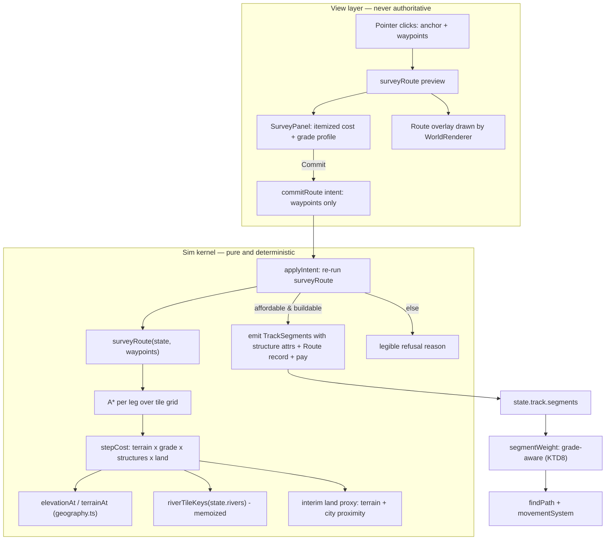
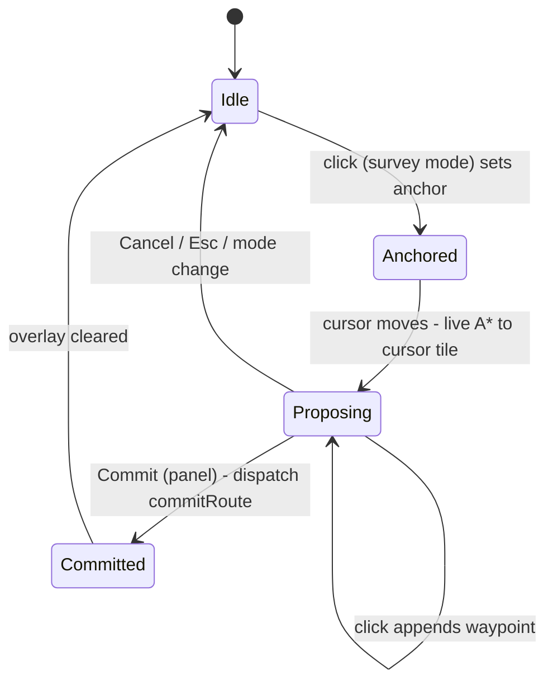

# Route Surveying and Track Economics - Plan

Milestone 3 of 6. Depends on milestone 2 (`docs/plans/2026-07-18-003-feat-procedural-terrain-substrate-plan.md`), which has shipped: `elevationAt(x, y)` and the eight-type terrain palette exist in `src/world/geography.ts`. See `docs/plans/2026-07-18-001-feat-two-scale-world-and-districts-plan.md` for the umbrella Product Contract.

## Goal Capsule

- **Objective:** Replace tile-by-tile track clicking with route surveying, and make the cost of a route depend on the terrain it crosses — so choosing where a line goes becomes the decision the player deliberates over.
- **Product authority:** Solo creator / product owner (mikejestes@gmail.com).
- **Open blockers:** None.
- **Execution profile:** Changes how track is created and adds the first player-facing route economics. The survey computation must live in the sim (headless, deterministic); the UI proposes, the sim disposes.
- **Stop conditions:** Stop and surface if the survey path cannot be recomputed deterministically inside `applyIntent` (it would break replay), or if grade derived from tile-level elevation turns out too noisy to read as a coherent profile — the latter would reopen milestone 2's field tuning.

---

## Product Contract

**Product Contract preservation:** changed — one interim amendment to Scope Boundaries. The requirements-only draft said land cost "derives from terrain alone" until milestone 5. This plan adds a city-proximity uplift to the interim land-cost proxy, because AE7's "expensive flat route across developed land" arm is otherwise untestable before milestone 5 lands. The uplift is a stand-in the milestone 5 land-value field replaces wholesale; no requirement text changed.

### Summary

The player picks two points; the game surveys a route across the elevation and cost fields, shows its price and grade profile, and lets the player adjust it before committing. Track cost becomes a function of terrain, grade, and the structures required to cross obstacles.

### Problem Frame

Track laying today chains individual adjacent tile clicks (the `buildMode === 'track'` branch of the pointerup handler in `src/main.ts`), and cost is a flat $50 per segment plus $100 when either endpoint is mountain (`TRACK_COST_PER_SEGMENT` / `MOUNTAIN_SURCHARGE` in `src/sim/model/track.ts`). Two things broke when milestone 2 landed. The cost model became vestigial: terrain now carries continuous elevation and eight biome types (`src/world/geography.ts`), and the two-term formula sees almost none of it — forest, marsh, and hills price identically to plains at build time. And the interaction is already at its limit: a Paris–Lyon line is a dozen deliberate clicks today and becomes thousands at any finer resolution.

Those failures share a fix. Surveying is not only the replacement interaction — it is the surface where terrain cost becomes legible, because the survey is where the player sees a number and reacts to it.

There is also a debt this milestone was always going to inherit: the river graph (`src/world/rivers.ts`) samples its own elevation field without the per-seed land-median offset or the authored landmask that `geography.ts` applies, and its own docblock defers reconciling the two "to whichever future unit wires rivers into rendering or track-crossing costs." That unit is here.

### Requirements

**Surveying**

- R1. The player lays track by choosing endpoints; the game proposes a route between them.
- R2. The proposed route is visible on the map before the player commits, with its total cost and its grade profile.
- R3. The player can adjust a proposed route — at minimum by adding intermediate waypoints — and see cost and grade update.
- R4. Committing a route is a distinct act, separate from proposing it.
- R5. A route that cannot be built is refused with a legible reason rather than silently failing.

**Cost and terrain**

- R6. Route cost varies with the terrain each segment crosses, across the full palette rather than a single mountain surcharge.
- R7. Steep grade costs more to build, so a route can trade length against gradient.
- R8. Crossing a river or a ravine requires a bridge; passing through high ground may require a tunnel or a cutting. Each is a priced choice surfaced during the survey.
- R9. Track cost includes the cost of the land it crosses, so routing through valuable land is more expensive than routing through hinterland.
- R10. Track carries no recurring maintenance cost. All track decisions are paid at build time.

**Operations**

- R11. Grade affects what a train can haul and how fast, so a cheap steep route has a standing operational consequence even though it has no standing financial one.
- R12. Existing track and stations remain valid — this milestone changes how track is created, not what track is.

### Acceptance Examples

- AE1. Neither route dominates. **Covers R6, R7, R9.** **Given** two candidate routes between the same cities, one short and steep across cheap land and one long and flat across developed land, **when** the player surveys both, **then** the costs and grade profiles differ and neither is strictly better.
- AE2. Grade has a running cost in kind. **Covers R11.** **Given** two completed routes of equal length, one flat and one steep, **when** the same train runs each with the same cargo, **then** the steep route is slower or carries less.
- AE3. Obstacles surface as choices. **Covers R8.** **Given** a proposed route crossing a river, **when** the player views the survey, **then** the bridge is itemized in the cost rather than folded invisibly into a per-segment rate.
- AE4. Refusal is legible. **Covers R5.** **Given** endpoints with no buildable path between them, **when** the player surveys, **then** the game says why rather than producing an empty route.

### Success Criteria

- Choosing a route is a decision the player hesitates over.
- A player can explain, from the survey alone, why one route costs more than another.
- Laying a continental line takes seconds, not hundreds of clicks.

### Scope Boundaries

- No district or land-value simulation. R9 consumes a land-value field; milestone 5 produces it. Until then, land cost derives from terrain plus a city-proximity proxy (see preservation note), and R9 is partially satisfied.
- No double track, gauge, signalling, or capacity modeling.
- No recurring maintenance — declined in the origin brainstorm and restated here as R10.
- No automatic route optimization beyond the proposed path; the player adjusts, the game does not re-plan around them.
- No construction time. Committing pays and builds in one act; milestone 6's charter mechanic owns "committed but not yet built" if it needs it.

---

## Planning Contract

### Key Technical Decisions

- KTD1. **A committed route is a first-class stored entity, not just the segments it emits.** (Resolves this plan's "resolve before enrichment" question.) `state.routes` carries `{ id, waypoints, path, costCents, committedDay }` with a serialized `nextRouteId` counter. The segments it emits into `state.track.segments` remain the graph trains run on — `src/sim/pathfinding.ts` is untouched. The route record is small, path-dependent state (exactly what the umbrella contract says the save is for), and milestone 6's speculation rights need a committed route to attach to. Storing only segments was rejected: reconstructing "which line is this" from an undifferentiated segment soup is exactly the kind of derivation that gets it wrong at the worst time.

- KTD2. **The sim recomputes the survey from waypoints inside `applyIntent`; the UI never sends segments or costs.** The `commitRoute` intent carries only the waypoint list. The sim re-runs the same pure survey function, re-derives path, structures, and cost, and pays from that. This keeps one source of truth: a stale UI proposal, a race with a concurrent state change, or a modified client cannot commit a route at the wrong price, and replaying an intent log stays byte-deterministic. The UI's survey call is a preview of the same function, so they cannot disagree.

- KTD3. **Survey pathfinding is A\* over the tile grid with build cost as the edge weight, run per leg between consecutive waypoints.** The grid is 40×28 (~1,120 tiles), so A\* is sub-millisecond and can run live on every cursor move. Waypoints constrain the path by construction — each leg is an independent A\* — which is simpler and more predictable than soft-constraint penalties. Determinism comes from fixed neighbor iteration order and a total tie-break (f-cost, then g-cost, then tile key), never from Map iteration order.

- KTD4. **Grade is derived from tile elevation at segment endpoints; structures are stored, grade is not.** `elevationAt(x, y)` (`src/world/geography.ts`) already exists at tile resolution with the per-seed offset applied. Grade per step = |Δelevation| / step length (diagonals are √2 long). Nothing about grade is stored — it is re-derived wherever needed, consistent with the terrain-is-a-function commitment. Structures *are* stored (KTD5) because they are player purchases that change effective grade.

- KTD5. **Structures are segment attributes, not separate entities.** (Resolves the deferred question.) `TrackSegment` gains an optional `structure?: 'bridge' | 'tunnel' | 'cutting'`. A bridge is required to cross a river tile; a tunnel or cutting is required where raw grade exceeds the unassisted maximum, and each caps the segment's *effective* grade (tunnel to ~0, cutting to a documented ceiling) for both pricing and operations. A separate structures array keyed to segments was rejected: it adds a join with no query that needs it. R12 holds — existing segments simply have no structure.

- KTD6. **The surveyor auto-selects the cheapest legal structure per obstacle and itemizes it; the player redirects with waypoints.** Where both a tunnel and a surface climb with cuttings are legal, the survey picks the cheaper total and lists it as a line item (AE3). The player's lever is the waypoint — moving the route, not micro-choosing per-obstacle hardware. A per-obstacle toggle UI was rejected for this milestone: it is real complexity, and the itemized breakdown plus waypoint control delivers R8's "priced choice" — the choice is *where the route goes*, with structures as the visible price of each choice.

- KTD7. **Rivers are rebased onto the elevation the game actually shows, then reconciled to the tile grid by intersection with `terrainAt`.** Two empirical facts, re-verified against the shipped code across a spread of seeds while deepening this plan, drive this: `buildRiverGraph` samples its own raw, un-offset `TerrainFields` instance rather than `geography.ts`'s `elevationAt`, so a large share of seeds produce *zero* rivers — a 12-seed spot check found 5 of 12 (not merely seed 1) — because the per-seed land-median offset in `geography.ts` never reaches it; and on seeds that do produce rivers, the share of river points landing on tiles the authored landmask classifies as sea is highly seed-dependent, from near-zero up past 80% in the same spot check, not a narrow band — which is exactly why this can't be left as a per-seed coincidence. So: (a) river generation moves onto the same offset tile elevation `geography.ts`'s `elevationAt` uses, with authored-mask sea accepted as a termination alongside field sea — one elevation source everywhere, rivers on every seed; this is a world-generation change covered by this milestone's schema bump, and it is the actual payment of the reconciliation debt `rivers.ts`'s docblock defers here. (b) A tile is a *crossable river tile* iff a river polyline passes through it and `terrainAt` classifies it as land — masked-sea points are unbuildable anyway and drop out. The derivation is a pure function of `state.rivers`, memoized by reference; nothing new is stored.

- KTD8. **Grade enters operations through `segmentWeight`.** A steeper segment gets a higher traversal weight — `weight = dist × terrainCost × (1 + k × effectiveGrade)` — which both slows trains (movement spends speed budget against weight) and steers `findPath` toward gentler routes when alternatives exist, with no changes to the movement system itself. Coupling grade to engine power (`Engine.power`) was considered and deferred: it doubles the tuning surface for an effect the weight multiplier already delivers, and AE2 is satisfiable with "slower" alone.

- KTD9. **Survey preview state is view state, never `GameState`.** The in-progress survey (anchor, waypoints, live proposal) lives beside the camera in the boot scope, mirroring milestone 1's camera rule: it would otherwise turn every cursor move into a save-state change. `WorldRenderer.render` accepts an optional overlay argument describing the proposal to draw; committing dispatches the intent and clears the overlay.

- KTD10. **Bump `SCHEMA_VERSION` (+1 from current) and let old saves fail loudly.** `state.routes`, `nextRouteId`, and the optional `TrackSegment.structure` field change the stored shape. `migrate()` already refuses version mismatches, there is still no save UI or load path in the running app, and the precedent (KTD9 of the terrain milestone) is directly on point.

### High-Level Technical Design

The survey function is called twice with the same arguments — once by the UI for preview, once by the sim at commit — which is what makes the preview trustworthy without making it authoritative.

Survey interaction state machine (view layer):

### Assumptions

- The survey operates on the existing 40×28 tile grid. Milestones 4–5 add street-scale *rendering*, not a finer routing grid; if routing resolution ever changes, A\* over a cost field is the representation that survives that change.
- Tile-level `elevationAt` differences between adjacent tiles produce usable grade signal. Milestone 2's `REFERENCE_FIELD_SCALE = 64` means adjacent tiles sample well-separated field points, so Δelevation is real structure, not noise floor. If profiles read as jagged in practice, smooth the *displayed* profile only — cost and operations keep the raw derivation.
- Cost constants below are starting points to be tuned during implementation against AE1 (both example routes must be viable). Terrain build-cost factors track `moveCostFor`'s actual ordering, confirmed against `geography.ts` while deepening this plan: plains/coast/farmland = 1, forest/hills = 2 (tied), mountain = 3, marsh = 4 — marsh is `moveCostFor`'s single most expensive terrain, above mountain. Build-cost starting points: plains/coast/farmland cheapest; forest ~1.5×; hills ~2×; mountain ~3× before grade and structures; marsh highest of the palette, ~3.5× (drainage) — above mountain, matching `moveCostFor` rather than reversing it.
- The interim land proxy prices tiles near cities upward (falloff over a few tiles, scaled by `sizeTier`) so AE7/AE1's "developed land" arm is real before milestone 5. It is replaced, not extended, by milestone 5's land-value field.
- `layTrack`/`canLayTrack` and the `layTrack` intent remain for tests and the debug hook, but the UI no longer drives them (R12: track's data model is unchanged; only creation changes).

### Sequencing

U1 → U2 → U3 → U4 land in order (each consumes the previous unit's API). U5 depends on U4 (structures must exist on segments). U6 depends on U3 and U4. U7 closes the milestone and depends on everything.

---

## Implementation Units

### U1. River rebase and tile reconciliation

- **Goal:** Rivers derived from the elevation the game shows, present on every seed, with a pure derivation of which tiles a route must bridge.
- **Requirements:** R8
- **Dependencies:** none
- **Files:**
  - `src/world/rivers.ts` (modify — rebase elevation sampling, add `riverTileKeys`)
  - `src/world/geography.ts` (modify only if `elevationAt`'s internals need exposing for the coarse-grid sample)
  - `tests/world/rivers.test.ts` (modify)
- **Approach:** Per KTD7(a): `buildRiverGraph` samples the offset tile elevation (`geography.ts`'s `elevationAt`, which includes the per-seed land-median offset) instead of its own raw field, and treats authored-mask sea as a valid termination alongside field sea. The graph stays a pure function of seed and grid dimensions; the D8 algorithm, determinism argument, and bounded-vertex guarantee are untouched. Then export `riverTileKeys(graph: RiverGraph): Set<string>` returning `"x,y"` keys for every polyline point whose tile `terrainAt` classifies as land (KTD7(b)) — masked-sea points drop out. No interpolation is needed: D8 flow steps are 8-adjacent by construction (verified empirically). Memoize by `RiverGraph` reference (a `WeakMap`), since the graph is immutable after generation. Update the module docblock: the "known gap" paragraph now resolves here.
- **Test scenarios:**
  - Across a spread of seeds (including seed 1, which produces zero rivers today), the rebased graph produces at least one river.
  - Elevation is non-increasing along every rebased polyline and every river terminates at field sea, masked sea, or a confluence (AE4 of the terrain milestone, re-proven post-rebase).
  - Every `riverTileKeys` key classifies as land under `terrainAt`; no key classifies as sea.
  - Same graph reference returns the same Set instance (memoization); an equal-valued but distinct graph returns equal contents.
  - An empty river graph returns an empty set.
  - The rebased graph is deterministic per seed and round-trips serialization (the terrain milestone's suite, re-run).
- **Verification:** Every seed has rivers; river tiles agree with the terrain the player sees; the bridge derivation is pure and memoized.

### U2. Track cost model

- **Goal:** Per-step build cost — terrain, grade, structures, land — as pure functions with exported tuning constants.
- **Requirements:** R6, R7, R8, R9, R10
- **Dependencies:** U1
- **Files:**
  - `src/sim/model/trackCost.ts` (create)
  - `tests/sim/trackCost.test.ts` (create)
- **Approach:** Export `stepCost(state, a, b): StepCost` where `StepCost` itemizes `{ baseCents, terrainCents, gradeCents, structure, structureCents, landCents, totalCents, rawGrade, effectiveGrade }`. Terrain factor comes from a `TRACK_TERRAIN_FACTOR: Record<Terrain, number>` covering the full palette (sea is unbuildable, mirroring `moveCostFor`'s `Infinity`). Grade = |Δ`elevationAt`| / step length; grade cost scales superlinearly (squared) so steepness hurts more than length. Structure selection (KTD5/KTD6): bridge whenever either endpoint is in `riverTileKeys`; where raw grade exceeds `MAX_UNASSISTED_GRADE`, choose the cheaper of cutting (caps effective grade at `CUTTING_MAX_GRADE`) and tunnel (effective grade 0), pricing each from the grade excess. Land cost: `LAND_BASE_FACTOR[terrain]` plus city-proximity uplift within `CITY_LAND_RADIUS`, scaled by `sizeTier` with linear falloff (interim proxy, see preservation note). All money in integer cents; every constant exported `SCREAMING_SNAKE` so tests import rather than duplicate.
- **Test scenarios:**
  - Every land terrain type yields a finite, distinct-where-intended cost; a sea endpoint yields unbuildable.
  - Cost is symmetric: `stepCost(a, b)` and `stepCost(b, a)` agree (grade uses |Δ|).
  - A step with higher |Δelevation| costs strictly more than an identical flat step; doubling grade more than doubles grade cost (superlinearity).
  - A step touching a river tile carries a `bridge` structure and its cost item; the same step with the river removed carries none.
  - Raw grade above `MAX_UNASSISTED_GRADE` always yields a structure, and the chosen one is the cheaper of the two candidates.
  - A tile adjacent to a tier-2 city costs more in land than the same terrain in open country, and the uplift falls off with distance.
  - `totalCents` equals the sum of its items for a broad sample of steps (itemization is complete — AE3's substrate).
- **Verification:** The cost model prices the full palette, itemizes completely, and is deterministic per seed.

### U3. Survey pathfinding

- **Goal:** A pure survey: waypoints in, cheapest path with itemized cost and grade profile out — or a legible refusal.
- **Requirements:** R1, R3, R5, R6, R7
- **Dependencies:** U2
- **Files:**
  - `src/sim/surveying.ts` (create)
  - `tests/sim/surveying.test.ts` (create)
- **Approach:** Export `surveyRoute(state, waypoints: Tile[]): SurveyResult`. Run A\* per consecutive waypoint pair over the 8-connected tile grid with `stepCost().totalCents` as edge weight and straight-line-×-cheapest-terrain as the admissible heuristic (KTD3). Deterministic tie-break: f, then g, then tile key — never insertion order of a hash map. Concatenate legs (deduplicating shared waypoint tiles) into `SurveyResult`: `{ ok: true, path, steps: StepCost[], totalCents, maxGrade, profile }` or `{ ok: false, reason }` with reasons from a closed union: `'endpoint-on-sea'`, `'waypoint-on-sea'`, `'no-path'`. `profile` is cumulative-distance/elevation pairs for the panel's grade readout.
- **Test scenarios:**
  - Covers AE4. Endpoints on sea, waypoints on sea, and genuinely disconnected endpoints each return their distinct refusal reason; none returns an empty path.
  - Two land endpoints on the same landmass return a connected 8-adjacent path from start to end inclusive.
  - Adding a waypoint off the direct line produces a path through that waypoint with cost ≥ the unconstrained path (R3's adjust-and-see-update, at the model level).
  - The chosen path's total cost is ≤ the cost of a hand-built alternative path between the same endpoints (optimality spot check).
  - Covers AE1. On a constructed state with a mountain ridge between two cities and a flat detour through a city's priced land: the direct survey is shorter with higher `maxGrade` and structure items; the detour survey is longer, flatter, with higher land items; neither total strictly dominates on both cost and grade.
  - Same state and waypoints surveyed twice, and surveyed after unrelated state mutations, return identical results (purity/determinism).
- **Verification:** Surveys are deterministic, optimal against the cost model, and every failure mode names itself.

### U4. Route commitment

- **Goal:** Committing a surveyed route pays for it, emits its segments with structure attributes, and records the route as an entity.
- **Requirements:** R4, R5, R9, R10, R12
- **Dependencies:** U3
- **Files:**
  - `src/sim/model/track.ts` (modify — `TrackSegment.structure`, route emission helper)
  - `src/sim/state.ts` (modify — `routes`, `nextRouteId`, `SCHEMA_VERSION` +1)
  - `src/store/gameStore.ts` (modify — `commitRoute` intent)
  - `src/store/applyIntents.ts` (modify — handle `commitRoute`)
  - `src/persistence/saveStore.ts` (modify — migration note for the version bump)
  - `tests/store/applyIntents.test.ts` (modify)
  - `tests/persistence/roundtrip.test.ts` (modify)
- **Approach:** Intent carries waypoints only (KTD2). `applyIntent` re-runs `surveyRoute`; on `ok` and affordable, it appends one `TrackSegment` per path step (carrying `structure` where the step has one), pushes a `Route { id: 'route-N', waypoints, path, costCents, committedDay }`, and debits via `addMoney`. On refusal or insufficient funds it is a no-op — commit-time refusal surfaces through the same preview the panel already shows (the UI re-surveys on every state-affecting event, so the panel's displayed refusal and the sim's are the same computation). Existing `layTrack` intent and function stay untouched (R12).
- **Execution note:** Land this with the determinism and round-trip suites run before and after — it changes `GameState` shape, and drift should be attributed here.
- **Test scenarios:**
  - Committing a valid survey debits exactly `totalCents`, appends exactly `path.length - 1` segments, and records one route with the next serial id.
  - Segments carrying structures round-trip through `serialize`/`deserializeSave`; segments without structures serialize without the key (no `undefined` in JSON).
  - Insufficient funds: state is byte-identical before and after the intent (no partial build).
  - A `commitRoute` with sea waypoints is a no-op (sim-side refusal, independent of UI).
  - Trains pathfind across committed-route segments exactly as across hand-laid ones (R12).
  - Replaying the same intent sequence from the same seed produces byte-identical serialized state.
- **Verification:** Commit is atomic, deterministic, and the save round-trips at the new schema version.

### U5. Grade in operations

- **Goal:** Steep routes slow trains; structures relieve what they were bought to relieve.
- **Requirements:** R11
- **Dependencies:** U4
- **Files:**
  - `src/sim/model/track.ts` (modify — `segmentWeight` gains grade term; `effectiveGrade` helper)
  - `tests/sim/track.test.ts` (modify)
  - `tests/sim/movement.test.ts` (modify)
- **Approach:** `effectiveGrade(seg)`: raw grade from `elevationAt` at endpoints, overridden by structure — tunnel/bridge → 0, cutting → capped at `CUTTING_MAX_GRADE` (KTD4/KTD5). `segmentWeight` multiplies its existing terrain-distance weight by `(1 + GRADE_WEIGHT_FACTOR × effectiveGrade / GRADE_UNIT)` (KTD8). Movement and pathfinding pick this up with zero changes of their own. **Existing-suite honesty:** the movement and track fixtures ride *real* terrain at empirically chosen anchor coordinates (their own comments say so) — they are not flat, so the grade term shifts weights in existing tests. The unit must keep `GRADE_WEIGHT_FACTOR` modest, re-verify each anchored fixture's assumption (notably `tests/sim/movement.test.ts`'s uniform-cost detour comparison), and update anchors or assertions where grade legitimately changes an outcome — attributing each change in the diff rather than papering over it.
- **Test scenarios:**
  - Covers AE2. Two equal-length routes on a constructed elevation profile, one flat and one steep: the same train with the same cargo takes measurably more ticks to traverse the steep one.
  - A tunneled segment weighs the same as a flat segment of equal terrain and length; a cutting weighs between raw-grade and flat.
  - `findPath` between two points connected by both a steep and a gentle track route picks the gentle one when its total weight is lower.
  - `effectiveGrade` and the multiplier formula are unit-tested directly against constructed elevations; with `GRADE_WEIGHT_FACTOR` set to 0 the weight equals the pre-change formula (parameterized regression guard, since real terrain offers no guaranteed zero-grade segment).
  - The existing movement suite passes after re-verification, with any assertion changes explained by grade, not silently retuned.
- **Verification:** Grade has a standing operational cost, structures neutralize it, and no existing movement behavior shifts on flat ground.

### U6. Survey interaction and panel

- **Goal:** The survey mode the player actually uses: click endpoints, see the route and its price live, adjust with waypoints, commit or cancel.
- **Requirements:** R1, R2, R3, R4, R5
- **Dependencies:** U3, U4
- **Files:**
  - `src/main.ts` (modify — survey interaction replaces track click-chaining)
  - `src/ui/panels/BuildPanel.tsx` (modify — 'track' mode becomes 'survey')
  - `src/ui/panels/SurveyPanel.tsx` (create)
  - `src/ui/App.tsx` (modify — mount SurveyPanel)
  - `src/render/worldRenderer.ts` (modify — optional proposal overlay)
  - `tests/ui/panels.test.ts` (modify)
  - `tests/render/worldRenderer.test.ts` (modify)
- **Approach:** Survey state (anchor, waypoints, latest `SurveyResult`) lives in the boot scope beside the camera, never in `GameState` (KTD9). Pointerup in survey mode appends the clicked tile (first click anchors); pointermove re-surveys to the cursor tile for the live proposal — A\* on this grid is cheap enough to run per move. `WorldRenderer.render` gains an optional overlay parameter `{ path, steps }` drawn above track: dashed polyline, distinct marks on structure steps (bridge/tunnel/cutting), scale-compensated like every other stroke. This unit also adds the river layer the renderer has never had — nothing draws `state.rivers` today, and a bridge itemized over an invisible river is illegible (AE3): a polyline layer between terrain and track, drawn from the U1-rebased graph, jittered per tile so it reads as a river rather than coarse-grid segments (the treatment the terrain milestone's plan described but deferred with rendering). `SurveyPanel` (React) shows the itemized breakdown (base / terrain / grade / structures / land), the grade profile with `maxGrade`, the refusal reason when `ok: false`, and Commit/Cancel; Commit dispatches `commitRoute` with the waypoints, Cancel and Esc clear the survey. Re-survey the pending proposal whenever the store version changes, so the panel's price never goes stale against the sim (KTD2's preview honesty).
- **Test scenarios:**
  - SurveyPanel renders an itemized breakdown summing to the displayed total, and renders each refusal reason as human-readable text (AE3/AE4 at the panel level).
  - Covers AE3. A proposal whose steps include a bridge shows a bridge line item.
  - The overlay-describing helper (pure) maps a `SurveyResult` to polyline points and structure marks; structure marks land on the correct steps.
  - BuildPanel mode wiring: entering survey mode clears any pending survey; leaving it clears the overlay.
- **Verification:** A continental line takes a handful of clicks; price and profile update live; commit and refusal both behave as the panel promises; rivers are visible where bridges are priced. Manual smoke: survey Paris–Lyon, adjust with a waypoint around the Alps, watch cost shift and a bridge itemize where the line crosses a visible river, commit, run a train over it.

### U7. Determinism, persistence, and debug hook close-out

- **Goal:** Close the milestone with the serialization contract intact and surveying drivable from automation.
- **Requirements:** R10, R12 plus the umbrella determinism/persistence commitments
- **Dependencies:** U1–U6
- **Files:**
  - `src/dev/debugHook.ts` (modify — `surveyRoute` and `commitRoute` affordances)
  - `tests/sim/tick.test.ts` (verify unchanged)
  - `tests/persistence/roundtrip.test.ts` (verify extended in U4)
- **Approach:** Expose `surveyRoute(waypoints)` (read-only, returns the result for value assertions) and `commitRoute(waypoints)` (via the `applyNow` path) on `window.__game`, following the standing assert-on-state-not-pixels rule from `docs/solutions/`. Confirm the full determinism suite passes: same seed + same intent log → byte-identical serialization, now including routes and structured segments. Confirm no recurring cost exists anywhere: a committed route parked for a simulated year changes `moneyCents` by exactly zero (R10).
- **Test scenarios:**
  - Covers R10. A state with committed routes ticked for 365 sim days shows no track-related money changes.
  - The determinism suite passes with routes present — same seed, same intents, byte-identical serialization across two runs.
  - A save containing routes and structured segments round-trips and resumes byte-identically.
- **Verification:** `npm test` green including determinism and round-trip; a browser driver can survey and commit by value.

---

## Verification Contract

| Gate | Command | Applies to | Signal |
|---|---|---|---|
| Type check | `npm run typecheck` | all units | clean |
| Unit tests | `npm test` | all units | all suites pass; new `tests/sim/trackCost.test.ts`, `surveying.test.ts` green |
| Determinism | `npm test` (`tests/sim/tick.test.ts`) | U4, U5, U7 | byte-identical serialization across runs — failure is a release blocker, not a flake |
| Round trip | `npm test` (`tests/persistence/roundtrip.test.ts`) | U4, U7 | save/load resumes byte-identically at the bumped schema version |
| Build | `npm run build` | all units | succeeds |
| Manual smoke | `npm run dev` | U6 | survey a continental line in a few clicks; itemized cost and grade profile update live; a waypoint reroutes it; commit builds it; a train runs it |

The determinism gate carries U4 especially: `commitRoute` is the first intent whose effect is computed from a search algorithm, and any nondeterminism in A\* ordering lands directly in serialized state.

Test conventions follow the repo: `describe` blocks name behavior plus decision id, `it` strings carry `AE<N>:` prefixes where they enforce an Acceptance Example, fixtures are local factory functions, tuning constants are imported from source rather than duplicated.

## Definition of Done

**Global**

- Track is laid by surveying between chosen points, with live cost and grade before commit, adjustable by waypoints (R1–R4).
- Refusals are legible and enumerated (R5).
- Cost sees the full terrain palette, grade, structures, and the interim land proxy (R6–R9); nothing recurs (R10).
- Grade slows trains and structures relieve it (R11); existing track, stations, and pathfinding behavior on flat ground are unchanged (R12).
- Every Acceptance Example (AE1–AE4) has a passing test.
- The Verification Contract passes: type check, unit tests, determinism, round trip, build.
- Abandoned-attempt code is removed — no dead click-chaining remnants in `main.ts`, no unused cost experiments.

**Per unit**

- Each unit meets its Verification line and its test scenarios pass. U6's draw calls follow the repo's no-rendering-tests policy — its pure helpers (overlay mapping, panel content) carry the coverage.
- New files carry a header docblock stating design rationale and citing KTD ids, matching the existing convention.
