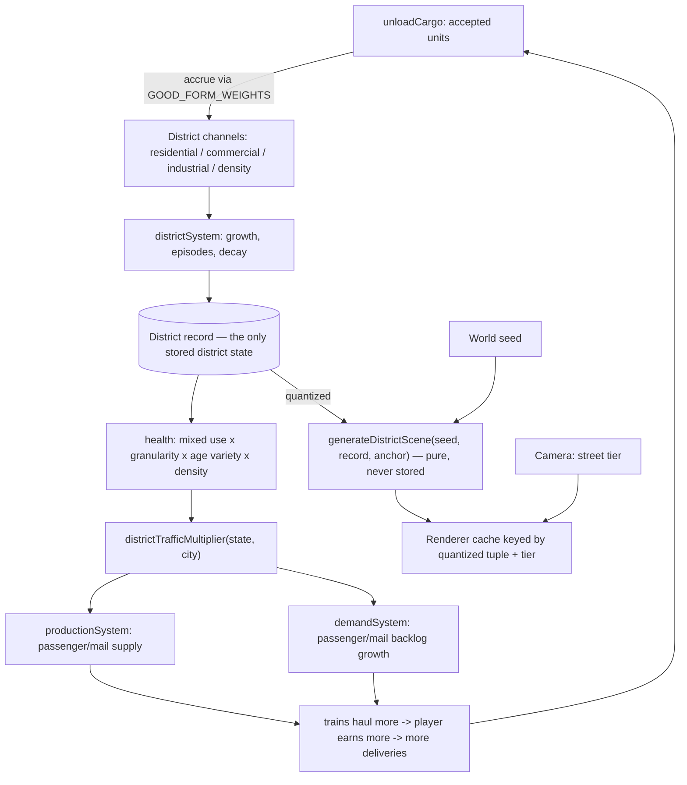
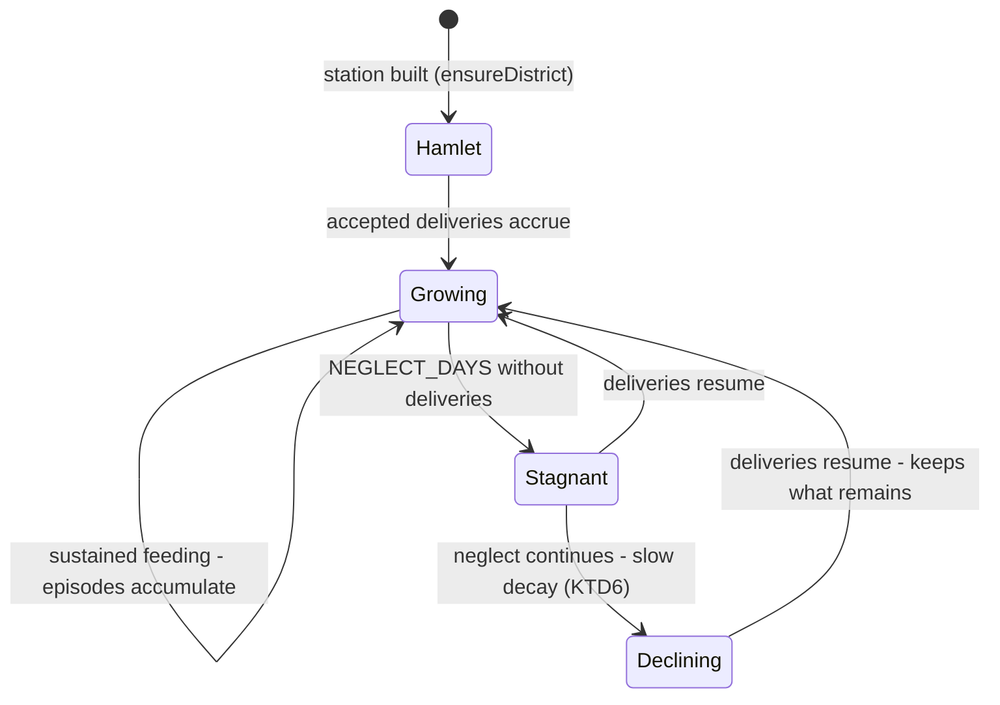

# City Districts and Organic Growth - Plan

Milestone 4 of 6. Depends on milestones 1 and 2 (both shipped: camera/tiers in `src/render/`, terrain fields in `src/world/`). Independent of milestone 3 — districts and surveying can proceed in either order; whichever lands second inherits the other's `SCHEMA_VERSION` bump. See `docs/plans/2026-07-18-001-feat-two-scale-world-and-districts-plan.md` for the umbrella Product Contract.

## Goal Capsule

- **Objective:** Give each station a district whose built form grows out of what the player's trains deliver, so the supply chain becomes visible as architecture and the street scale becomes a place rather than a zoom level.
- **Product authority:** Solo creator / product owner (mikejestes@gmail.com).
- **Open blockers:** None for planning. This is the milestone where the design's central bet — that watching a district respond is engaging — gets tested.
- **Execution profile:** Adds the largest new sim surface since the original economy, plus a fourth zoom tier and the first generated-scene rendering. The bounded-accumulator discipline (R4) and the derived-scene rule (R9) are the two contracts most at risk under implementation pressure.
- **Stop conditions:** Stop and surface if district scenes cannot be generated within a frame budget at street tier, or if the health model cannot distinguish AE1's two districts legibly — the second would mean the goods-to-form mapping needs product rework, not more code.

---

## Product Contract

**Product Contract preservation:** unchanged.

### Summary

Add a per-district simulation whose state is a small aggregate record, and a street-level rendering that generates buildings from position and seed conditioned on that record. Delivered materials drive what the district becomes; district health feeds back into the traffic it generates.

### Problem Frame

The supply chain is the product's stated substance — the origin brainstorm calls it "the substance of using every resource type" — and it is currently invisible. A player can read a city's demand only by opening a panel. Nothing about looking at the map tells them what a city has been receiving or what it lacks.

The city model today is a single record with a size tier, a population number, and demand and backlog maps (`src/sim/model/cities.ts`). Growth is a scalar advancing through tiers. There is nothing spatial about a city, so there is nothing to look at when the camera arrives.

### Requirements

**District state and growth**

- R1. Each station has a district whose built form grows in response to goods delivered into that station.
- R2. Different delivered materials produce different built form, such that a player can infer from looking what has been shipped and what has been neglected.
- R3. District state persists as a compact aggregate — not as individual building records.
- R4. District growth is bounded. No accumulator grows without a ceiling.
- R5. Districts stagnate or decline when their station stops receiving what they need.

**District health**

- R6. District health derives from the generators of urban diversity — mixed uses, block granularity, building age variety, and density.
- R7. District health feeds back into the passengers, mail, and demand the district generates, so a healthy district is worth more to the player.
- R8. District health is legible to the player without opening a panel.

**Street rendering**

- R9. Street layout and building footprints are generated from position and seed, conditioned on district state, and never stored.
- R10. The street scale is reached by continuing to zoom, not by entering a separate view.
- R11. Zooming into a district the player has never visited produces full detail without growing the save.

**Player boundary**

- R12. The player never zones, designates land use, places buildings, or demolishes within a district.

**Integration**

- R13. District state reaches React through the existing store version channel; no second store and no derived-object snapshot.
- R14. New district entities carry serialized id counters; no module-global state and no non-JSON-safe sentinels.

### Acceptance Examples

- AE1. Built form reflects hauling. **Covers R1, R2.** **Given** two districts of equal size, one fed steel and manufactured goods and one fed only food, **when** the player zooms into each, **then** they are visibly different, and the difference corresponds to what was delivered.
- AE2. Health pays. **Covers R6, R7.** **Given** two districts of equal population, one with high diversity and one with low, **when** both are observed over the same period, **then** the healthier district generates more traffic.
- AE3. Neglect bites. **Covers R5.** **Given** a developed district, **when** its station stops receiving deliveries for a sustained period, **then** the district stops growing and begins to decline.
- AE4. Detail is free. **Covers R9, R11.** **Given** a save from a session with no zooming, **when** it is loaded and the player zooms to street level in several cities, **then** full detail appears and the save serializes to the same size.
- AE5. Growth is bounded. **Covers R4.** **Given** a district fed far beyond its needs for a long period, **when** its state is inspected, **then** every accumulator sits at or below its documented cap.

### Success Criteria

- A player can identify what a district has been receiving by looking at it.
- Watching a district respond to a new line is engaging on its own.
- District simulation cost does not scale with zoom depth or visited area.

### Scope Boundaries

- No station type, land value, severance, or relocation. Milestone 5 owns all of it; districts here respond only to what is delivered.
- No speculation or land acquisition. Milestone 6.
- No player verbs inside a district — restated as R12 because it is the constraint most likely to erode under implementation pressure.
- No individual buildings as durable, addressable objects. Buildings express district state.
- No road or traffic simulation. Streets are generated form, not a network.

---

## Planning Contract

### Key Technical Decisions

- KTD1. **District state is form channels plus growth history — nothing else.** (Resolves the first "resolve before enrichment" question.) A `District` record carries: identity and anchor (`id`, `stationId`, `anchorX/Y` — the station tile at creation, which milestone 5's relocation rules need); three bounded form channels `residential`, `commercial`, `industrial` in [0, 1] fed by deliveries; `density` in [0, 1]; `development` in [0, 1] (overall built-out extent); and growth history — `firstGrowthDay`, `lastGrowthDay`, `episodeCount` (bounded), `lastDeliveryDay`. Everything the renderer or health model needs beyond this is *derived*: use mix is the normalized channel shares, age variety is a function of the first/last growth span, block granularity is a function of episode count. This keeps the record ~a dozen numbers, plainly serializable, and unit-testable in isolation.

- KTD2. **Goods map to form through a fixed weight table.** `GOOD_FORM_WEIGHTS: Partial<Record<GoodId, {residential?, commercial?, industrial?, density?}>>` covers every `GoodId` (`src/sim/model/goods.ts`) — food and cattle thicken residential; manufactured goods (`goods`, and delivered passengers, weakly) build commercial frontage; coal, iron, and steel build industrial character, with steel additionally raising `density` (steel permits height, per the origin's key decision). Grain, like cattle, is a raw good on its way to becoming food rather than a processed good, so it carries a small residential weight by the same logic, not an industrial one — it is a farm crop, not a mineral. Mail, like passengers, is a small commercial weight — both are city-to-city traffic goods rather than freight, and the parenthetical already groups them. No delivered good has a zero-weight row. A table, not code branches: AE1's "difference corresponds to what was delivered" is then a property of data an implementer can tune without touching logic, and the panel-free legibility story (R8) inherits one authoritative mapping.

- KTD3. **Only accepted deliveries accrue.** The accrual hook sits in `unloadCargo` (`src/sim/systems/delivery.ts`) and credits the district for units that actually fulfilled city demand or fed a processor — not for cargo that arrived and stayed on the train. Dumping unwanted goods at a station must not build a district; the district is a readout of *useful* delivery history, which is also what keeps the feedback loop (R7) from being farmable with junk hauls.

- KTD4. **Jacobs' four generators get honest, derivable definitions.** Mixed use = 1 − normalized deviation of the three channel shares from uniform. Block granularity = `episodeCount / EPISODE_TARGET`, clamped — a district that grew in many separate episodes has fine grain; a single boom builds superblocks. Age variety = growth span (`lastGrowthDay − firstGrowthDay`) over `AGE_SPAN_DAYS`, clamped — growth spread over time yields mixed building ages. Density = a plateau curve peaking at sufficient density (too sparse scores low; there is no over-density penalty at this scale). Health is the weighted mean of the four. Each input is a pure function of the KTD1 record, so the health model is fully testable without rendering anything.

- KTD5. **Health feeds back through the existing generation systems via one pure multiplier — no parallel channel.** (Resolves the second "resolve before enrichment" question.) A selector `districtTrafficMultiplier(state, city)` returns `1 + k × Σ(health − HEALTH_NEUTRAL)` — the sum runs over each qualifying district's *health deviation* from neutral, not over full per-district multipliers, so `k` and the clamp band apply once to the combined deviation rather than compounding per district — clamped to a documented band, for districts whose station catchment covers the city (`inCatchment`, `src/sim/model/track.ts`; a city may sit in more than one station's catchment). **Undeveloped districts contribute nothing:** a district below a documented development floor is excluded from the sum, so building a station never *penalizes* a city's traffic while its hamlet district is still empty — a fresh station must be neutral, not a debuff, or siting stations becomes locally irrational. `productionSystem` multiplies passenger/mail supply generation by it; `demandSystem` multiplies passenger/mail backlog growth by it. One code path means one place where traffic numbers are made, and the existing fee/growth systems see nothing new — a healthy district simply is a city that sends and wants more traffic. The parallel-channel alternative (districts generating their own supply pools) was rejected: it duplicates the loading logic in `delivery.ts` and creates a second pool for trains to drain, which is exactly the kind of drift the umbrella's "one catchment definition" note warns about.

- KTD6. **Decline is slower than growth, and it is stagnation first.** (Resolves the deferred symmetric-decay question.) After `NEGLECT_DAYS` without an accepted delivery, channels and development decay at a fraction of the growth rate. The origin's relocation decision explicitly rejected decay-as-punishment; the same taste applies here — neglect reads as a district going quiet, not a rubber band snapping back. Asymmetry constants are exported and tested.

- KTD7. **A fourth zoom tier, `street`, and a raised `MAX_SCALE`.** (Resolves the deferred tier question.) `zoomTiers.ts` gains `street` above `local` with a hysteresis band matching the existing pattern, and `MAX_SCALE` (`src/render/camera.ts`) rises so the tier has depth to exist in. District scenes draw at `street`; `local` and below keep the current marker rendering, so the existing tiers' look does not change. Continuous zoom with no mode switch (R10) is preserved by construction — a tier is a render branch, not a screen.

- KTD8. **Scenes are pure functions of (seed, district record quantized, anchor); the renderer caches by value, the sim stores nothing.** `generateDistrictScene` quantizes its district-record inputs (development, channels, density to 1/16ths) so the scene is stable across ticks that change nothing visible, and the renderer caches the generated scene texture keyed by the quantized tuple — regeneration happens only when the district visibly changes. No revision counter is stored; the cache key *is* the derivation input. This satisfies R9/R11 the same way terrain chunks satisfied "zoom depth is free": derivation plus caching, storage never.

- KTD9. **City model and city growth are untouched.** (Resolves the deferred `demandForTier` question.) `sizeTier`, `demandForTier`, and `growthSystem` remain the trunk exactly as the umbrella contract requires. The district layer couples to cities only through KTD5's multiplier. If tuning later wants district health to influence city growth, that is a one-line change to `freightFulfillment`'s consumer — deliberately not made now.

- KTD10. **District creation happens on station build, for every station.** `applyIntent`'s `buildStation` case calls `ensureDistrict` after a successful build. Rural stations get districts too — they simply stay hamlets without deliveries, which is correct: R1 says each station has a district, and a freight halt that grows a small settlement when fed is the nineteenth-century station-town story the product is telling. Ids come from a serialized `nextDistrictId` (R14).

- KTD11. **Bump `SCHEMA_VERSION` (+1 from current) and let old saves fail loudly.** `state.districts` and `nextDistrictId` change the stored shape; `migrate()` already refuses mismatches; no save UI exists. Same rationale as the terrain milestone's KTD9. Composes with milestone 3's bump in either landing order.

### High-Level Technical Design

The paid loop runs entirely through existing systems — delivery, production, demand — with the district record as the new state in the middle and the multiplier as its only outbound edge.

Tick order (`src/sim/systems/index.ts`): production → demand → movement → delivery → **districts** → growth. Districts read the deliveries the same tick applied and settle before city growth reads anything.

District lifecycle:

### Assumptions

- Scene generation cost is dominated by building-footprint layout for a few hundred buildings per district at full development — comfortably per-frame at 32×32-chunk-generation cost levels already proven in `terrainChunks.ts`. If a mature district exceeds the budget, generate into a `RenderTexture` once per cache key exactly as terrain chunks do; the cache design (KTD8) already assumes this shape.
- A district's visual footprint spans roughly one tile around its anchor (a deliberate stylization — the tile is ~100 km and the district is drawn as the place that matters within it). `MAX_SCALE` rises to give the street tier roughly the same zoom depth `local` has today; exact thresholds are tuning values in `zoomTiers.ts`, chosen during implementation with the hysteresis pattern preserved.
- Health cue rendering (R8) is expressible through the scene itself: low health generates vacancy — gap parcels, a muted palette band, boarded frontage — so legibility needs no HUD element. If playtesting wants a stronger cue, a tint pass over the district scene is the escape hatch, still panel-free.
- The React binding follows `docs/solutions/ui-bugs/react-frozen-ui-over-mutable-store-state.md`: any UI that reads district state subscribes through the existing version counter (R13). This milestone adds no new panel; existing panels are untouched.
- Passengers delivered to a station count as accepted (they fulfilled city passenger demand) and carry a small commercial weight per KTD2 — stations that move people build shopfronts, stations that move coal build yards.
- **Forward-compatibility note (milestone 5).** Two of this milestone's contracts are amended in place by milestone 5 (`docs/plans/2026-07-18-006-feat-station-siting-type-and-severance-plan.md`, its Assumptions), and neither requires this milestone's units to change — they are called out here only so a milestone-4-first implementer does not harden them as permanent invariants: (1) `ensureDistrict`'s per-station-id idempotency (KTD10) narrows to per-(station id, anchor) once relocation can produce a second district for one station id; do not write tests that assert per-station-id idempotency as a load-bearing guarantee. (2) The `development`-scaled scene extent is not milestone 5's severance footprint — milestone 5 introduces a fixed `DISTRICT_FOOTPRINT_TILES` constant instead, because an extent that grows and decays cannot key an append-only cut list; keep this milestone's extent purely a rendering concern, not a persisted geometry boundary.

### Sequencing

U1 → U2 → U3 → U4 → U5 in order (model, then wiring, then accrual, then dynamics, then feedback). U6 depends on U1 only and can proceed in parallel after it. U7 depends on U6. U8 closes the milestone and depends on everything.

---

## Implementation Units

### U1. District model

- **Goal:** The district record, the goods-to-form mapping, and the health model — pure and fully tested before anything ticks.
- **Requirements:** R2, R3, R4, R6, R14
- **Dependencies:** none
- **Files:**
  - `src/sim/model/districts.ts` (create)
  - `tests/sim/districts.test.ts` (create)
- **Approach:** Define `District` per KTD1 and `makeDistrict(id, station)`. Export `GOOD_FORM_WEIGHTS` (KTD2), `accrueDelivery(district, good, qty, day)` clamping every channel to its cap, and the derived functions: `useMix`, `ageVariety`, `blockGranularity`, `densityScore`, and `districtHealth` per KTD4. Export every cap, weight, and curve constant `SCREAMING_SNAKE`. No system, no rendering, no store — this unit is the model milestone 5 and 6 build on, so its shape is the thing to get right.
- **Test scenarios:**
  - Covers AE5. Accruing any good far beyond its cap leaves every channel at or below its documented cap.
  - Covers AE1 (model level). A district fed steel+goods and a district fed only food produce different dominant channels and different `density`, and the difference matches `GOOD_FORM_WEIGHTS`.
  - A balanced three-channel district scores higher mixed-use than a single-channel district of equal total.
  - `episodeCount` at `EPISODE_TARGET` yields granularity 1; a single episode yields the documented minimum.
  - Growth span of zero days yields age variety 0; a span ≥ `AGE_SPAN_DAYS` yields 1.
  - `districtHealth` is in [0, 1] across a randomized sweep of valid records, and increases monotonically when any single generator input improves.
  - The record round-trips `JSON.stringify`/`parse` with no NaN, Infinity, or undefined fields (R14).
- **Verification:** The model is bounded, deterministic, JSON-safe, and distinguishes AE1's two districts on paper.

### U2. District creation and state wiring

- **Goal:** Every station gets a district; districts live in `GameState` behind a serialized counter.
- **Requirements:** R1, R3, R14
- **Dependencies:** U1
- **Files:**
  - `src/sim/state.ts` (modify — `districts`, `nextDistrictId`, `SCHEMA_VERSION` +1)
  - `src/store/applyIntents.ts` (modify — `ensureDistrict` after successful `buildStation`)
  - `src/persistence/saveStore.ts` (modify — migration note)
  - `tests/store/applyIntents.test.ts` (modify)
  - `tests/persistence/roundtrip.test.ts` (modify)
- **Approach:** `state.districts: District[]` seeded empty; `ensureDistrict(state, station)` creates `dst-N` from the serialized counter with the station's tile as anchor (KTD10). Creation is idempotent per station id. Schema bump per KTD11, with the migration comment naming this milestone. Ground truth for the wiring: `applyIntent`'s current `buildStation` case (`src/store/applyIntents.ts`) calls `buildStation(state, ...)` and discards its boolean return — `nextStationId` is even incremented in the same expression regardless of success. Gating `ensureDistrict` on a *successful* build (per KTD10 and the test scenario below) requires capturing that return value in the switch case, then locating the newly-pushed `Station` (e.g. the last element of `state.stations`, or by the id just minted) to pass to `ensureDistrict` — a small but real change to a case that today is a single discarded call.
- **Test scenarios:**
  - Building a station creates exactly one district anchored at the station tile, with the next serial id.
  - A failed station build (sea tile, unaffordable) creates no district and does not advance the counter.
  - Districts round-trip through `serialize`/`deserializeSave` byte-identically.
  - Two runs from the same seed and intent log produce identical district arrays by serialization.
- **Verification:** Districts exist, persist, and stay deterministic; round-trip suite green at the new schema version.

### U3. Delivery accrual

- **Goal:** Accepted deliveries — and only accepted deliveries — build the district.
- **Requirements:** R1, R2
- **Dependencies:** U2
- **Files:**
  - `src/sim/systems/delivery.ts` (modify — accrual hook in `unloadCargo`)
  - `tests/sim/economy.test.ts` (modify)
- **Approach:** In `unloadCargo`, after the city-demand and processor-feed steps resolve how many units were actually accepted, credit the station's district via `accrueDelivery` with the accepted quantity and stamp `lastDeliveryDay` (KTD3). Cargo that stays on the train accrues nothing. The hook is a few lines; the semantics — accepted-only — are the point.
- **Test scenarios:**
  - Delivering food a city demands raises the district's residential channel; the amount matches the accepted quantity, not the carried quantity.
  - Cargo arriving at a station whose catchment demands none of it accrues nothing and does not stamp `lastDeliveryDay`.
  - Feeding a processor accrues to the district under the delivered good's weights.
  - A delivery split between city demand and remaining-on-train accrues only the accepted portion.
- **Verification:** District accrual mirrors what the economy actually absorbed, unit for unit.

### U4. District dynamics system

- **Goal:** Districts grow when fed, record their growth history, and go quiet — then decline slowly — when neglected.
- **Requirements:** R4, R5
- **Dependencies:** U3
- **Files:**
  - `src/sim/systems/districts.ts` (create)
  - `src/sim/systems/index.ts` (modify — insert after delivery, before growth)
  - `tests/sim/districts.test.ts` (modify)
  - `tests/sim/tick.test.ts` (verify unchanged)
- **Approach:** `districtSystem` per tick: advance `development` toward the level the channels support when recently fed; stamp `firstGrowthDay` on first growth, update `lastGrowthDay`, and increment `episodeCount` when growth resumes after a gap ≥ `EPISODE_GAP_DAYS` (bounded at `EPISODE_COUNT_CAP`); after `NEGLECT_DAYS` without deliveries, decay channels and development at `DECLINE_RATE` — a documented fraction of the growth rate (KTD6). All rates are per-day and multiply `dtDays`, matching every existing system's shape.
- **Test scenarios:**
  - Covers AE3. A developed district with deliveries halted holds steady until `NEGLECT_DAYS`, then declines tick over tick.
  - Decline per day is measurably slower than growth per day at the same development level (asymmetry, KTD6).
  - Covers AE5. A district fed maximally for a simulated decade keeps every field at or below its cap, including `episodeCount`.
  - Two feeding episodes separated by more than `EPISODE_GAP_DAYS` increment `episodeCount`; continuous feeding counts one.
  - A never-fed district stays a zero-development hamlet indefinitely (no drift).
  - Determinism: same seed and intent log through many ticks produces byte-identical district state.
- **Verification:** Growth, stagnation, and decline all behave per the constants; determinism suite green with the new system in the pipeline.

### U5. Traffic feedback

- **Goal:** Healthy districts generate more passengers, mail, and demand — the loop that pays the player for good urbanism.
- **Requirements:** R7
- **Dependencies:** U4
- **Files:**
  - `src/store/selectors.ts` (modify — `districtTrafficMultiplier`)
  - `src/sim/systems/production.ts` (modify — multiply passenger/mail supply)
  - `src/sim/systems/demand.ts` (modify — multiply passenger/mail backlog growth)
  - `tests/sim/passengers.test.ts` (modify)
  - `tests/store/selectors.test.ts` (modify)
- **Approach:** Per KTD5: the selector composes health across districts whose station catchment (`inCatchment`) covers the city, clamped to `[MULT_MIN, MULT_MAX]`; a city with no districted station in range gets exactly 1. Production and demand call the selector for passengers and mail only — freight demand stays governed by `demandForTier` (KTD9). Note the selector lives in `src/store/selectors.ts` but is imported by sim systems; if that direction feels wrong during implementation, host it in `src/sim/model/districts.ts` and re-export from selectors — the sim must never import from the store layer.
- **Test scenarios:**
  - Covers AE2. Two cities of equal tier, one covered by a high-health district and one by a low-health district, generate measurably different passenger/mail supply and backlog over the same ticks.
  - A city with no station in range has multiplier exactly 1 and pre-milestone traffic numbers (regression guard).
  - A city whose only district is a fresh zero-development hamlet also has multiplier exactly 1 — building a station is never an immediate traffic penalty (KTD5's floor).
  - The multiplier is clamped at both documented bounds under extreme health values.
  - Freight demand is byte-identical with and without districts present (KTD9 isolation).
- **Verification:** The loop pays: health moves traffic, traffic moves fees, and nothing outside passengers/mail shifts.

### U6. Street scene generation

- **Goal:** A pure generator that turns (seed, district record, anchor) into streets, blocks, and building footprints — the derived scene everything visual reads from.
- **Requirements:** R2, R9, R11, R12
- **Dependencies:** U1
- **Files:**
  - `src/world/streets.ts` (create)
  - `tests/world/streets.test.ts` (create)
- **Approach:** `generateDistrictScene(seed, district, anchor): DistrictScene` — quantize record inputs per KTD8, then lay out deterministically: a station square at the anchor; main streets radiating (count scaling with development), perturbed by seeded noise so no two districts are twins; a block grid within the development extent with block size driven by `blockGranularity`; parcels per block; footprints per parcel carrying `{ rect, heightClass, use, ageClass, vacant }` drawn from the record — use distribution from `useMix` (commercial concentrating near the station), heights from `density`, age classes from `ageVariety`, vacancy rate rising as health falls. Randomness comes only from hashing (seed, district id, element index) — never from `state.rng`, which the sim owns (the same discipline `rivers.ts` follows) — though the *value* fed in as `seed` is `state.rng.seed` (`src/sim/rng.ts`), the same world seed `generateGame` already threads to `configureTerrainSeed` (`src/world/geography.ts`) and to `installDebugHook` (`src/dev/debugHook.ts`); reading the counter would violate the no-`state.rng`-read rule, but the stored seed field is plain data, not a draw from the stream. This is directional guidance, not a layout spec: the invariants that matter are determinism, quantization stability, boundedness, and record-conditioned variety; the aesthetic is the implementer's.
- **Test scenarios:**
  - Same inputs generate identical scenes (deep equality); different district ids or seeds generate different layouts.
  - Sub-quantum record changes (development +0.001) generate an identical scene; crossing a quantum boundary changes it (KTD8 cache stability).
  - Covers AE1 (scene level). The steel+goods record's scene has taller height classes and more industrial/commercial parcels than the food-only record's scene, which has more residential.
  - Building count and scene extent are bounded functions of development — a maxed record stays under documented ceilings.
  - Low-health records generate a higher vacancy rate than high-health records of equal development (R8's substrate).
  - Zero-development records generate a minimal hamlet, not an empty scene (a station square and a building or two).
- **Verification:** Scenes are deterministic, bounded, quantization-stable, and visibly conditioned on what was delivered.

### U7. Street tier and district rendering

- **Goal:** Continuing to zoom past `local` resolves a district into its generated streets, cached and cheap.
- **Requirements:** R8, R10, R11
- **Dependencies:** U6
- **Files:**
  - `src/render/zoomTiers.ts` (modify — `street` tier)
  - `src/render/camera.ts` (modify — raise `MAX_SCALE`)
  - `src/render/districtRenderer.ts` (create)
  - `src/render/worldRenderer.ts` (modify — mount district layer, branch at `street`)
  - `tests/render/zoomTiers.test.ts` (modify)
  - `tests/render/districtRenderer.test.ts` (create)
- **Approach:** Add `street` above `local` with hysteresis thresholds following the existing pattern (KTD7); raise `MAX_SCALE` to give the tier depth. `DistrictRenderer` follows `TerrainChunkManager`'s proven shape: pure policy functions (which districts are in view; cache key from quantized record + tier; eviction past a resident budget) plus a thin GPU shell that renders a scene into a `RenderTexture` once per cache key. At `street` tier, district scenes draw above terrain; markers for stations/trains remain. `local` and below are pixel-identical to today (regression guard). Vacancy and palette cues from U6 make health readable on sight (R8).
- **Test scenarios:**
  - Tier logic: `street` engages above its up-threshold from `local` and disengages below its down-threshold, with the hysteresis band honored; existing three-tier tests still pass.
  - Cache key changes exactly when the quantized record, district id, or tier changes.
  - The in-view predicate returns districts whose anchor falls in the visible rect plus margin; eviction never selects an in-view district.
  - Draw calls themselves are not unit-tested, per the repo's no-rendering-tests policy — the pure policy functions above carry the coverage.
- **Verification:** Zooming from continent to street is one continuous gesture (R10); mature districts render without frame hitches; regenerations happen only on visible change. Manual smoke: feed one city steel and another food for a while, zoom into both, and tell them apart (AE1, by eye).

### U8. Persistence, determinism, and debug hook close-out

- **Goal:** Close the milestone with the save flat, the sim deterministic, and districts drivable from automation.
- **Requirements:** R11, R13, R14 plus the umbrella determinism/persistence commitments
- **Dependencies:** U1–U7
- **Files:**
  - `src/dev/debugHook.ts` (modify — `districts` accessor, `districtScene` sampler)
  - `tests/persistence/roundtrip.test.ts` (verify extended in U2)
  - `tests/sim/tick.test.ts` (verify unchanged)
- **Approach:** Expose live district records and a `districtScene(districtId)` sampler on `window.__game`, per the assert-on-state-not-pixels rule — a browser driver can then verify AE1 by comparing scene statistics (height classes, use counts), not screenshots. Confirm AE4 end to end: serialize, generate scenes for several districts, serialize again, compare sizes byte-for-byte.
- **Test scenarios:**
  - Covers AE4. Serialization before and after generating scenes for every district is byte-identical — scene generation touches no state.
  - The determinism suite passes with districts active: same seed, same intents, byte-identical state across runs.
  - A save with mature districts round-trips and resumes byte-identically.
- **Verification:** `npm test` green including determinism and round-trip; save size is independent of zooming and scene generation.

---

## Verification Contract

| Gate | Command | Applies to | Signal |
|---|---|---|---|
| Type check | `npm run typecheck` | all units | clean |
| Unit tests | `npm test` | all units | all suites pass; new `tests/sim/districts.test.ts`, `tests/world/streets.test.ts`, `tests/render/districtRenderer.test.ts` green |
| Determinism | `npm test` (`tests/sim/tick.test.ts`) | U2–U5, U8 | byte-identical serialization across runs — failure is a release blocker, not a flake |
| Round trip | `npm test` (`tests/persistence/roundtrip.test.ts`) | U2, U8 | save/load resumes byte-identically at the bumped schema version |
| Build | `npm run build` | all units | succeeds |
| Manual smoke | `npm run dev` | U6, U7 | feed two cities differently, zoom to street tier in one gesture, and read what each received off the architecture; neglect one and watch it go quiet |

The scene-purity gate (AE4's byte-identical save around scene generation) carries this milestone: it is the mechanical proof that the street scale stayed derived.

Test conventions follow the repo: `describe` blocks name behavior plus decision id, `it` strings carry `AE<N>:` prefixes where they enforce an Acceptance Example, fixtures are local factory functions, tuning constants are imported from source rather than duplicated.

## Definition of Done

**Global**

- Every station has a district that grows from accepted deliveries, differently by material (R1, R2; AE1).
- District state is a compact, bounded, JSON-safe aggregate (R3, R4, R14; AE5).
- Neglect stagnates then slowly declines (R5; AE3).
- Health derives from the four Jacobs generators and pays through passenger/mail traffic (R6, R7; AE2).
- Health is readable from the scene itself — no panel required (R8).
- Street scenes are derived, cached, never stored; the save is flat under any amount of zooming (R9, R11; AE4).
- Street scale is reached by zoom alone (R10); the player has no verb inside a district (R12).
- District state reaches React only through the existing version channel (R13).
- Every Acceptance Example (AE1–AE5) has a passing test.
- The Verification Contract passes: type check, unit tests, determinism, round trip, build.
- Abandoned-attempt code is removed — no unused layout experiments or dead health formulas in the diff.

**Per unit**

- Each unit meets its Verification line and its test scenarios pass. U7 carries tests for its pure policy functions only, per the no-rendering-tests policy.
- New files carry a header docblock stating design rationale and citing KTD ids, matching the existing convention.
