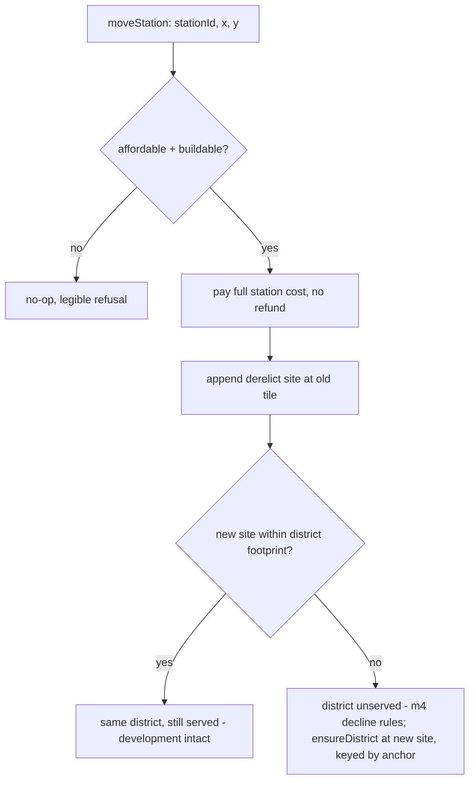

# Station Siting, Type, and Severance - Plan

Milestone 5 of 6. Depends on milestone 4 (`docs/plans/2026-07-18-005-feat-city-districts-and-organic-growth-plan.md`) — a district must exist before it can be severed. Milestone 3's route commitment, if landed, lets severance be previewed during surveying; without it, severance is evaluated at build time (see Assumptions). See `docs/plans/2026-07-18-001-feat-two-scale-world-and-districts-plan.md` for the umbrella Product Contract.

## Goal Capsule

- **Objective:** Make station siting a decision with a permanent consequence. The depot that creates land value also cuts the neighborhood, and moving it later leaves both scars.
- **Product authority:** Solo creator / product owner (mikejestes@gmail.com).
- **Open blockers:** None.
- **Execution profile:** Extends milestone 4's district record with the first *permanent* state in the game (cuts and derelict sites never heal), and introduces the land-value derivation milestone 6 trades on. Boundedness of the stored cut list and the never-heals invariant are the risk surfaces.
- **Stop conditions:** Stop and surface if severance cannot be made legible in the district scene (a cut the player cannot see is a punishment, not a decision), or if the bounded cut representation cannot express R10's edge-versus-middle difference.

---

## Product Contract

**Product Contract preservation:** unchanged.

### Summary

Introduce a land-value field over districts, station type as a second axis alongside catchment size, and severance — the border vacuum a station and its approach create in the district they enter. Stations can be relocated; severance and the derelict site they leave behind cannot be undone.

### Problem Frame

Station siting today is nearly free of consequence. A station is a position and a Chebyshev radius (`src/sim/model/track.ts`), costed by tier, and placing it well versus badly differs only in which tiles fall inside the catchment. There is no upside beyond coverage and no downside at all.

That is the opposite of what railroads actually did to cities. Jane Jacobs named rail lines as the archetypal *border vacuum* — hard infrastructure that creates a dead edge and hollows out the blocks beside it. The same depot that made land valuable also cut the neighborhood in half. Without that tension, the district simulation from milestone 4 is something the player feeds rather than something they shape.

### Requirements

**Land value**

- R1. Districts carry a land-value field that varies spatially within the district.
- R2. Siting a station raises land value in its catchment.
- R3. Land value influences what the district builds where, so value and built form are coupled rather than parallel.

**Station type**

- R4. Station type — at minimum freight yard, passenger terminal, and mixed depot — is chosen at siting time.
- R5. Station type shapes what kind of district grows around it, independently of catchment size.
- R6. Station type is visible on the map without opening a panel.

**Severance**

- R7. A station, its yards, and the track approaching it sever the district they pass through, depressing the blocks along that edge.
- R8. Severance is spatial — it follows the line of the infrastructure, not the whole district uniformly.
- R9. Severance damage reduces district health and therefore the traffic the player earns from.
- R10. A route that enters a district at its edge severs less than one that cuts through its middle.

**Relocation**

- R11. The player can move a station after siting it.
- R12. Severance persists after relocation. The player can move infrastructure; they cannot undo the cut.
- R13. An abandoned station site becomes derelict land that depresses what surrounds it, so relocation leaves a second vacuum rather than a clean slate.
- R14. The district keeps the development it already has when its station moves; it does not decay wholesale.

### Acceptance Examples

- AE1. Siting creates value. **Covers R1, R2.** **Given** an unserved city, **when** the player sites a station, **then** land value rises in its catchment and falls off with distance from it.
- AE2. Type shapes the district. **Covers R4, R5.** **Given** two cities served identically in goods and volume, one through a freight yard and one through a passenger terminal, **when** both districts mature, **then** they differ in built form and in what they generate.
- AE3. The cut costs money. **Covers R7, R9, R10.** **Given** a district, **when** the player routes the approach through its middle rather than around its edge, **then** the blocks along that line decline and the district generates measurably less traffic than the edge-served alternative.
- AE4. Relocation does not heal. **Covers R11, R12, R13.** **Given** a district cut by a badly sited station, **when** the player moves that station elsewhere in the city, **then** the original severance remains, the damaged blocks do not recover, and the abandoned site depresses its own surroundings.
- AE5. Development survives the move. **Covers R14.** **Given** a well-developed district, **when** its station relocates within the same city, **then** the existing built form remains rather than reverting.

### Success Criteria

- Where to bring a line into a city is a decision players hesitate over.
- A player who sites badly can see the cost on the map, not only in a number.
- Relocation reads as a real correction with a real price, rather than as either a free undo or a punishment.

### Scope Boundaries

- No land acquisition, purchase, or speculation. Milestone 6 owns the player's ability to trade land; this milestone only produces the value field it trades on.
- No clearance or demolition rights. Explicitly outside the product's identity — the player is never a planner.
- No compulsory purchase, eminent domain, or political mechanics.
- No station capacity, platform, or throughput modeling.

---

## Planning Contract

### Key Technical Decisions

- KTD1. **Severance is a bounded list of cut records on the district aggregate, event-sourced at build time.** (Resolves the first "resolve before enrichment" question.) `District.cuts: Array<{ ax, ay, bx, by, strength }>` in world coordinates — each cut is the chord of a track segment, station footprint, or yard within the district's footprint (a fixed radius set once at district creation — see Assumptions — not milestone 4's development-scaled scene extent), appended when the infrastructure is built and *never removed*. Damage is computed from the cuts at query time as a distance-falloff field; nothing per-tile or per-building is stored, which keeps milestone 4's R3 intact. The list is bounded by construction — the footprint holds a finite number of distinct segment chords — and defensively by a cap with nearest-merge, so a pathological build spree cannot grow the record without limit.

- KTD2. **Land value is derived per query from stored path-dependent inputs; value itself is never stored.** (Resolves the second "resolve before enrichment" question.) `landValueAt(state, wx, wy)` composes: a terrain base, station-catchment uplift (peaking at the station, linear falloff to the catchment edge, scaled by district development), district-development uplift, severance depression near cut lines, and derelict-site depression — clamped to a documented floor. Path dependence lives entirely in the *inputs* (cuts, derelict sites, district records, stations), all of which are already stored; the field is a pure function over them. This keeps the save flat and makes every value *attributable* — the function returns an itemized breakdown, which is precisely what milestone 6's R9 ("the player can tell what caused a parcel's value to move") consumes. Storing per-parcel values was rejected: it duplicates derivable data and turns every infrastructure event into a cache-invalidation problem.

- KTD3. **Station type is a stored field and an independent axis from radius.** `Station` gains `stationType: 'freight' | 'passenger' | 'mixed'`, chosen in the build UI at siting time; `radius` (Depot/Station/Terminal) remains the catchment axis untouched, per the origin assumption that type and tier are independent. Type carries no cost of its own — radius keeps driving `STATION_COST` — because type is a shaping choice, not a price tier; if tuning wants differential pricing later it is one table away. Type is fixed at siting and preserved through relocation: re-typing a station is a re-siting decision the product has not asked for.

- KTD4. **Type shapes the district by modulating accrual weights and traffic mix — not by new channels.** A `STATION_TYPE_MODIFIERS` table scales milestone 4's `GOOD_FORM_WEIGHTS` at accrual time (freight yard amplifies industrial and density accrual and damps commercial; passenger terminal amplifies commercial and residential; mixed is neutral) and skews the district's passenger/mail traffic contribution correspondingly. AE2's "differ in built form and in what they generate" then follows from two table rows, and milestone 4's model gains no new state.

- KTD5. **Cut damage is centrality-weighted.** Each cut's contribution to district damage scales with its strength, its length within the footprint, and a centrality factor that falls off with the cut's distance from the district anchor — a chord through the middle outweighs the same chord grazing the edge. This is what makes R10 a property of geometry rather than a special case, and AE3's edge-versus-middle comparison becomes a numeric assertion on the damage function.

- KTD6. **Severance reduces health multiplicatively, as a fifth factor on milestone 4's four generators.** Milestone 4's exported `districtHealth` (its KTD4 four-generator weighted mean) is renamed `jacobsHealth`; this plan's `districtHealth` composes `jacobsHealth × (1 − severancePenalty)`, with the penalty bounded below 1 so a cut district is damaged, never zeroed. Because the export name is preserved, `districtTrafficMultiplier` (milestone 4 KTD5) needs no code change at its call site — it already calls whatever `districtHealth` resolves to; only the definition moves. R9 (severance costs the player money) needs no new plumbing — the cut flows through the exact loop the player is paid by.

- KTD7. **Districts backfill cuts at creation, and new infrastructure appends to existing districts.** Build events (`layTrack`, milestone 3's `commitRoute` if present, `buildStation`) append cuts to any district whose footprint the new infrastructure crosses. `ensureDistrict` scans existing track at creation so a line that predates the station severs the district it later anchors — the cut was physically there first. Both paths route through one `recordCuts` helper so the two can never disagree.

- KTD8. **Relocation is a new-site build that leaves a permanent derelict record.** A `moveStation` intent charges the full station cost for the new site (no refund — sunk value stays sunk, per the origin's rejection of retained value), updates the station's position, and appends `{ x, y, day }` to a new `state.derelictSites` list — permanent, never removed, contributing a fixed local depression to land value and a derelict-yard element to the scene. If the new position is within the district's footprint, the district continues being served; if beyond it, the district goes unserved (milestone 4's stagnation-then-decline takes over — which is R14-compatible: the record and its built form persist) and a new district is ensured at the new site. Ensuring a new district here depends on narrowing milestone 4's `ensureDistrict` idempotency from per-station-id to per-(station id, anchor) — see Assumptions: the abandoned district keeps the station's id for historical attribution but is no longer the record matched to it, so a fresh district is created at the new anchor rather than the move being silently absorbed into (or blocked by) the old one. Track approaching the old site is not auto-removed: the rails are the player's property and the cut is already permanent either way.

- KTD9. **Derelict depression is constant and bottomed.** (Resolves the deferred long-horizon question.) A derelict site depresses value and scene condition in a fixed radius by a fixed amount, forever — it does not deepen over time, and the surrounding blocks' decline bottoms out at the land-value floor. An escalating blight simulation was rejected: the origin wants a *scar*, legible and permanent, not a spreading disease the player must manage.

- KTD10. **Land value conditions the scene through parcel-level sampling.** `generateDistrictScene` (milestone 4) gains land-value input: parcel density and height skew toward high-value locations, parcels along cuts render as the border vacuum (vacancy band, declined frontage), and derelict sites render as the abandoned yard. This is R3's value-form coupling and the "see the cost on the map" success criterion in one mechanism — the same derivation prices the land and draws its consequences.

- KTD11. **Bump `SCHEMA_VERSION` (+1 from current) and let old saves fail loudly.** `stationType`, `District.cuts`, and `derelictSites` change the stored shape. Same rationale and precedent as the prior milestones; composes with whichever of milestones 3/4 landed last.

### High-Level Technical Design

```mermaid
flowchart TB
  Build[Build events: buildStation / layTrack / commitRoute] --> Record["recordCuts(state, geometry)"]
  Record --> Cuts[(District.cuts — permanent, bounded)]
  Build --> Move[moveStation intent]
  Move --> Derelict[(state.derelictSites — permanent)]
  Cuts --> Damage["severancePenalty: strength x length x centrality (KTD5)"]
  Damage --> Health["districtHealth = jacobs x (1 - penalty) (KTD6)"]
  Health --> Traffic[milestone 4 traffic multiplier -> player revenue]
  subgraph Derived [Derived per query — never stored (KTD2)]
    LV["landValueAt(state, wx, wy): itemized"]
  end
  Stations[Stations: position, radius, type] --> LV
  Cuts --> LV
  Derelict --> LV
  Districts[District records] --> LV
  LV --> Scene["generateDistrictScene: value-conditioned parcels, vacuum bands, derelict yards (KTD10)"]
  Types[STATION_TYPE_MODIFIERS] -->|scale accrual + traffic mix| Districts
```

The permanent stores (cuts, derelict sites) are append-only and bounded; everything the player sees or is charged flows through the two derivations (health penalty, land value) so nothing needs invalidating when infrastructure changes — the next query sees the new inputs.

Relocation decision flow:



### Assumptions

- Milestone 4's `District` record, accrual path, health model, scene generator, and traffic multiplier exist as planned there. This plan extends those seams (`accrueDelivery` weights, `districtHealth`, `generateDistrictScene` inputs) rather than adding parallel ones. Two of milestone 4's contracts are amended in place rather than left standing, both required by this plan and neither requiring milestone 4's own units to change: (1) `districtHealth` (its KTD4) is renamed `jacobsHealth`, and this plan's `districtHealth` wraps it with the severance factor (KTD6) — `districtTrafficMultiplier`'s call site is untouched because the export name it calls is preserved; (2) `ensureDistrict`'s idempotency (its KTD10: "idempotent per station id") narrows to per-(station id, anchor), because relocation beyond a district's footprint (KTD8) must be able to produce a second district for the same station id — a station-id-only key would either suppress the new district or collide with the abandoned one.
- If milestone 3 has landed, `commitRoute` is a cut source and the survey overlay can preview severance (a cheap `recordCuts` dry-run against the proposal); if not, cuts are recorded at build time only and R10 is satisfied retrospectively, exactly as the origin dependency note anticipated. Neither ordering changes this plan's units — only whether U3's preview hook has a caller.
- The district footprint — the fixed radius within which infrastructure severs (U3), damage accrues length (U4), and relocation continuity is judged (U7) — is a new constant this plan introduces (e.g. `DISTRICT_FOOTPRINT_TILES`), set once at district creation from the anchor and held constant for the district's life thereafter. It is deliberately *not* derived from milestone 4's `development`-scaled scene extent: that extent grows and can shrink under milestone 4's decay (its KTD6), and a footprint that moved with it would let the same geometry drift in and out of severance eligibility over time — intolerable for an append-only, never-heals cut list where "was this chord ever in scope" must have one permanent answer. The constant is chosen to approximate milestone 4's own "roughly one tile around the anchor" stylization (its Assumptions), so what cuts the district still matches what the player sees crossing it.
- A dedicated land-value map overlay is *not* built here; milestone 6 owns pre-purchase value legibility (its R7). This milestone's "see the cost on the map" criterion is met through the scene itself (KTD10). The itemized `landValueAt` is built now so milestone 6 starts from a finished derivation.
- Relocation UI is minimal: a move affordance on the existing station interaction (select station → move mode → click new tile), reusing the build-mode plumbing in `src/main.ts`. No new panel.

### Sequencing

U1 → U2 land first (type axis, then its district effect). U3 → U4 → U5 build the severance-and-value core in order. U6 depends on U4 and U5; U7 depends on U3–U6; U8 closes the milestone and depends on everything.

---

## Implementation Units

### U1. Station type

- **Goal:** Type chosen at siting, stored on the station, visible on the map.
- **Requirements:** R4, R6
- **Dependencies:** none
- **Files:**
  - `src/sim/model/track.ts` (modify — `Station.stationType`, `buildStation` signature)
  - `src/store/gameStore.ts` (modify — `buildStation` intent gains `stationType`)
  - `src/store/applyIntents.ts` (modify)
  - `src/ui/panels/BuildPanel.tsx` (modify — type picker when station mode is armed)
  - `src/main.ts` (modify — thread the chosen type into the intent)
  - `src/render/worldRenderer.ts` (modify — per-type glyph at region/local tiers)
  - `tests/sim/track.test.ts`, `tests/store/applyIntents.test.ts`, `tests/ui/panels.test.ts` (modify)
- **Approach:** Add the field per KTD3 with `'mixed'` as the default the picker starts on. Radius/cost logic is untouched. The renderer distinguishes the three types with distinct marks (e.g., square/circle/diamond variants of the existing station marker), scale-compensated like every marker, from `region` tier inward (R6) — the pure `shouldShow`-style predicates carry the test load per the no-rendering-tests policy.
- **Test scenarios:**
  - Building each type stores it and round-trips it through serialization.
  - The build intent carries the type end to end: panel selection → intent → stored station.
  - Radius and cost are unaffected by type (independent-axes guard).
  - The glyph-selection predicate maps each type to a distinct mark and respects tier gating.
- **Verification:** Three stations of three types are distinguishable on the map at a glance without any panel.

### U2. Type shapes the district

- **Goal:** What a district becomes depends on what kind of station anchors it.
- **Requirements:** R5
- **Dependencies:** U1
- **Files:**
  - `src/sim/model/districts.ts` (modify — `STATION_TYPE_MODIFIERS`, accrual takes station type)
  - `src/sim/systems/delivery.ts` (modify — pass the station's type to accrual)
  - `src/store/selectors.ts` (modify — traffic mix skew by type)
  - `tests/sim/districts.test.ts` (modify)
- **Approach:** Per KTD4: a per-type modifier table scales `GOOD_FORM_WEIGHTS` at accrual time, and the district's passenger/mail contribution through the milestone 4 multiplier is skewed by type (passenger terminals contribute more passengers, freight yards more mail-and-demand-side weight). Constants exported for tests and tuning.
- **Test scenarios:**
  - Covers AE2 (model level). Identical delivery histories through a freight yard and a passenger terminal yield districts with different dominant channels and densities, matching the modifier table.
  - Covers AE2 (traffic level). The two districts contribute measurably different passenger/mail generation at equal health.
  - Mixed-depot modifiers are identity: byte-identical accrual to milestone 4 behavior (regression guard).
- **Verification:** Type is a real second axis: same goods, different city.

### U3. Severance records

- **Goal:** Infrastructure crossing a district leaves a permanent, bounded cut record — from build events and from pre-existing track alike.
- **Requirements:** R7, R8, R12
- **Dependencies:** U1 (station footprint as a cut source)
- **Files:**
  - `src/sim/model/districts.ts` (modify — `District.cuts`, `recordCuts`, cap-and-merge)
  - `src/sim/model/track.ts` (modify — `layTrack`/`buildStation` invoke `recordCuts`)
  - `src/store/applyIntents.ts` (modify — `commitRoute` path invokes `recordCuts` when milestone 3 is present)
  - `tests/sim/districts.test.ts` (modify)
- **Approach:** Per KTD1/KTD7: one helper computes the chords of new geometry within each district's footprint and appends `{ax, ay, bx, by, strength}` — station footprints at `STATION_CUT_STRENGTH`, track at `TRACK_CUT_STRENGTH`. `ensureDistrict` backfills from `state.track.segments`. Deduplicate identical chords; past `CUTS_CAP`, merge the nearest pair rather than dropping data. Cuts are append-only — no code path removes one.
- **Test scenarios:**
  - Laying track through a district's footprint appends cuts; track outside appends none.
  - Building a station in a district appends a station-strength cut.
  - A district created on a tile already crossed by track is born with the backfilled cut (KTD7).
  - Identical geometry recorded twice stores one cut; exceeding the cap merges rather than grows (boundedness, milestone 4 R3/R4 discipline).
  - Removing nothing: the public API offers no cut removal; serialization round-trips cuts exactly.
- **Verification:** Every crossing leaves exactly one bounded, permanent record, regardless of which build path made it.

### U4. Severance damage — health and scene

- **Goal:** Cuts cost health (and therefore money) in proportion to where they run, and the border vacuum is visible in the streets.
- **Requirements:** R7, R8, R9, R10
- **Dependencies:** U3
- **Files:**
  - `src/sim/model/districts.ts` (modify — `severancePenalty`, health gains the fifth factor)
  - `src/world/streets.ts` (modify — cuts condition the scene: vacuum band, declined parcels)
  - `tests/sim/districts.test.ts`, `tests/world/streets.test.ts` (modify)
- **Approach:** `severancePenalty(district)` per KTD5 — per-cut strength × in-footprint length × centrality falloff from the anchor, summed and squashed below 1. `districtHealth` multiplies per KTD6, so milestone 4's traffic multiplier picks the damage up unchanged. The scene generator marks parcels within `SEVERANCE_SCENE_RADIUS` of a cut as vacuum: vacancy, declined frontage, no tall building classes (KTD10's severance half).
- **Test scenarios:**
  - Covers AE3 (R10 arm). The same-length cut through the anchor produces strictly more penalty than along the footprint edge.
  - Covers AE3 (R9 arm). A cut district generates measurably less passenger/mail traffic than the identical uncut district, through the existing multiplier.
  - Penalty is monotonic in cut count and strength, and bounded below 1 for any cut list (a district is never zeroed).
  - Scene level: parcels along a cut have higher vacancy and lower height classes than the same parcels in the uncut scene; parcels far from cuts are unchanged.
- **Verification:** The cut is legible in the scene and measurable in the ledger, and the middle hurts more than the edge.

### U5. Land-value field

- **Goal:** An itemized, derived land value at any world coordinate — the number milestone 6 trades on.
- **Requirements:** R1, R2
- **Dependencies:** U3
- **Files:**
  - `src/sim/model/landValue.ts` (create)
  - `tests/sim/landValue.test.ts` (create)
- **Approach:** Per KTD2: `landValueAt(state, wx, wy): LandValue` returning `{ totalCents, items }` where items name each contribution — `terrain-base`, `station-uplift` (per station: peak at the station scaled by type and district development, linear falloff to the catchment edge), `district-development`, `severance` (negative, distance falloff from cuts), `derelict` (negative, fixed radius; consumed here once U7 stores the sites) — clamped to `LAND_VALUE_FLOOR`. Pure function of state; exported constants; integer cents.
- **Test scenarios:**
  - Covers AE1. Siting a station raises value at its tile and monotonically less toward the catchment edge; beyond the catchment the uplift is zero.
  - Overlapping catchments compose additively and respect the documented cap.
  - Value near a cut is depressed relative to the same coordinate without the cut, with falloff by distance.
  - `totalCents` equals the sum of items everywhere (itemization completeness — milestone 6's R9 substrate).
  - The floor holds under stacked depressions.
  - Purity: repeated queries and query order do not change results or state (determinism suite unaffected).
- **Verification:** Value is spatial, attributable, derived, and never stored.

### U6. Value–form coupling

- **Goal:** The district builds what its land values say to build — one derivation prices the land and draws it.
- **Requirements:** R3
- **Dependencies:** U4, U5
- **Files:**
  - `src/world/streets.ts` (modify — scene generation samples `landValueAt`)
  - `tests/world/streets.test.ts` (modify)
- **Approach:** Per KTD10: parcel placement samples the value field — height and density classes skew toward high-value parcels, low-value fringes stay low-built. Quantize sampled values into the scene cache key inputs (milestone 4 KTD8) so value changes invalidate the cached scene exactly when they should.
- **Test scenarios:**
  - Parcels near the station (high value) carry taller height classes than fringe parcels in the same scene.
  - A value change that crosses a quantum regenerates the scene; a sub-quantum change does not.
  - The coupling composes with severance: a high-value corridor crossed by a cut still renders the vacuum band (U4's conditioning wins locally).
- **Verification:** Value and built form move together; the scene remains cache-stable.

### U7. Relocation and derelict sites

- **Goal:** Stations move; scars stay.
- **Requirements:** R11, R12, R13, R14
- **Dependencies:** U3, U4, U5, U6
- **Files:**
  - `src/sim/state.ts` (modify — `derelictSites`, `SCHEMA_VERSION` +1)
  - `src/sim/model/track.ts` (modify — `moveStation`)
  - `src/store/gameStore.ts`, `src/store/applyIntents.ts` (modify — `moveStation` intent)
  - `src/main.ts` (modify — move affordance in the station interaction)
  - `src/world/streets.ts` (modify — derelict yard element in the scene)
  - `src/persistence/saveStore.ts` (modify — migration note)
  - `tests/sim/track.test.ts`, `tests/store/applyIntents.test.ts`, `tests/persistence/roundtrip.test.ts` (modify)
- **Approach:** Per KTD8/KTD9: `moveStation` validates the new tile (buildable, affordable at full station cost), appends the derelict record at the old tile, updates the station position (id, radius, type preserved), records new cuts at the new site, and applies the within-footprint continuity rule. `landValueAt` gains its derelict item; the scene renders a derelict yard at the site. Derelict records are append-only and permanent.
- **Test scenarios:**
  - Covers AE4. After a move: the original cuts remain byte-identical, the old site carries a derelict record, and value around the old site is depressed.
  - Covers AE5. A developed district whose station moves within the footprint keeps its channels, development, and health (minus nothing), and keeps being served.
  - A move beyond the footprint leaves the district's record intact but unserved — milestone 4's decline applies, and a new district exists at the new site.
  - An unaffordable or sea-tile move is a no-op with state byte-identical.
  - Cost is the full station cost with no refund; money changes by exactly that amount.
  - Derelict records round-trip and survive replay deterministically.
- **Verification:** Relocation is a real correction with a real price, and both scars — the cut and the yard — outlive it.

### U8. Persistence, determinism, and debug hook close-out

- **Goal:** Close the milestone with the permanent state proven permanent and the derivations proven pure.
- **Requirements:** umbrella determinism/persistence commitments
- **Dependencies:** U1–U7
- **Files:**
  - `src/dev/debugHook.ts` (modify — `landValueAt`, `moveStation`, district cut/derelict accessors)
  - `tests/sim/tick.test.ts`, `tests/persistence/roundtrip.test.ts` (verify)
- **Approach:** Expose `landValueAt` (itemized) and `moveStation` on `window.__game` so a browser driver can assert AE1/AE4 by value. Confirm the determinism suite with cuts, types, and derelict sites active, and confirm the save stays flat: land-value queries and scene generation change serialization by zero bytes.
- **Test scenarios:**
  - Determinism: same seed and intent log (including moves) → byte-identical serialization across runs.
  - A save with cuts, typed stations, and derelict sites round-trips and resumes byte-identically.
  - Querying land value across the map leaves serialization byte-identical (KTD2 proof).
- **Verification:** `npm test` green including determinism and round-trip; the permanent stores are the only new bytes in the save.

---

## Verification Contract

| Gate | Command | Applies to | Signal |
|---|---|---|---|
| Type check | `npm run typecheck` | all units | clean |
| Unit tests | `npm test` | all units | all suites pass; new `tests/sim/landValue.test.ts` green |
| Determinism | `npm test` (`tests/sim/tick.test.ts`) | U2–U8 | byte-identical serialization across runs — failure is a release blocker, not a flake |
| Round trip | `npm test` (`tests/persistence/roundtrip.test.ts`) | U1, U3, U7, U8 | save/load resumes byte-identically at the bumped schema version |
| Build | `npm run build` | all units | succeeds |
| Manual smoke | `npm run dev` | U1, U4, U6, U7 | route an approach through a district's middle and watch the blocks along it decline; move the station and see both scars; tell a freight town from a passenger town by looking |

The never-heals invariant carries this milestone: no code path may remove a cut or a derelict record, and the tests assert that structurally (no removal API) as well as behaviorally.

Test conventions follow the repo: `describe` blocks name behavior plus decision id, `it` strings carry `AE<N>:` prefixes where they enforce an Acceptance Example, fixtures are local factory functions, tuning constants are imported from source rather than duplicated.

## Definition of Done

**Global**

- Land value is spatial, station-created, and falls off with distance (R1, R2; AE1).
- Value and built form are coupled through one derivation (R3).
- Station type is chosen at siting, visible on the map, and shapes the district independently of radius (R4–R6; AE2).
- Severance follows the infrastructure, costs health and traffic, and hurts more through the middle than at the edge (R7–R10; AE3).
- Stations relocate at full price; cuts and derelict sites persist forever; development survives the move (R11–R14; AE4, AE5).
- Every Acceptance Example (AE1–AE5) has a passing test.
- The Verification Contract passes: type check, unit tests, determinism, round trip, build.
- Abandoned-attempt code is removed — no dead falloff experiments or orphaned overlay stubs in the diff.

**Per unit**

- Each unit meets its Verification line and its test scenarios pass. Rendering units carry tests for pure predicates only, per the no-rendering-tests policy.
- New files carry a header docblock stating design rationale and citing KTD ids, matching the existing convention.
