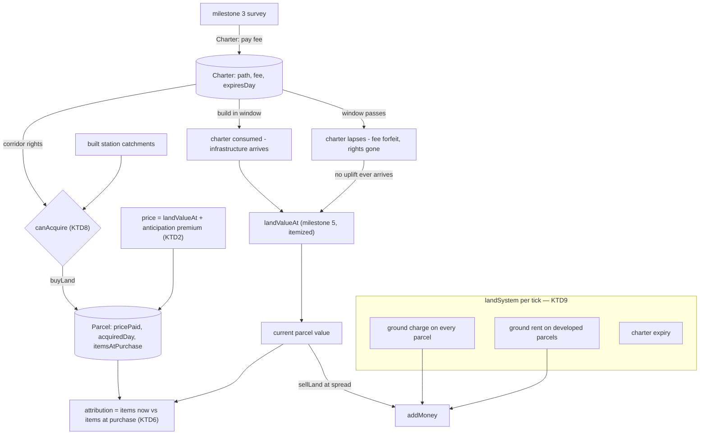
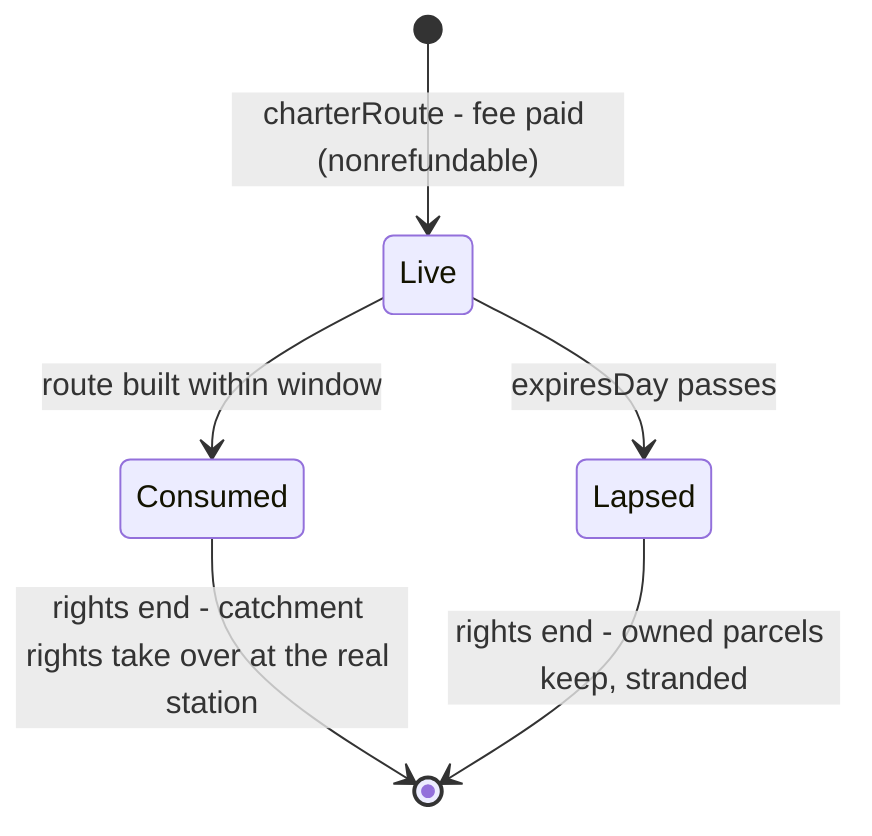

# Land Economics and Speculation - Plan

Milestone 6 of 6. Depends on milestone 5 (`docs/plans/2026-07-18-006-feat-station-siting-type-and-severance-plan.md`) for the itemized land-value field, and on milestone 3 (`docs/plans/2026-07-18-004-feat-route-surveying-and-track-economics-plan.md`) for surveying — the charter mechanic below attaches to the survey. See `docs/plans/2026-07-18-001-feat-two-scale-world-and-districts-plan.md` for the umbrella Product Contract.

## Goal Capsule

- **Objective:** Let the player profit as a landowner as well as a carrier — buying ahead of their own infrastructure, the way nineteenth-century railroads actually made their money — without turning the game into a risk-free money printer.
- **Product authority:** Solo creator / product owner (mikejestes@gmail.com).
- **Open blockers:** None remaining — the exploit-surface blocker is resolved by KTD1's charter design, **adopted in planning and flagged for product-owner sign-off** (see Assumptions). If the sign-off rejects the charter shape, U2 and the anticipation-pricing half of U1 are the units that change; the rest stands.
- **Execution profile:** Adds the player's second income stream and the game's first mechanic that can be exploited rather than merely unbalanced. The anti-exploit economics (KTD1–KTD3) are the load-bearing surface; U8's scripted-strategy tests are their proof.
- **Stop conditions:** Stop and surface if the scripted exploit tests cannot be tuned to "profitable but subordinate" — that is the signal the mechanic's shape, not its constants, is wrong, and it reopens the product decision rather than more tuning.

---

## Product Contract

**Product Contract preservation:** unchanged in requirements. The "resolve before enrichment" blocker is resolved by decision in the Planning Contract (KTD1) rather than by narrowing any requirement; R1's "committed" is given its concrete form (a chartered route) by that decision.

### Summary

The player can acquire and develop land inside the catchment of stations they have built or committed to, and land bought ahead of the infrastructure that serves it appreciates when that infrastructure arrives.

### Problem Frame

The player is a carrier paid on delivery, and the origin product contract rules out owning or speculating on *goods* — that is the identity line separating this game from a transport-arbitrage game. Land is different, and the history is unambiguous: land grants, station-town development, and buying ahead of announced routes were where the money was. A railroad that profited when the land around its depots developed is not a genre violation.

Milestone 5 produces a land-value field that responds to the player's own infrastructure. Without this milestone, that field only feeds the district simulation — the player can see value they created but cannot participate in it.

The mechanic has a structural problem that must be named up front. The player decides where the line goes *and* buys the land it will make valuable. They control both sides of the trade. Absent a constraint, buying ahead of your own committed route is free money, and the interesting decision collapses.

### Requirements

**Acquisition**

- R1. The player can acquire land within the catchment of their own stations, built or committed, and nowhere else.
- R2. Acquired land can be developed, and development interacts with the district simulation rather than running parallel to it.
- R3. Acquisition and development are paid in integer cents through the existing money path.

**Speculation**

- R4. Land acquired before the infrastructure that serves it appreciates when that infrastructure arrives.
- R5. Committing to a route grants acquisition rights along it before the track is built.
- R6. Speculation carries genuine risk, so buying ahead is a judgment rather than a guaranteed return.

**Legibility**

- R7. Land value is visible to the player before purchase.
- R8. The player can see what they own, what it cost, and what it is now worth.
- R9. Appreciation and depreciation are attributable — the player can tell what caused a parcel's value to move.

**Boundaries**

- R10. The player never owns or speculates on goods. Land is the only asset.
- R11. Land holdings persist as compact records consistent with the district aggregate model, not as per-tile ownership maps.

### Acceptance Examples

- AE1. Buying ahead pays. **Covers R1, R4, R5.** **Given** a city the player has committed a route to but not yet reached, **when** the player acquires land in the planned catchment before the line arrives and holds it until after, **then** that land is worth more than it cost.
- AE2. Buying ahead can lose. **Covers R6.** **Given** the same setup, **when** the player abandons the route or the district fails to develop, **then** the acquired land is worth less than it cost.
- AE3. Rights are bounded. **Covers R1.** **Given** a city with no station and no committed route, **when** the player attempts to acquire land there, **then** the attempt is refused with a legible reason.
- AE4. Value is readable. **Covers R7, R9.** **Given** a parcel whose value has moved, **when** the player inspects it, **then** the current value and the reason for the change are both legible.
- AE5. Severance cuts both ways. **Covers R4, R9.** **Given** the player owns land along the line of their own approach, **when** that approach severs the district, **then** the owned land reflects the severance damage rather than only the catchment uplift.

### Success Criteria

- Routing decisions carry a second layer of judgment — where value will be, not only what haulage will cost.
- A player who speculates badly loses money in a way they can understand.
- Land income never dominates haulage income to the point where running trains becomes optional.

### Scope Boundaries

- No commodity trading, futures, or goods speculation. The identity line from the origin product contract, restated as R10.
- No stock market, shares, bonds, or corporate finance. Deferred in the origin brainstorm and still deferred.
- No competing landowners or AI bidders. Deferred with AI competitors generally.
- No mortgages, leverage, or debt instruments.
- No compulsory purchase or land assembly mechanics.

---

## Planning Contract

### Key Technical Decisions

- KTD1. **Route commitment is a paid, expiring charter — and that is what defuses the exploit.** (Resolves the load-bearing blocker. Composite of the origin's candidate constraints; requires product-owner sign-off, see Assumptions.) From a completed survey, the player may *charter* the route instead of (or before) building it: they pay a non-refundable charter fee — `CHARTER_FEE_FRACTION` of the surveyed build cost — and receive acquisition rights along the chartered corridor for `CHARTER_WINDOW_DAYS`. Building the route inside the window consumes the charter; letting it lapse forfeits the fee and the rights, and the player keeps any land they bought — stranded, unserved, and repriced accordingly. Three of the origin's four candidate constraints compose here: commitment costs real money, rights expire, and (KTD2) prices anticipate. The fourth (holding cost) is KTD3. Free commitment was rejected because it prices the option at zero; instant-build-only commitment (milestone 3's commit) was rejected because R5 explicitly requires rights *before* the track exists.

- KTD2. **Acquisition prices anticipate the infrastructure — the margin is the district's success, not the announcement.** Purchase price = current `landValueAt` **plus** an anticipation premium: `ANTICIPATION_FRACTION` of the *projected* uplift the chartered or under-construction infrastructure would add. The projection evaluates milestone 5's uplift formula with **pinned reference inputs**, never the live district record — a charter terminal at an unserved city has no district and no station type yet, and evaluated naively the projection would be ~zero, landing exactly on the free-money endpoint. Pin: reference type `'mixed'`, a documented reference radius, and an exported `ANTICIPATION_REFERENCE_DEVELOPMENT` constant strictly greater than zero standing in for district development. The seller — the abstract market — has read the newspapers. What the player buys at a discount to *eventual* value is only the part that depends on the district actually developing, which is the risk R6 demands. `ANTICIPATION_FRACTION` strictly between 0 and 1 is the tuning dial: at 1 speculation is pointless, at 0 it is free money. Because R5's rights run the length of the corridor (KTD8), not just its terminal, the projection is a *field*, not a scalar: it instantiates milestone 5's station-uplift shape (peak at the terminal, linear falloff to the pinned reference radius, scaled by the pinned reference development) and queries it at the parcel's own position — exactly as `landValueAt` will query the real uplift once the station exists. A parcel bought near the terminal carries most of the premium; one bought at the corridor's far edge carries little to none, because that is also where the eventual real uplift will be smallest. Flattening the premium to the terminal's peak value regardless of parcel position was rejected: it would overprice distant corridor land relative to what it can ever be worth, making far-corridor speculation a strictly losing move rather than a smaller, genuine bet.

- KTD3. **Holding land costs; developed land yields.** A per-day ground charge (`LAND_TAX_RATE` on price paid) debits every held parcel, and a per-day ground rent (`GROUND_RENT_RATE` scaled by parcel value and the serving district's development) credits developed ones — both integer cents through `addMoney`, both bounded. Idle speculation bleeds; land that the player's own trains cause to develop pays. This gives AE2 teeth beyond paper losses and answers the origin's cap-or-curve question as *curve*: rent is bounded per parcel and parcels are bounded by catchment geometry, and U8 carries an explicit tuning gate asserting land income stays subordinate to haulage. Milestone 3's R10 no-recurring-cost rule is track-scoped; land carrying costs are one of the origin's own named candidates. A parcel's *serving district* is the highest-development district whose station catchment contains the parcel center; a parcel no district covers earns zero rent (charter-corridor land before any station exists bleeds tax with no offset — deliberately). U4 and U7 both cite this one rule.

- KTD4. **A parcel is a fixed sub-tile grid cell — stable under everything the scene does.** (Resolves the granularity question.) The world's tiles subdivide into a fixed `PARCELS_PER_TILE_EDGE` grid; a parcel is addressed `(tileX, tileY, subX, subY)` and holds `{ id, address, pricePaidCents, acquiredDay, valueItemsAtPurchase }`. Terminology guard: these *ownership parcels* are a different thing from milestone 4's scene "parcels" (derived building lots inside generated blocks) — the two never map onto each other; ownership parcels live in stable world coordinates and scene parcels regenerate freely. Parcels are *not* keyed to district blocks: blocks are derived, regenerate on quantum changes, and cannot anchor ownership. Holdings are a compact list (R11) — a few records per station town, nothing per-tile map-shaped.

- KTD5. **The player owns; the district builds.** (Resolves the development question, per the origin's identity decision.) There is no develop verb. An owned parcel develops when its district develops — development intensity for rent purposes derives from the district record and the parcel's position in the value field, the same inputs the scene draws from, without the sim ever running scene layout. R2's "development interacts with the district simulation" is exactly this: ownership changes who collects, never what gets built.

- KTD6. **Valuation is derived per query; purchases store their opening snapshot.** (Resolves the valuation question.) Current parcel value = milestone 5's itemized `landValueAt` at the parcel center (plus the anticipation item while a charter is pending). Each parcel stores the itemized breakdown at purchase; attribution (R9) is the item-by-item diff between then and now — "catchment uplift +$310, severance −$120" — computed on demand, never stored. This is the smallest stored footprint that makes causes legible, and AE5 falls out for free: the severance item goes negative on owned land like anywhere else.

- KTD7. **Selling is allowed, at a spread.** `sellLand` credits current value minus `SALE_SPREAD_FRACTION`. Without a sale path, appreciation is unrealizable paper and AE1 is untestable in cents; without a spread, buy-sell churn around known events is free. The spread also closes the residual loop of buying just before building and flipping just after — the round trip costs the spread plus the anticipation premium already paid.

- KTD8. **Rights are one predicate with two sources.** `canAcquire(state, parcel)`: the parcel center lies within a built station's catchment **or** within `CHARTER_RIGHTS_RADIUS` of a live charter's path (which covers the prospective terminal catchment, since the path ends there). Refusals are a closed union (`'no-rights'`, `'already-owned'`, `'insufficient-funds'`), rendered verbatim by the UI (AE3), matching milestone 3's refusal pattern.

- KTD9. **Land economics run in one new system, after districts, before growth.** `landSystem` handles charter expiry, ground charge, and ground rent each tick — deterministic, bounded, all money integer cents. Charters get a serialized `nextCharterId`; parcels `nextParcelId` (R11, the established counter convention).

- KTD10. **Value legibility is an overlay in buy mode, plus a holdings panel.** Arming the new `land` build mode tints tiles/parcels by the actual `purchasePrice` — `landValueAt` plus any live anticipation premium — at the current tier, so the number the player reads is the number `buyLand` debits (R7 as "price shown is price paid"; outside buy mode, plain `landValueAt` remains the display quantity). Clicking buys the parcel under the cursor. A `LandPanel` lists holdings: cost, current value, delta, and the top attribution items (R8, R9/AE4). The overlay is view-state like the survey proposal — never `GameState`.

- KTD11. **Bump `SCHEMA_VERSION` (+1 from current) and let old saves fail loudly.** `parcels`, `charters`, and their counters change the stored shape. Same precedent as every milestone before it.

### High-Level Technical Design

Where the risk lives, end to end: the fee is sunk at charter; the premium is sunk at purchase; the tax bleeds while holding; and the payoff — value beyond what was priced in, plus rent — arrives only if the line is built *and* the district develops. Every arrow the player profits by runs through infrastructure they must actually build and feed.

Charter lifecycle:

### Assumptions

- **Product decision adopted in planning, flagged for sign-off:** the charter design (KTD1), anticipation pricing (KTD2), and carrying costs (KTD3) are a specific resolution of the origin's open blocker, chosen because it composes three of the four candidate constraints the origin itself listed and keeps every piece attributable to a mechanic the player can see. The product owner should confirm this shape — ideally before U2 is implemented — since it defines what "committing to a route" means to the player from here on.
- Milestone 3's `SurveyResult` and route entities exist as planned there; the charter stores the surveyed path and cost, and "building the chartered route" means committing a route whose path lies within the chartered corridor (exact-match is too brittle against a waypoint nudge).
- Milestone 5's `landValueAt` is itemized and covers severance and derelict contributions; AE5 is a test of that composition on owned parcels, not new machinery.
- Tuning constants (`CHARTER_FEE_FRACTION`, `ANTICIPATION_FRACTION`, `LAND_TAX_RATE`, `GROUND_RENT_RATE`, `SALE_SPREAD_FRACTION`, `CHARTER_WINDOW_DAYS`) are starting points; U8's scripted-strategy tests pin the *ordering* properties (ahead-and-build beats buy-after; abandon loses; land income subordinate) rather than exact returns, so tuning can move constants without rewriting tests.
- The value overlay renders through the existing chunk/overlay machinery at whatever granularity the tier makes legible (tile-level at region, parcel-level at street); overlay rendering is view-state and untested beyond its pure color/level mapping, per the no-rendering-tests policy.

### Sequencing

U1 → U2 → U3 → U4 in order (parcels and rights, then charters, then trade, then the ticking economics). U5 depends on U1 and milestone 5. U6 depends on U3 and U5. U7 depends on U4. U8 closes the milestone and depends on everything.

---

## Implementation Units

### U1. Parcel model and acquisition rights

- **Goal:** Parcels as stable, compact records; one predicate that says where the player may buy.
- **Requirements:** R1, R11
- **Dependencies:** milestone 5's `landValueAt`
- **Files:**
  - `src/sim/model/land.ts` (create)
  - `tests/sim/land.test.ts` (create)
- **Approach:** Per KTD4: parcel addressing on the fixed sub-tile grid, `parcelCenter(address)` for field queries, `makeParcel` storing price, day, and the purchase-time value items (KTD6). Per KTD8: `canAcquire(state, address)` with the closed refusal union — built-station catchment via the existing `inCatchment`, charter corridor via distance-to-path (charter shape arrives in U2; the predicate takes the corridor list as data so U1 tests it with fixtures).
- **Test scenarios:**
  - Covers AE3. An address in open country with no station and no charter refuses with `'no-rights'`; the same address inside a built catchment is acquirable.
  - An already-owned address refuses with `'already-owned'`.
  - Parcel addresses are stable and unique; `parcelCenter` is consistent with the addressing round-trip.
  - Parcel records round-trip `JSON.stringify`/`parse` with no non-finite fields (R11).
- **Verification:** Rights are exactly built-catchment-or-corridor, and every refusal names itself.

### U2. Charters

- **Goal:** Committing ahead of construction is a real, paid, expiring act — the act R5's rights attach to.
- **Requirements:** R5, R6
- **Dependencies:** U1, milestone 3
- **Files:**
  - `src/sim/state.ts` (modify — `charters`, `nextCharterId`, `SCHEMA_VERSION` +1)
  - `src/sim/model/land.ts` (modify — charter shape, corridor derivation, fee computation)
  - `src/store/gameStore.ts`, `src/store/applyIntents.ts` (modify — `charterRoute` intent)
  - `src/persistence/saveStore.ts` (modify — migration note)
  - `tests/store/applyIntents.test.ts`, `tests/persistence/roundtrip.test.ts` (modify)
- **Approach:** Per KTD1: `charterRoute` re-runs the survey from waypoints (milestone 3's KTD2 discipline — the sim recomputes, the UI proposes), debits the fee, stores `{ id, waypoints, path, surveyedCostCents, feePaidCents, charteredDay, expiresDay, status: 'live' }`. A subsequent `commitRoute` consumes the charter when a documented overlap fraction (`CHARTER_CONSUME_OVERLAP`) of the committed path's tiles lies within the chartered corridor — a threshold, not an exact match, because milestone 3's commit re-runs A\* against *current* costs, and over the charter window those costs move (districts develop, the land term shifts), so the built path can legitimately drift from the stored one. Status transitions are the only mutations; fees never refund.
- **Test scenarios:**
  - Chartering debits exactly the fee and grants corridor rights along the surveyed path (acquirable where it was not before).
  - Building within the window consumes the charter; the fee stays spent.
  - An unaffordable or refused-survey charter is a no-op with byte-identical state.
  - Charters round-trip and replay deterministically.
- **Verification:** Commitment is distinct, paid, visible in state, and consumed or lapsed — never silently forgotten.

### U3. Buying and selling

- **Goal:** The trade itself: anticipation-priced purchase, spread-priced sale, integer cents throughout.
- **Requirements:** R3, R4, R7 (price shown is price paid), R10
- **Dependencies:** U2
- **Files:**
  - `src/sim/model/land.ts` (modify — `purchasePrice` with anticipation premium, `salePrice` with spread)
  - `src/sim/state.ts` (modify — `parcels`, `nextParcelId`)
  - `src/store/gameStore.ts`, `src/store/applyIntents.ts` (modify — `buyLand`, `sellLand` intents)
  - `tests/store/applyIntents.test.ts`, `tests/sim/land.test.ts` (modify)
- **Approach:** Per KTD2: `purchasePrice = landValueAt(center) + ANTICIPATION_FRACTION × projectedUplift(terminal, center)`, where `projectedUplift` instantiates milestone 5's station-uplift shape at the charter's terminal with the pinned reference type/radius/development and samples it at the parcel's own `center` — so the premium falls off with the parcel's distance from the terminal exactly as the real uplift will once built; zero premium where no live charter or pending construction applies. Per KTD7: `sellLand` credits `landValueAt(center) × (1 − SALE_SPREAD_FRACTION)` and removes the parcel. Both route through `addMoney`; refusals reuse U1's union plus `'insufficient-funds'`. The only assets in the state are parcels — nothing here touches goods (R10 is structural: there is no intent that trades anything else).
- **Test scenarios:**
  - Buying inside a live charter's corridor costs strictly more than raw `landValueAt` (the premium is real) and strictly less than value-if-built (the discount is real).
  - Covers R17. The premium falls off with distance from the charter terminal: a parcel near the terminal pays strictly more premium than one further along the same corridor, and a parcel at the corridor's far edge pays near-zero premium (the field, not a flat terminal price, per KTD2).
  - Buying inside a built catchment with no pending infrastructure prices at raw value (no premium without anticipation).
  - Buy-then-immediately-sell loses exactly the spread plus any premium (churn is never free).
  - Unaffordable purchases and rights-refused purchases are no-ops with byte-identical state.
  - All prices are integers; money changes match prices exactly.
- **Verification:** Every trade is priced by the documented formulas, and no sequence of trades alone mints money.

### U4. Land system — carrying cost, rent, expiry

- **Goal:** Holding land is a position with running consequences, not a parked note.
- **Requirements:** R2, R6
- **Dependencies:** U3
- **Files:**
  - `src/sim/systems/land.ts` (create)
  - `src/sim/systems/index.ts` (modify — after districts, before growth)
  - `tests/sim/land.test.ts` (modify)
- **Approach:** Per KTD3/KTD9: each tick, expire past-window charters to `'lapsed'`; debit ground charge per parcel; credit ground rent per parcel scaled by parcel value and the serving district's development (KTD5 — intensity derives from the district record and the value field, never from scene layout). Rates are per-day, multiply `dtDays`, round deterministically to integer cents.
- **Test scenarios:**
  - A charter past `expiresDay` flips to `'lapsed'` exactly once; its corridor rights end (U1 predicate now refuses).
  - An undeveloped parcel bleeds the documented charge per day; a parcel in a developed district nets positive.
  - Rent is bounded per parcel at maximum development and value.
  - Determinism: the system's money flows are byte-identical across runs from the same seed and intents.
- **Verification:** Time is a cost to the idle speculator and an income to the builder, at documented bounded rates.

### U5. Valuation and attribution

- **Goal:** What it's worth now, and why it moved — computed, never stored.
- **Requirements:** R8, R9
- **Dependencies:** U1, milestone 5
- **Files:**
  - `src/store/selectors.ts` (modify — `parcelValuation(state, parcelId)`)
  - `tests/store/selectors.test.ts` (modify)
- **Approach:** Per KTD6: current itemized value from `landValueAt` (plus the live anticipation item), delta against `pricePaidCents`, and attribution as the item-by-item diff against `valueItemsAtPurchase`, sorted by magnitude with human-readable labels. Pure selector; the panel renders its output verbatim.
- **Test scenarios:**
  - Covers AE4. A parcel whose catchment gained a station shows the uplift item as the top positive cause; one crossed by a new cut shows severance as the top negative cause.
  - Covers AE5. A parcel along the player's own severing approach shows both the uplift and the negative severance item simultaneously.
  - A parcel whose charter lapsed attributes the loss to the vanished anticipation/uplift, not to an unnamed residual.
  - Covers R17 (appreciation is timed to arrival, not to commitment). A parcel valued the instant before its charter is consumed by construction and the instant after: the anticipation item disappears and the real station-uplift item takes over without a windfall jump — the two items agree at the moment of transition to within the reference-vs-actual-development gap KTD2 already prices in, so consumption alone is not a second payout on top of what was already bought.
  - Attribution items sum to the total delta (completeness).
- **Verification:** Every cent of movement has a name the player can read.

### U6. Land UI — overlay, buy mode, holdings

- **Goal:** Value visible before purchase on the map; holdings readable in one panel.
- **Requirements:** R7, R8
- **Dependencies:** U3, U5
- **Files:**
  - `src/ui/panels/BuildPanel.tsx` (modify — `land` mode)
  - `src/ui/panels/LandPanel.tsx` (create)
  - `src/ui/App.tsx` (modify — mount LandPanel)
  - `src/main.ts` (modify — buy-mode click → `buyLand` intent; overlay wiring)
  - `src/render/worldRenderer.ts` (modify — value overlay when buy mode is armed)
  - `tests/ui/panels.test.ts` (modify)
- **Approach:** Per KTD10: arming `land` mode passes a value-overlay descriptor to the renderer (view-state, like milestone 3's survey overlay) — tiles/parcels tinted by the *same* `purchasePrice` function U3's `buyLand` charges (premium included where a charter is live), at the current tier; disarming reverts the descriptor to plain `landValueAt`, so the display quantity itself names which number the player is looking at. Clicking dispatches `buyLand` for the parcel under the cursor, and refusals surface as a transient message rendered from the refusal union. `LandPanel` lists holdings from `parcelValuation`: cost, value, delta, top causes; a sell button per row dispatches `sellLand`. React binding follows the version-counter rule from `docs/solutions/`.
- **Test scenarios:**
  - Covers R7, R18, AE6 (price shown is price paid). The overlay descriptor's per-parcel price is computed by calling the exact same `purchasePrice` function `buyLand` charges from — not a parallel formula — verified for a charter-corridor parcel (premium included) and a built-catchment parcel with no pending infrastructure (premium absent); a fixture purchase at the displayed price changes money by exactly that amount.
  - Arming and disarming `land` mode switches the descriptor between `purchasePrice` and plain `landValueAt` (KTD10's two display quantities are distinguishable, not just documented).
  - LandPanel renders cost, current value, signed delta, and attribution labels for a fixture portfolio (AE4 at the panel level).
  - The overlay's pure value-to-band mapping is monotonic and bounded.
  - Buy-mode wiring: a click on a rights-refused parcel dispatches and surfaces the `'no-rights'` reason verbatim (AE3 at the UI level).
- **Verification:** A player can read the exact price they will pay on the map before buying, and their ledger after — no hidden rolls, and no daylight between the number shown and the number charged.

### U7. Development interaction

- **Goal:** Owned land participates in the district's growth — the district builds, the owner collects.
- **Requirements:** R2
- **Dependencies:** U4, milestone 4/5 scene inputs
- **Files:**
  - `src/sim/model/land.ts` (modify — parcel development intensity from district record + value field)
  - `src/render/worldRenderer.ts` (modify — ownership-cue overlay from parcel world-rects at street tier)
  - `tests/sim/land.test.ts` (modify)
- **Approach:** Per KTD5: `parcelIntensity(state, parcel)` — the serving district's development (KTD3's rule) scaled by the parcel's share of the local value field — feeds U4's rent and the ownership cue. The cue is drawn from the ownership parcel's *world-space rect* as a street-tier overlay, exactly like the value overlay — never by tagging milestone 4's scene footprints, which would require a world-to-scene-geometry mapping that deliberately does not exist (KTD4's terminology guard). No develop verb exists; the scene builds what the district builds, owned or not (R12 of milestone 4 stays intact).
- **Test scenarios:**
  - A parcel in a developing district gains intensity as the district's development rises; a parcel in a hamlet stays near zero.
  - A parcel under overlapping catchments uses the highest-development covering district (KTD3's serving rule); a parcel under none has zero intensity.
  - Intensity is bounded and deterministic, and never reads scene layout (purity guard — sim independent of rendering).
  - The pure overlay helper maps owned parcels to world-space rects; unowned parcels produce nothing; ownership changes nothing about the generated scene itself.
- **Verification:** Ownership changes who collects and how it reads — never what gets built.

### U8. Close-out — determinism, persistence, and the exploit gate

- **Goal:** The milestone's economics proven: ahead-buying pays, abandonment loses, land never replaces trains, and the save contract holds.
- **Requirements:** R3, R6, R10 plus the umbrella determinism/persistence commitments
- **Dependencies:** U1–U7
- **Files:**
  - `src/dev/debugHook.ts` (modify — `buyLand`, `sellLand`, `charterRoute`, `parcelValuation` affordances)
  - `tests/sim/landEconomics.e2e.test.ts` (create — scripted-strategy scenarios)
  - `tests/sim/tick.test.ts`, `tests/persistence/roundtrip.test.ts` (verify)
- **Approach:** Scripted end-to-end scenarios over the headless sim, following `tests/sim/loop.e2e.test.ts`'s pattern: run the full charter→buy→build→feed→collect arc and its failure branches, asserting *ordering* properties rather than exact returns (per Assumptions). Expose the land verbs on `window.__game` for browser-driver verification by value.
- **Test scenarios:**
  - Covers AE1. Charter → buy in the corridor → build within window → feed the district: final parcel value exceeds all-in cost (price + fees + carrying).
  - Covers AE2 (abandon arm). Charter → buy → let the charter lapse: the position is net negative and the loss is attributable.
  - Covers AE2 (failure arm). Charter → buy → build → never feed the district: rent never covers carrying; the position underperforms the AE1 arc.
  - Exploit gate: charter → buy → build → immediately sell everything nets less than the AE1 hold-and-feed arc and less than a no-land baseline plus spreads (no flip profit).
  - Subordination gate: over a long scripted run, land net income stays below haulage income by the documented margin (success criterion, as a tunable assertion).
  - Determinism: the full scripted arc serializes byte-identically across two runs; saves mid-arc round-trip and resume identically.
- **Verification:** `npm test` green including the economics scenarios, determinism, and round trip; the money printer does not print.

---

## Verification Contract

| Gate | Command | Applies to | Signal |
|---|---|---|---|
| Type check | `npm run typecheck` | all units | clean |
| Unit tests | `npm test` | all units | all suites pass; new `tests/sim/land.test.ts`, `landEconomics.e2e.test.ts` green |
| Determinism | `npm test` (`tests/sim/tick.test.ts`) | U2–U8 | byte-identical serialization across runs — failure is a release blocker, not a flake |
| Round trip | `npm test` (`tests/persistence/roundtrip.test.ts`) | U2, U3, U8 | save/load resumes byte-identically at the bumped schema version |
| Build | `npm run build` | all units | succeeds |
| Manual smoke | `npm run dev` | U6 | charter a route, read value along it, buy ahead, build, watch the holdings panel explain what happened |

The exploit gate (U8) carries this milestone: it is the executable form of the origin's load-bearing unknown, and its assertions are the contract any future tuning must keep.

Test conventions follow the repo: `describe` blocks name behavior plus decision id, `it` strings carry `AE<N>:` prefixes where they enforce an Acceptance Example, fixtures are local factory functions, tuning constants are imported from source rather than duplicated.

## Definition of Done

**Global**

- Acquisition works exactly within built catchments and live charter corridors, and nowhere else (R1; AE3).
- Charters are paid, expiring, and consumed by construction (R5; KTD1 confirmed or revised by product sign-off).
- Buying ahead can pay and can lose, and both outcomes are attributable (R4, R6, R9; AE1, AE2, AE4).
- Owned land develops with the district and collects accordingly; the player never directs development (R2).
- All land money flows through `addMoney` in integer cents (R3); goods remain untradeable (R10).
- Holdings are compact records with serialized counters (R11).
- Value is readable before purchase and after, on the map and in the panel (R7, R8).
- Severance flows through to owned land (AE5).
- Every Acceptance Example (AE1–AE5) has a passing test, and the exploit and subordination gates pass.
- The Verification Contract passes: type check, unit tests, determinism, round trip, build.
- Abandoned-attempt code is removed — no dead pricing experiments or orphaned overlay stubs in the diff.

**Per unit**

- Each unit meets its Verification line and its test scenarios pass. UI and overlay units carry tests for pure mappings only, per the no-rendering-tests policy.
- New files carry a header docblock stating design rationale and citing KTD ids, matching the existing convention.
